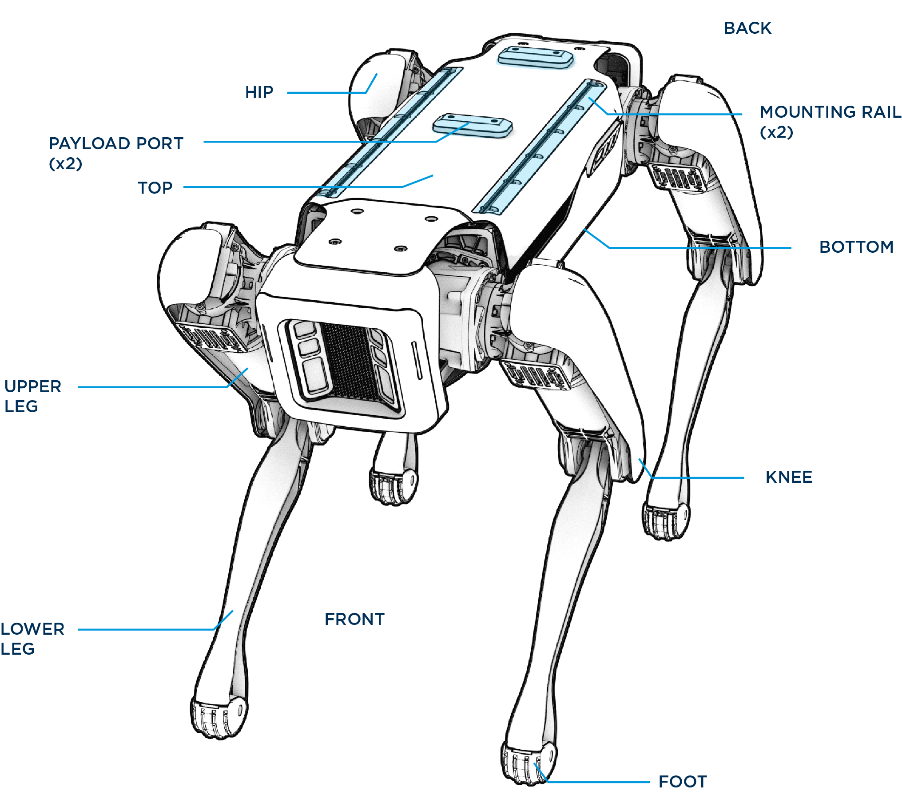

<!--
Copyright (c) 2023 Boston Dynamics, Inc.  All rights reserved.

Downloading, reproducing, distributing or otherwise using the SDK Software
is subject to the terms and conditions of the Boston Dynamics Software
Development Kit License (20191101-BDSDK-SL).
-->

# About Spot

## Cameras

Spot has 5 pairs of stereo cameras that provide black and white images and video.

## Hips and joints

Spot has 2 actuators in each hip, and one actuator in each knee. The hip joints are referred to as HX and HY for each plane of rotation.  This creates the following degrees of freedom and limits on each axis:

*   12 DOFs, 3 per leg
*   Hip Joint X-axis (HX): +/- 45 degrees from vertical (45 degrees of internal and external rotation from vertical)
*   Hip Joint Y-axis (HY): +/- 91 degrees with 50 degree bias from vertical (flexion/extension)
*   Knee: +/- 14-160 degrees from straight (flexion/extension range from 14 to 160 degrees)

Legs are referred to as front or hind and left or right. For example, the front left leg is FL, or the hind left leg is HL. A complete joint reference for one leg looks like this:

*   fl.hx refers to the front left hip X
*   fl.hy refers to the front left hip Y
*   fl.kn refers to the front left knee

The [robot state protobuf message](../../protos/bosdyn/api/robot_state.proto) in the Spot SDK describes data about the robot, including information about joints and legs. The following snippet shows the data returned about the robot state using the [`get_robot_state` example](../../python/examples/get_robot_state/README.md) for hip X joint on the front left leg:

    ...
    joint_states {
        name: "fl.hx"
        position {
          value: 0.21174180507659912
        }
        velocity {
          value: 0.003905495163053274
        }
        acceleration {
          value: 2.1059951782226562
        }
        load {
          value: -1.86274254322052
        }
      }
    ...

## Robot specifications

### Dimensions

| Specification | Value |
| ------------- | ------ |
| Robot type | Spot Gamma |
| Length |	1100 mm (43.3 in) |
| Width |	500 mm (19.7 in) |
| Height (standing) |	840 mm (33.1 in) |
| Height | (sitting)	191 mm (7.5 in) |
Net weight |	32.5 kg (71.7 lbs) |
Degrees of freedom |	12 |
Maximum speed |	1.6 m/s |

### Environment

| Specification | Value |
| ------------- | ------ |
| Ingress protection |	IP54 |
| Operating temperature |	-20C to 45C |
| Slopes |	+/- 30 degrees |
| Stairways |	Stair dimensions that meet US building code standards, typically with 7 in. rise for 10-11 in. run |
| Max step height |	300 mm (11.8 in) |
| Lighting |	Above 2 lux |

## Power

| Specification | Value |
| ------------- | ------ |
| Battery capacity |	605 Wh |
| Max battery voltage |	58.8V |
| Typical runtime |	90 minutes |
| Standby time |	180 minutes |
| Charger power |	400W |
| Max charge current |	7A |
| Time to charge |	120 minutes |

## Payload

| Specification | Value |
| ------------- | ------ |
| Max weight |	14 kg (30.9 lbs) |
| Max power per port |	150W |
| Payload ports |	2 |

## Sensing

| Specification | Value |
| ------------- | ------ |
| Camera type |	Projected stereo |
| Field of view |	360 degrees |
| Operating range |	4 m (13 ft) |

## Connectivity

| Specification | Value |
| ------------- | ------ |
| Wifi | 802.11 |
| Ethernet | 1000Base-T |
