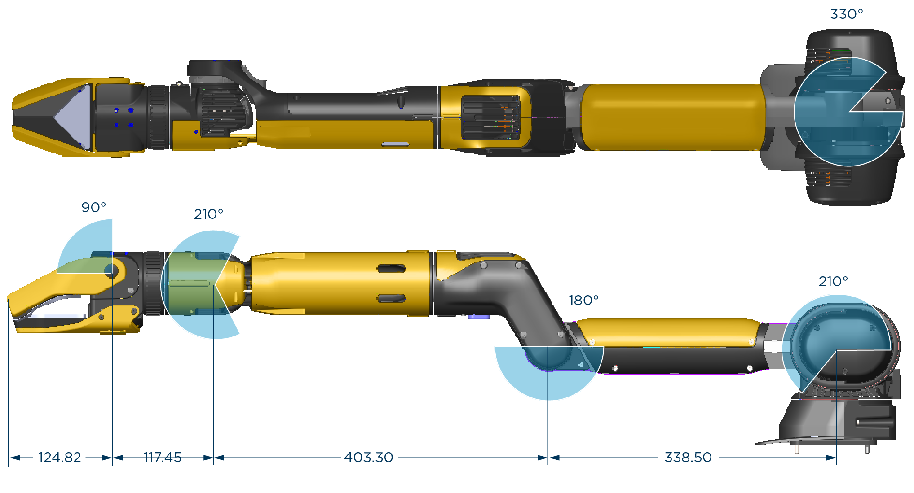

<!--
Copyright (c) 2023 Boston Dynamics, Inc.  All rights reserved.

Downloading, reproducing, distributing or otherwise using the SDK Software
is subject to the terms and conditions of the Boston Dynamics Software
Development Kit License (20191101-BDSDK-SL).
-->

# Arm and gripper specifications

## Joint ranges of motion and link lengths

Link lengths are in mm.

## Arm specifications
- **Degrees of freedom**:                            6 + gripper              
- **Length at full extension**:                      984 mm                   
- **Max. reach height on robot**:                    1800 mm                  
- **Mass/weight, including gripper**:                8 kg                     
- **Max. endpoint speed**:                           10 m/s                   
- **Lift capacity\***:                                Up to 11 kg              
- **Continuous lift capacity at 0.5 m extension\***:  5 kg                     
- **Drag capacity\* (on carpet)**:                    Up to 25 kg              
- **Operating temp**:                                -20 C to 45 C            
- **Ingress protection**:                            Water and dust resistant 

\* At 22 C. 

## Gripper specifications
- **Depth**:                                 90 mm                                          
- **Peak clamp force (at tip of opening)**:  130 N                                          
- **Integrated sensors**:                    ToF, IMU, 4K RGB                               
- **Accessory port**:                        Gigabit Ethernet, 50W power, camera sync (PPS) 
- **Max Camera FOV**:                        RGB: 60.2° x 46.4°; Depth: 55.9° x 44°

## How big an object can the gripper grasp
The robot Arm is capable of holding any object it can fit the gripper jaws around. In general, this means that objects a person can pick up are also manageable by the robot. 
 
## Gripper safety
Continue to observe the recommended safety distance of 3 meters from the robot. Do not touch the Arm or gripper (or the robot) while the robot is active. 
 
## Pinch points
The gripper has a small clearance that offers some possibility to avoid complete pinching. However, pinching is always possible when grasping/holding objects. Limit human interaction with the gripper when in use. 
 
* Never introduce hands or fingers between an object to be grasped or being grasped and the gripper jaws. Keep hands away.
* Never attempt to open the gripper while the robot is powered on. Never try to interfere with grasping and carrying. Stay away from an active robot.
