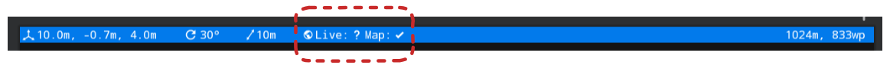

<!--
Copyright (c) 2023 Boston Dynamics, Inc.  All rights reserved.

Downloading, reproducing, distributing or otherwise using the SDK Software
is subject to the terms and conditions of the Boston Dynamics Software
Development Kit License (20191101-BDSDK-SL).
-->

# GPS on Spot  
Starting in software version 4.0, the Spot SDK now supports integration with
Global Positioning Systems (GPS) and Global Navigation Satellite Systems
(GNSS) hardware. Spot can be localized to Earth-centered reference frames and
can autonomously navigate and localize on Graph Nav maps that have been
recorded with these systems.  
  
## Hardware Integration

### GPS Receiver Overview  
  
GPS devices compute their position with respect to the Earth using constellations of satellites. Their computed fixes are typically reported through a standard message protocol specified by the Nation Marine Electronics Association known as [NMEA-0183](https://www.nmea.org/nmea-0183.html). GGA messages include information about the computed position of the receiver, such as latitude, longitude, and altitude. GST messages include information about the quality of the computed position fix, such as the standard deviation in meters of the latitude, longitude, and altitude measurements. In addition to computing the position of the receiver, GPS receivers also compute an accurate time measurement. The time measurement is captured in the ZDA message.  
  
Most consumer-grade GPS receivers can compute their location with a few meters of accuracy. This accuracy can be improved using a system of base stations and relay satellites. One system, known as Satellite Based Augmentation System (SBAS) uses ground stations at known locations to compute positioning errors and relay them to receivers using a network of relay satellites. In the United States, this system is also known as Wide Area Augmentation System (WAAS). To achieve centimeter level accuracy, a system known as Real Time Kinematics (RTK) can be used. This system uses a local base station to report corrections directly to the receiver. For use in robot navigation, it is recommended to use a receiver that supports one or more correction services to maximize the accuracy of the measurements and the performance of the system as a whole.  
  
### Attaching GPS Receivers to Spot  
  
GPS receivers make NMEA-0183 messages available through different interfaces. Examples of receiver interfaces include USB, Ethernet, Wi-Fi, and Bluetooth. Spot is not able to consume this data directly from the sensor. Instead, Spot has an interface for accepting GPS data from attached payloads through its API. This means that in addition to a GPS receiver payload, a user must also attach a payload capable of translating from the GPS receiver interface to the Spot API. For information about designing and attaching payloads for Spot, refer to the documentation [here](../../payload/README.md). The figure shown below depicts a system with three GPS receivers communicating with Spot through the GPS API.  
  
Boston Dynamics provides an example of such a system involving the [Trimble SPS986](https://www.sitechnorcal.com/products/site-positioning-systems/antennas-and-base-stations/trimble-sps986-gnss-smart-antenna). The CORE I/O and associated extension also supports GPS devices using USB and UDP connections.


_Figure 1: Spot GPS System Diagram_
  
### Writing Custom GPS Services  
  
The GPS Listener example provided by Boston Dynamics translates NMEA-0183 messages to the Spot API. If this is not suitable for a use case, it is possible to interface with the Spot API directly to provide GPS data. To do this, a new service should be developed. For information on how to do this, please refer to the documentation [here](../developing_api_services.md). This service will need to send NewGpsDataRequest messages to Spot's Aggregator service. This request must contain information about the position of the receiver in either [Geographic Coordinate System](https://en.wikipedia.org/wiki/Geographic_coordinate_system) (GCS: latitude, longitude, and altitude) or in [Earth Centered Earth Fixed](https://en.wikipedia.org/wiki/Earth-centered,_Earth-fixed_coordinate_system) (ECEF) coordinates. Additionally, the timestamp of the fix in robot time and the quantity of satellites used to calculate the fix must be provided. If available, other information such as horizontal and vertical accuracy, yaw, heading, the GPS timestamp, and information about individual satellites used for the fix can be included. GPS data points must also include an SE3Pose specifying the location of the receiver with respect to Spot's body. For additional information, please refer to the [API documentation](../../../protos/bosdyn/api/README.md).

## Background

### Common Reference Frames  
  
See [the geometry and frames document](../../concepts/geometry_and_frames.md) for more information on common robot reference frames and their definitions.


_Figure 2. Relevant GPS Frames_

GPS data are used in Spot's SDK through the following reference frames:  
  
  * **Robot Body - "body"** (see frames doc)is a frame at the geometric center of the robot's body.
  * **Odometry - "odom"** (see frames doc)  is an inertial frame that estimates the fixed location in the world (relative to where the robot is booted up) using the kinematics of the robot.
  * **Payload -** is the frame of the robot's payload computer, usually defined using the payload registration service.
  * **GPS Antenna - "gps"** this is the frame of the GPS receiver antenna, and is the frame that the GPS unit should be reporting positional measurements in. The orientation convention for this frame should be the same as with the robot body; that is, the x-axis should point "forward", and the z axis should point "up". The GPS antenna payload is defined in the GPS service itself.
  * **[Earth-Centered-Earth-Fixed ](https://en.wikipedia.org/wiki/Earth-centered,_Earth-fixed_coordinate_system)** **\- "ecef"** is a standard frame defined based on the center of the Earth. Some parts of the SDK refer to the GPS antenna or robot body's relative position and/or orientation with respect to this frame.
  * **[Latitude/Longitude/Height](https://en.wikipedia.org/wiki/Latitude) \- "llh"** refers to angular measurements on the Earth's surface and an altitude measurement. Some parts of the SDK refer to the GPS antenna or robot body's position using this convention.
  * **Seed Frame - "seed"** is a fixed metric frame in which a Graph Nav map has been represented (see [Graph Nav Map Structure](./graphnav_map_structure.md)). Graph Nav maps may contain a transformation between seed frame and the ECEF frame.
  * **Waypoint Frame - "waypoint"** defines the frame of a graph nav waypoint. Usually this is the frame of the robot body at the time that the waypoint was recorded. Waypoints may contain transformations to the ECEF frame.

## Software Integration

### Registration to Odometry  
  
As Spot moves, it measures the movement of its body with respect to the
ground. This position measurement is known as odometry and is measured with
respect to a coordinate frame known as odom. Importantly, this measurement has
six degrees of freedom, three for position and three for orientation. When GPS
data is received by Spot, it provides estimates of position, but not
orientation. In order to extract orientation information, the GPS data is
transformed into a Cartesian coordinate system tangent to the surface of the
Earth. A trajectory of odometry and GPS measurements is synchronized in time
and recorded. As Spot moves through its environment, this trajectory is used
to find a registration _odom_T_gps_  between the odom frame and the GPS frame
tangent to the Earth.  

  
_Figure 3: Correlation and registration of GPS and Odometry trajectories._ 
  
The currently computed registration can be queried using the Spot API. The
Registration service supports the _GetLocation_  RPC which returns a
_GetLocationResponse_ .  
  
                                                     
GetLocationResponse::Status                          |   Explanation                                              
-----------------------------------------------------|----
`STATUS_UNKNOWN` | No registration could be computed                                                                    
`STATUS_OK` | A (possibly invalid) registration was computed       
`STATUS_NEEDS_DEVICE`  | No GPS device is available to compute a registration 

If the Registration status is STATUS_OK, a Registration object will be
available for inspection.  
  
 
Registration::Status | Explanation                                                      
--- | ---       
`STATUS_UNKNOWN`                                                           | No registration could be computed                                          
`STATUS_OK`                                                                | A registration was computed                                                
`STATUS_NEED_DATA`                                                         | No usable GPS data was available                                           
`STATUS_NEED_MORE_DATA`                                                    | Spot has not moved far enough           
`STATUS_STALE` |  No usable data has been received recently enough to compute a registration 

  
  
### Registration to Graph Nav Maps  
  
While recording a Graph Nav map (see
[here](../../../python/examples/graph_nav_command_line/README.md)),
whenever a GPS device is attached to the robot and a registration to odometry
is found, the registration is stored in the Graph Nav Map inside individual
waypoint snapshots.  
  
This is referred to as "raw GPS data" in examples (see
[here](../../../python/examples/graph_nav_view_gps/README.md)).  Note
that the raw data stored in waypoint snapshots represents the registration to
the odometry frame at the time the waypoint snapshot was recorded, and may be
inaccurate or missing entirely in areas where there were no satellites
reachable from the GPS.  
  
```python  
# World objects stored within waypoint snapshots may contain raw GPS data and
a registration to the odometry frame.  
       for world_object in snapshot.objects:  
           if world_object.HasField('gps_properties'):  
               # This is a "latitude longitude height" message.   
               llh = world_object.gps_properties.registration.robot_body_location  
  
```  
  
Graph Nav maps can also be registered to the ECEF frame using anchoring
optimization (see [here](../../../python/examples/graph_nav_anchoring_optimization/README.md)).
This process takes all of the raw GPS data in the map along with the odometry
data, fiducials, loop closures and other measurements to find an optimized
registration between the seed frame and the ECEF frame. 

  
_Figure 4: an example of the raw (blue) and annotated (red) GPS data displayed on
OpenStreetMaps. The raw data may have noise, missing data, or systematic
errors that anchoring optimization attempts to correct._  
  
Registrations to the ECEF frame obtained via this method are available in
waypoint annotations:  
```python  
# The optimized GPS data is stored in each waypoint's annotations.  
ecef_tform_waypoint = waypoint.annotations.gps_settings.ecef_tform_waypoint  
```  
  
Note that after anchoring optimization, all of the waypoints stored in the
graph will have an associated ecef_tform_waypoint transform. For waypoints
without raw GPS data in them, this value corresponds to the anchoring
optimizer's best guess at where these waypoints are given the data from
waypoints that do have raw gps data in them.  
  
If you are unsatisfied with the results of anchoring optimization, or want to
modify the gps coordinates of any waypoint, you may directly set the values
inside waypoint annotations, and these will be used by the robot for
navigation and localization.  
  
### Navigating using Graph Nav and GPS  
  
When the robot is navigating on a Graph Nav map, it will use data from GPS
whenever:  
  
  1. There exists a GPS-enabled payload and GPS service running currently on the robot.
  2. The map has either raw GPS data in waypoint snapshots, or GPS data in waypoint annotations.
    1. When both exist, Graph Nav will use the data in waypoint annotations.  
  
Graph Nav automatically uses or ignores GPS data depending on the context. For
example, in areas where GPS signal is lost (too few satellites, high error,
etc.) Graph Nav will simply continue navigating using realsense data, LIDAR
point clouds, fiducials, and odometry. When GPS signal is reacquired, Graph
Nav will attempt to use the data without interruption.  
  
If GPS data is expected, but not present on the robot (due to misconfigured or
broken payload hardware, for example), Graph Nav navigation will fail with a
STATUS_IMPAIRED return code.  
  
#### RPCs  
  
The following RPCs are relevant for using and understanding GPS use in Graph
Nav:  
  
  * **graph_nav.GetLocalizationState -**  this RPC returns information about the robot's GPS-centric localization when "request_gps_state" is set to "true" in the request. 
    * This returns a message of type GPSLocalization, which contains an estimate of the robot's body in ECEF frame and LLH frame, and diagnostic information about the current GPS state and whatever GPS state happens to be in the map.
  
    **GPSLocalization::State**                                                  |    **Explanation**                                                             
    ----|----
    `STATE_OK`                                                                   |    Using GPS.                                                                  
    `STATE_BAD_FRAMES`                                                            |    Error getting frames (ko, etc.)                                             
    `STATE_NO_GPS_OBJECTS  `                                                     |    No GPS available.                                                           
    `STATE_REGISTRATION_NOT_OK`                                                   |    GPS registration isn't ready.                                               
    `STATE_NO_GPS_STATES`                                                         |    No GPS state measurements.                                                  
    `STATE_NOT_ENOUGH_SATELLITES`                                                 |    Too few satellites to localize.                                             
    `STATE_NO_ECEF_FRAME`                                                         |    GPS registration is missing a frame.                                        
    `STATE_HIGH_ERROR`                                                            |    The GPS data exists, but is high error.                                     
    `STATE_STALE  `                                                              |    The GPS data exists, and we have not used it yet, but it is too old to use. 
    `STATE_INTERNAL_ERROR `                                                       |     Internal error (e.g. missing waypoints).                                    
    
*  **graph_nav.NavigateToAnchor** \- this RPC allows Graph Nav to navigate to either a point in the "seed" frame, the ECEF frame, or the LLH frame. To navigate to a latitude and longitude, or to an ECEF coordinate, use GPSNavigationParams as the goal field.
    *  When navigating to a GPS coordinate, Graph Nav will use its best guess of where each waypoint is in the ECEF frame to find the closest waypoint to the goal. Graph Nav will then navigate to that waypoint, and then walk the robot in a straight line toward the goal.
    *  If the GPS command fails, NavigateToAnchor will return `INVALID_GPS_COMMAND``. Here are possible reasons the GPS command might be invalid:
    
    **GPSStatus** |**Explanation**
    ----|----   
    `GPS_STATUS_OK` | The GPS command was valid and can be executed.                                
    `GPS_STATUS_NO_COORDS_IN_MAP`                        |The GPS command could not be completed because the map does not have GPScoordinates, neither in                                                  waypoint annotations nor in the waypoint snapshot data. Please record the map using a GPS-enabled robot, or annotate the waypoints with custom GPS coordinates.                      
    `GPS_STATUS_TOO_FAR_FROM_MAP` | The GPS command could not be completed because the coordinates passed in weretoo far from any mapped GPS                                                  data.                                                                         
        


    > Note that LLH coordinates given to this request require sufficient precision (in the sub-meter range) for the robot to navigate successfully to them. The order of magnitude of precision required is about $1 \times 10^{-6}$ degrees. If this isn't satisfied, GPS_STATUS_TOO_FAR_FROM_MAP is likely to be returned.
  
* **map_processing.ProcessAnchoring -**  this RPC may be used to find an optimized pose of every waypoint in the ECEF frame. Set "measurement_params.use_gps" to true and set "apply_gps_result_to_waypoint_on_server" to true as well to set the waypoint transforms in ECEF frame.
  * After processing the anchoring, re-download the map using the graph_nav.DownloadGraph RPC to see the changes.

## Tablet  

### GPS Status Display
When recording a Graph Nav map, or localizing to a loaded Graph Nav map, the status of the GPS system is displayed at the top of the screen after the Earth (🌎) icon:



These icons communicate status of the "Live" data (that is, data arriving at the present moment from the GPS service), and the "Map" data (that is, the status of GPS data in the currently recorded map). The meaning of the icons is shown below:

Icon | Name | Explanation
---|---|---
. | *nothing* | Neither the live nor the map data reports that a GPS service exists.
❌ | *x mark* | The GPS service is not working, misconfigured, or does not exist.
**?** | *question mark* | A GPS service exists, but the data are not being used (either because it is high error, or there are too few satellites).
✔️ | *check mark*   | A GPS service exists, and the data are being used. 

For example, in the image shown the icons: 
> 🌎 Live: **?** Map: ✔️

mean that the current GPS data exists but is high error or has too few satellites, and that the map data exists and is of high quality. When this happens, the robot is navigating using its cameras, LIDAR point cloud, fiducials, etc. but is not using GPS data.

### Recording an Autowalk Mission with GPS

To record an Autowalk Mission with GPS, simply record an Autowalk mission as you normally would, and keep an eye on the GPS status icons shown above. If live GPS data ever appears, it will be recorded into the map that Autowalk uses, and later the robot will be able to navigate using GPS while running that mission.

Missions without GPS can also be *extended* using a robot that has a GPS service, and the inferred GPS coordinates of the rest of the map will be automatically inferred via anchoring optimization on mission download from the tablet.