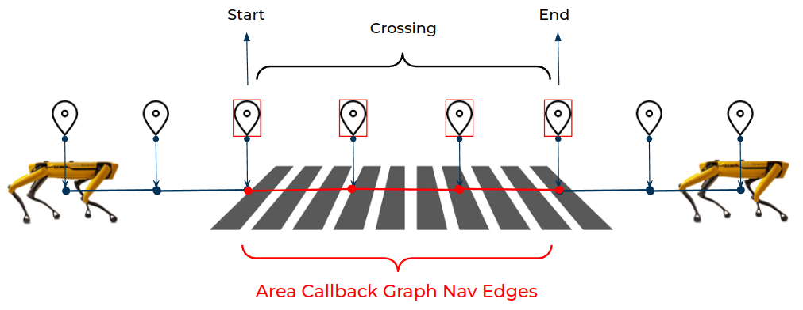

<!--
Copyright (c) 2022 Boston Dynamics, Inc.  All rights reserved.

Downloading, reproducing, distributing or otherwise using the SDK Software
is subject to the terms and conditions of the Boston Dynamics Software
Development Kit License (20191101-BDSDK-SL).
-->

# GraphNav Area Callbacks

## Introduction

Imagine we want Spot to check for forklifts before deciding to cross the road.  If this is part of a mission, we could add a [remote mission callback service](https://dev.bostondynamics.com/python/examples/remote_mission_service/readme) that makes the robot to look left and right before crossing the road, where the robot's vision is connected to a ML model that checks for the forklift on the road.  However, this approach will only execute the callback when it is at that point in the mission.  In cases where the robot reroutes across the crosswalk due to a blockage elsewhere, or the robot decides to return to a dock across the crosswalk when its battery is low, or if the map is used for navigation outside of that mission, the robot will _not_ execute that callback, but will instead walk directly out into the crosswalk, regardless of whether it is safe to do so.

We sometimes want the robot _to execute a sequence of actions anytime the robot is at the certain location in the map_. That is where we can use **Area Callbacks**. An Area Callback allows the user to associate certain areas with specified actions, such as safety checks at the crosswalks, opening doors, and signaling the environment using the lights and sounds.

## How does an Area Callback work?



GraphNav maps are composed of edges and waypoints. These edges are annotated with information that is necessary for the successful navigation of the robot. In addition to information such as detected stairs and different friction coefficient settings for slippery surfaces, annotations can include **Area Callback Regions** so that robot can complete assigned actions every time it visits these edges.  These regions specify which **Area Callback Service** should be called to handle this region.

We may want the robot to do different things for each of the following cases:

- the robot gets to the _start_ of the Area Callback region
- the robot is _crossing_ the Area Callback region
- the robot gets to the _end_ of the Area Callback region

The Area Callback service that is called can specify a _policy_ as to what should GraphNav should do at the start and and of the region.  Options include continuing on, stopping and waiting for the callback to allow it to continue, or delegating control to the callback to perform an action with the robot.

### Example: Crosswalk SpotCAM Light


- the robot gets to the _start_ of the callback (Area Callback region)
- the robot _waits and checks_ its surrounding for the forklift (ML example included as pseudocode), during which it flashes the lights of the SpotCAM slowly.
- once the robot confirms that the crosswalk is clear of forklifts, it starts _crossing_ the region, during which it flashes the lights quickly and brighter.
- the robot reaches the _end_ to turn off the spotcam light and proceed to complete the rest of the mission

For this example, the callback would set a policy to tell the robot to **stop** at the start of the region.  After the callback verified that it is safe to cross, it would change the policy to **continue on** past the start and **continue on** past the end.
The callback would still continue to be updated by graph nav for the duration of the region traversal.

Code implementing this callback can be found in the [python example](../../../python/examples/area_callback/README.md).

## The Life Cycle of an Area Callback

An Area Callback is a gRPC service implementing the `AreaCallbackService` definition.  It responds to RPC calls to describe itself, and to execute actions during navigation.

### Startup

1. The callback service launches and creates the gRPC service.
2. The callback service registers itself with the robot's directory.
3. GraphNav calls the `AreaCallbackInformation` RPC to get information about this callback.

At this point the callback is "live", meaning that it is running an GraphNav has successfully contacted it.

### Recording

When recording a map, the tablet shows Area Callbacks similarly to other actions that can be triggered during a mission.

### Execution

When reaching an Area Callback region, GraphNav will begin calling out to the callback service.
1. **BeginCallback**: This call lets the callback know that the region is beginning, and includes the region id and the route through the region.
2. **UpdateCallback**: This call will include the stage of traversal through the region, and the response to this call sets the current policy for the callback.  This RPC is repeated regularly for the entire traversal of the region, and the callback can update its policy appropriately as things change.
3. **BeginControl**: This call transfers control of the robot to the callback with a Lease.  The callback remains in control until it either changes its policy (via `UpdateCallback`) to no longer request control, or it receives a LeaseUseResult through its lease usage that indicates that some other system is now in control of the robot.
4. **EndCallback**: Called either when leaving the region, or when the response to `UpdateCallback` indicates that the callback is complete.  `UpdateCallback` will no longer be called.  `EndCallback` may also be called early if GraphNav is interrupted and is no longer executing the route.

### Shutdown

When shutting down an Area Callback service, the service should unregister itself from the directory.  This will be handled automatically when using the python `DirectoryRegistrationKeepAlive` helper.

## Creating an Area Callback

Implementing an Area Callback is accomplished through writing and registering an `AreaCallbackService`.  The recommended way to write this service is to inherit from the python helper class `AreaCallbackRegionHandlerBase` and implement the `begin()`, `run()`, and `end()` methods, and then use that class with the `AreaCallbackServiceServicer` and `GrpcServiceRunner` to run the service.  [Python examples](../../../python/examples/area_callback/README.md) are available.

When using the `AreaCallbackServiceServicer`, The normal usage is to pass in  the newly implemented `AreaCallbackRegionHandlerBase` subclass as the `area_callback_builder_fn`.  
This function is called fresh for each region that the callback is used to cross.  As a result, a new instance of the class will be created for each region.  If your use case requires sharing data across regions, you can define a function with the correct interface that will create your subclass with the correct shared data.  Note that the `AreaCallbackRegionHandlerBase` class expects to be recreated fresh for each region, and so it is not recommended to use an `area_callback_builder_fn` that always returns the _same_ instance.

### How to write a callback's `run()`
The majority of work for an `AreaCallbackRegionHandlerBase` subclass will be done in the `run()` method. This function is expected to run for the entire time that the robot is crossing the region.  If the function returns early, that will signal to GraphNav that the callback is complete and no longer needs to be updated.  Helper methods on the base class are provided to allow `run()` to block until a particular event it needs to react to.
 
 - `block_until_arrived_at_start()`
 - `block_until_arrived_at_end()`
 - `block_until_control()`
 - `safe_sleep()`

These methods will return when their particular condition is met.  If the navigation is aborted, they will raise an exception of a subclass of `bosdyn.client.area_callback_region_handler_base.HandlerError`.  These exceptions do not need to be caught, and can be used to exit from `run()`.  If you _do_ catch these exceptions for performing cleanup work, be sure to re-raise them after cleaning up, rather than continuing on in the `run()` method.  It is expected that `run()` will complete quickly once navigation has stopped.  If your use-case requires more time for cleanup operations you should create a thread to do that work and still return from `run()` quickly. Note that `safe_sleep()` works very similar to python's `time.sleep()` except that it will raise one of the above exceptions if the navigation through the region aborts during the sleep.  In addition to these blocking methods, implementations can directly call `check()` which will immediately raise a `HandlerError` if the callback should abort.

In addition to these blocking calls, the `stage()` and `has_control()` helpers can be used to check this information in a non-blocking manner. `stage()` will return the [`bosdyn.api.UpdateCallbackRequest.Stage`](../../../protos/bosdyn/api/proto_reference.html#updatecallbackrequest-stage) enum describing the stage of crossing the region.

Aside from the task-specific work that the callback does, its other responsibility is to communicate a two-part _policy_ to GraphNav as to what actions GraphNav should perform at the start and end of the region.
The recommended way to set and update this policy is to use the helper methods:

 - `stop_at_start()`
 - `control_at_start()`
 - `continue_past_start()`
 - `stop_at_end()`
 - `control_at_end()`
 - `continue_past_end()`

The policy can be initially set in the constructor of the handler, and updated in `run()`. The correct way to continue on after using `stop_at_*` or `control_at_*` is to use `continue_past_*` once the reason for stopping or controlling the robot is complete.
In the [area_callback_crosswalk](../../../python/examples/area_callback/README.md) example, the initial policy is set in the constructor to
```python
        self.stop_at_start()
        self.continue_past_end()
```        
To tell GraphNav that the robot should stop at the start of the region, but after it is past the start, it does not need to stop at the end of the region.
Inside `run()`, after the callback has verified that it is safe to cross, the callback modifies the policy via its helper method:
```python
        self.continue_past_start()
```
After this call, the policy for the callback will be updated to specify that GraphNav does not need to stop at the start, and it also continues the second part of the policy that it does not need to stop at the end of the region.

## Testing an Area Callback


### Test runner script

Once a callback is written, it can be tested using the [area_callback_test_runner](../../../python/examples/area_callback/README.md#running-the-example-without-graph-nav-recording) script.  This script will call the callback directly, without involving GraphNav.  Because GraphNav is not running the callback, certain features may not be available. For example, route and region information will not be filled out in the BeginCallbackRequest, and requesting localization data from GraphNav may not provide meaningful responses.  But for many types of Area Callbacks, this test script provides a simple way to make sure that they are operating as expected and debug failures.

Example usage:
```sh
> python3 examples/area_callback/area_callback_test_runner.py --service my-service-name $ROBOT_IP
```

For detailed instructions of using this runner with an example callback, see the [area callback example](../../../python/examples/area_callback/README.md).

### Test within GraphNav

To test within GraphNav, you will need to record a map that has an Area Callback region which uses your callback service.  For recording a map with Spot's tablet, follow the [Autowalk recording instructions](https://support.bostondynamics.com/s/article/Getting-Started-with-Autowalk#Recording).  Adding an Area Callback to a map during recording is similar to adding an Autowalk action.  After selecting your callback's name from the list, follow the on-screen prompts to define the start and and of a region.

Note that if you pass through the same area again (for example, returning across the same crosswalk on the way back) you will need to add the Area Callback region to the return path during recording as well.

For detailed instructions of recording a map with an example callback, see the [area callback example](../../../python/examples/area_callback/README.md).