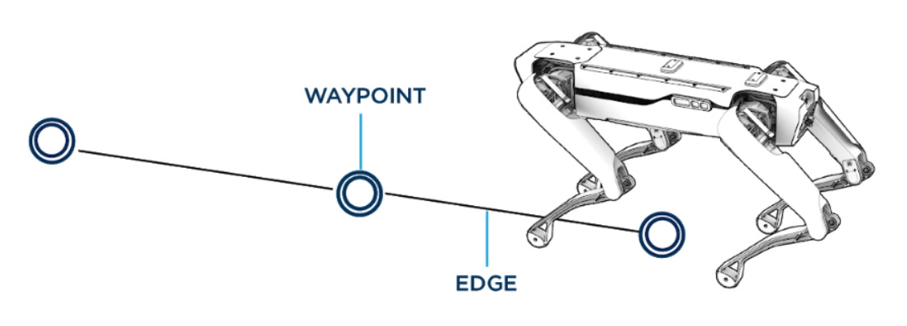

<!--
Copyright (c) 2023 Boston Dynamics, Inc.  All rights reserved.

Downloading, reproducing, distributing or otherwise using the SDK Software
is subject to the terms and conditions of the Boston Dynamics Software
Development Kit License (20191101-BDSDK-SL).
-->

# Autonomy Technical Summary

This summary provides information about the technical implementation and use of the Spot Autonomy SDK to create autonomous behaviors. Boston Dynamics customers are using GraphNav for data gathering and inspection in a variety of industrial and commercial contexts. Localization, maps, graphs and other concepts are explained in the context of autonomy in commercial robotics.

## About GraphNav

Spot features a mapping, localization, and autonomous traverse system collectively known as GraphNav. This capability is being used today by Boston Dynamics customers in the construction, oil and gas, and utilities industries for data gathering and controls monitoring applications.

GraphNav consists of a service that runs on the robot, and an API that developers use to exercise GraphNav capabilities. Robot operators can use a feature called Autowalk in the tablet app that is provided with the robot, which builds upon GraphNav and the mission service to quickly record and replay traversals of an environment while performing useful actions along the way.

## Key concepts

For Spot, the world is represented as a locally consistent graph of waypoints and edges.

### Waypoints

Waypoints represent places in the world that the robot can navigate to. Each waypoint has an associated snapshot of feature data from its location. This data allows the robot to track its position as it moves from waypoint to waypoint.

This feature data is built from the robot's onboard sensors. Areas that are largely empty without much visual texture may not provide good features for the robot to keep track of its location. The waypoint's snapshot of features also includes detected fiducials, which can be attached in the environment to help the robot through difficult areas that do not contain many sensor features.

A mounted LIDAR sensor can augment the onboard sensors. The LIDAR sensor provides much more information for each waypoint and allows the robot to successfully track its location in a wider variety of environments.

### Edges

Edges in the map represent how the robot moves between waypoints. They contain both the relative pose of connected waypoints and any needed parameters describing how the robot should move along that edge. For example, edges that traverse staircases encode information about the stairs in their parameters.

The robot navigates by moving from waypoint to waypoint across edges and is constrained to stay within a corridor defined by each edge.

Graph edges are created in a locally consistent manner. However, there is no "global frame" of the map as a whole. If there are multiple paths through the graph from one waypoint to another, accumulating the transforms along the different paths may lead to different resulting transforms between the two waypoints.

## Mapping the environment

The robot must be manually driven in order to map and record the environment. The resulting graph can be used to localize the robot within the mapped environment. Once recorded, the robot can autonomously traverse the environment within that graph.

Recorded maps do not persist across reboots. To be saved, maps need to be downloaded from Spot. For example, Autowalk downloads the recorded map to the tablet. Recorded maps can be uploaded to and used by other robots. Note: Robot-side caching makes subsequent uploads fast in the common case.

## Initialization and localization

After uploading a new map, the robot must have its localization explicitly set. One way to set the localization is by providing a transform to a specific waypoint.  Another way is to trigger an initialization after positioning the robot near a fiducial that was stored in the prior map during the recording process.

Once the robot's localization has been initialized, the robot will continue to track its position relative to waypoints in the map. The waypoint being used for localizing will switch to adjacent waypoints as the robot moves through the map.

Currently, external pose inputs (such as GPS or beacons) are not supported. However, some Boston Dynamics customers use the Spot API to build additional layers of functionality to assist with initialization or monitoring.

## Lost robots

The robot may become lost while navigating a recorded map. Recovery from this condition is a key aspect of overall system robustness. Operators monitor status messages, observing the state of the robot and checking for a self-reported LOST status. To recover from a lost condition, the robot's localization must be re-initialized. The robot will not attempt to recover from a lost condition on its own.

Lost events depend largely on the environment in which the robot is operating. When the scene has few features or has changed significantly, the localization process produces inaccurate results. Operators can update the map by recording new waypoints with new data and removing old ones.

## Notes on Using Localization Data

The Spot robot's approach to localization differs from other common localization approaches.

For Spot, the world is represented as a graph of waypoints and edges, and the robot's localization is a pose relative to one of those waypoints.  There is no position within a "global" map frame. To determine the robot's position relative to another waypoint, follow the edges along a path from the robot's localization waypoint to the desired waypoint, accumulating the transforms along the way.

The robot will switch its localization from one waypoint to another as the robot navigates through a map, but it does not update the map while it does so. The map is fixed at record time and used from then on as a navigational aid.

The robot's localization estimate is regularly updated from the latest available data. This estimate is computed to produce the best available position estimate, without trying to achieve smooth position or velocity estimates. If your application needs a smooth position estimate or velocity, the best source is the robot-state service and relying on the estimates of the body position and velocity in the "odom" frame.

