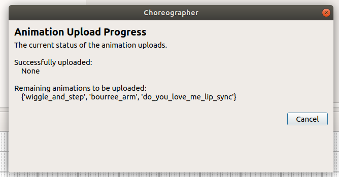

<!--
Copyright (c) 2023 Boston Dynamics, Inc.  All rights reserved.

Downloading, reproducing, distributing or otherwise using the SDK Software
is subject to the terms and conditions of the Boston Dynamics Software
Development Kit License (20191101-BDSDK-SL).
-->


# Animations in Choreography

The Choreography service is a framework for producing scripted motion through a list of customizable, predetermined moves. The sequences can be customized through the track layering system, the parameters associated with each move, and the adjustable beats per minute of the sequences.

While these knobs provide a large amount of flexibility when authoring choreographies, there are scenarios where the exact desired behavior can't fully be expressed through the existing moves. The animation API and associated pipeline provides the ability to further customize the motion.

## Animation pipeline

The animation pipeline allows you to create custom sequences using 3D animation tools and integrate them in Choreographer scripts just like the predefined default moves.

For the intro sequence of the video [Spot’s On It](https://www.youtube.com/watch?v=7atZfX85nd4) we used Autodesk Maya to produce the kaleidoscoping dance moves. Autodesk Maya is a 3D animation software that gives fine-grain control for authoring and editing kinematics trajectories. A range of tool sets can be used with this API.

<iframe width="600" height="400" allow="autoplay"
src="https://www.youtube.com/embed/7atZfX85nd4">
</iframe>


## Text files for representing animations

The base representation for the animation is a human-readable text file. While an animated dance move can be created through 3D animation tools like Autodesk Maya, moves can also be hand-written and edited.

The primary component of the animated move is a set of timestamped key frames which specify the motion of the different tracks (arms, gripper, legs, or body). The timestamped keyframes that specify the animation can be densely spaced, as they would be from a 3D animation software, or they can be very sparse and the robot will interpolate between each key frame.

Additionally, components of the text file enable different animation-specific options. The text file can also specify the different parameters to be associated with the move. A complete overview of the animation file format can be found on the [Animation files for Choreographer](animation_file_specification.md) page.

The animated move text files are parsed into `Animation` protobuf messages and uploaded to the robot. Once the animation is uploaded to the robot, it can be referenced by name within choreographies.

This parsing step (from text file to protobuf message) happens automatically in Choreographer for both animations in the **Animations** directory that matches the directory structure shown below and for animations uploaded by selecting **Load Animated Move** from the File menu.

```
dance_directory/
	choreographer.exe
	animations/
		bourree_arm.cha
		my_animation.cha
```

## Python example script

The `animation_file_to_proto.py` python script file in the `bosdyn-choreography-client` package provides client access to the same functions used by Choreographer to complete the text file to protobuf animation parsing.

## Automatic animation uploading in Choreographer

When Choreographer connects to a robot, it begins uploading all animations automatically to every connected robot. This includes connecting to a robot at startup from command line arguments and connecting to a robot at run time through the connection interface.  Once an animation is uploaded, it is stored on the robot until it is rebooted.  

A dialog indicates the status of all animations being uploaded (example below). If an animation fails to upload, check the terminal where the Choreographer executable is running. It should contain an error message describing why the animation is invalid.



## Choreography logs for animations

To aid in creating animated moves without 3D animation software, we provide choreography logs. These logs can be recorded through the Choreography service at any time, including:

* While driving the robot with the tablet
* Moving the robot arm manually (while it is powered off)
* Running an existing choreography sequence.

A choreography log contains high-rate timestamped key frames with the robot's joint state, foot contacts, and body pose relative to the animation frame (defined by the robot's foot state when the choreography log started). These key frames can be used directly for the animation file's key frames.

There are two ways to create choreography logs. A log is automatically started when a choreography sequence begins and stopped 3 seconds after completing the sequence. The most recent one can be downloaded by clicking the "Download Auto Log" button in Choreographer. Alternatively, you can manually start a log with the "Start Manual Log" button in Choreographer or the StartRecordingState RPC. Once started, the button will transform to say "Stop Manual Log". The log can be terminated by pressing that button or using the StopRecordingState RPC. It can then be downloaded by clicking the "Download Manual Log" button. Either log can be downloaded using the DownloadRobotStateLog RPC with the appropriate log_type set.

The manual log has a maximum of 5 minutes of recording. The robot will only keep the most recent auto log and the most recent manual log saved. As a result, logs must be downloaded immediately to ensure data is not lost.

The log can be downloaded as a [compressed npz file](https://numpy.org/doc/stable/reference/generated/numpy.savez_compressed.html) which tightly packages the data stored as a python dictionary into a serialized object. This is the default format and will be used if no file extension is specified in the file name when saving the log.

Logs can also be downloaded as a text files, which saves the `ChoreographyStateLog` protobuf message as a protobuf-to-text message. To save in this format, include the ".txt" file extension when entering the log name.


The API for the choreography logs is described on the [Choreography Service](choreography_service.md) page and can be accessed via the API in the Choreographer client.
