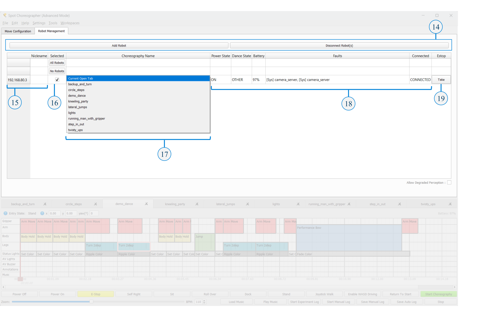

<!--
Copyright (c) 2023 Boston Dynamics, Inc.  All rights reserved.

Downloading, reproducing, distributing or otherwise using the SDK Software
is subject to the terms and conditions of the Boston Dynamics Software
Development Kit License (20191101-BDSDK-SL).
-->

# Boston Dynamics Choreographer Developer Guide

Choreographer is a tool for authoring dances and executing them on robots. It lets you construct choreography sequences from a list of predetermined and customizable moves. You simply have to add moves to the choreography timeline, adjust move parameters as needed, and press "Start Choreography."

## Running Choreographer

Choreographer is an executable program you can download from the [Boston Dynamics Support Center](https://support.bostondynamics.com/s/downloads) (login required).

To run the program, double-click the executable. Choreographer is supported for Windows and Linux platforms. See the [Choreographer Setup](choreographer_setup.md) page for details on downloading and running the Choreographer application.

## Choreography safety

CAUTION: Choreography moves can induce unpredictable or unstable motions in Spot, which may increase the risk of falls, collisions, and other hazards. Observe the following safety precautions:

- Before using choreography, ensure there is at least 3 meters of clearance around Spot in all directions.
- Stay at least 3 meters away from Spot when motors are active. Power off motors before approaching Spot.
- Ensure that all bystanders who are in or may enter the area where choreography is performed are adequately warned and stay at least 3 meters away from Spot at all times.

WARNING: A small percentage of people may experience epileptic seizures or blackouts when exposed to certain light patterns or flashing lights. Choreography moves that include Spot’s status lights or A/V warning system lights could trigger epileptic symptoms or seizures, even in people with no history of photosensitive epilepsy. Observe the following safety precautions:

- When designing choreography routines that include Spot’s status lights or A/V warning system lights, avoid patterns and frequencies known to increase the risk of epileptic symptoms.
- Before using choreography, ensure that all bystanders are adequately warned of any risk of exposure to light patterns and flashing lights from Spot.

WARNING: At higher volumes, prolonged exposure to the noise produced by the buzzer can be harmful. Refer to _Spot Instructions for Use_ available at [Spot Product Safety](https://support.bostondynamics.com/s/spot/product-safety)

### Beginner and advanced modes

Choreographer provides as much design freedom as possible. A consequence of this freedom is that the robot cannot perform some combinations of moves, parameters, and other settings under all conditions.

Beginner mode provides a more controlled experience that is more likely to produce reliable results. This mode has smaller parameter ranges, which allow for less energetic but generally more reliable dances. In beginner mode, some of the more dynamic dance moves have been removed from the Moves List.

By default, Choreographer starts in Beginner mode. You can switch modes using the "Mode" submenu under "Settings", or the `--mode` command line argument. You can also switch to Advanced mode by selecting the **Load in Advanced mode** checkbox in Choreographer's welcome menu.

Note that if you create a dance in Advanced mode, Choreographer may not be able to load it while in Beginner mode if the dance’s parameters are outside its reduced range, or the dance uses moves that have been restricted.

It is highly recommended that Choreographer users start in Beginner mode until they are comfortable using the robot and creating/executing choreographies!

## User interface overview

The Choreographer interface consists of the following important key sections/buttons:

1. **Moves List** - List of predefined stock moves and animation moves sorted by general category such as “Body” or “Transition.”
2. **Move Information** - When you select a move in the Moves List its name and description will appear here.
3. **Move Controls** - Each move can be played on a connected Spot before adding it to a sequence using the "Run Move on Robot" button. Each move also has a button or dropdown to reset or set its parameters to the default options or a preset option. Some moves also have the option to "Get Joints from Robot", which will read a selected robot connection's joint values and apply them to the move's parameter fields.
4. **Move Diagram** - Some moves have an additional visualization view to aid in editing parameters. There are 3 types of visualization tools that may appear here; the 3D Model view for visualizing joint and body positions, the Color Selector for editing and viewing lights move colors, and the Gait Diagram for visualizing the liftoff and touchdown points of a Custom Gait move's swing fields.
5. **Move Parameters** - When you select a customizable move, its adjustable parameters appear in this area. Modify the parameters to adjust how the robot acts during this move. Be sure to test and make sure the robot can handle your parameters! Sometimes more extreme parameters can be too much for the robot during high or low BPM songs, so if a combination of parameters does not work, adjust them until they do for your situation. Hover over the blue question mark near the parameter name to see a description of that parameter.
6. **Dance Previews** - The Dance Previews view will display an estimated 3D and 2D visualization for the sequence(s) of the currently selected tab, or all open tabs. See the [Dance Previews](dance_previews.md) documentation for details.
7. **Timeline Toolbar** - Contains widgets to set a sequence's start position and entrance state and display the lowest battery level of the connected Spot(s). When options are available and set, the set entrance state will determine the state (sit, stand) that Spot will transition to before the sequence starts. The set start position of a sequence will be used for Dance Preview tools (see item 6) and can be useful for user documentation, but this data has no effect on robot playback of a sequence. The Timeline Toolbar can be hidden/shown under "Settings"->"Show Timeline Toolbar".
8. **Dance Tabs** - Each open tab represents an open choreography sequence. Multiple choreography sequences can be opened at once and will appear as different tabs above the timeline.
9. **Dance Timeline** - The timeline shows a representation of your dance over time. Each move is represented with a different block. Move blocks can be edited to set or change move parameters. Blocks can be relocated on the timeline by clicking and dragging or copied and pasted to a new location on the timeline. They can be stretched or shrunk if the move parameters allow it.
10. **Robot Controls** - The robot control buttons are used to send commands to any robots connected to Choreographer, including starting and stopping your dance and powering on or off your robot’s motors. Note: Buttons that trigger commands on robots are disabled when Choreographer is not connected to any robots, or no robots are selected in the robot management table.
11. **Timeline Controls** - Timeline controls allow you to load and play a song for your robot’s dance, manually adjust the BPM of your robot’s moves to match your song, and adjust the zoom level of the timeline. Note: Other music, playback, and timeline options can be found under the "Settings" Menu. Music volume, metronome, sequence start delay and timecode options, along with other playback settings, can be found under “Playback and Music Settings”. Options to change the timeline's units can be found under “Timeline Settings”.
12. **Move Configuration/Robot Management Tabs** - Toggle between the move configuration tab, which displays tools for sequence and move editing; and the robot management tab, which displays all active robot connections and health statistics.
13. **Mode Indicator** - Indicates whether Choreographer is running in “Beginner” or “Advanced” mode. The title provides an indicator to help remember which mode the application is loaded in. Use the "Settings"->"Mode" submenu to switch between modes (open sequences will be closed).
14. **Add/Disconnect Buttons** - Dynamically change which robots are connected and controlled by Choreographer.
15. **Robot Connections** - Lists the Robots connected to Choreographer by their hostname (IP address). Additional columns provide additional information and control options for each Robot's row. A "nickname" or short user provided description can also be provided to help identify robots. This nickname can be typed directly into the table or assigned when connecting robots through the command line before Choreographer starts.
16. **Selected Column** - Select or unselect a connection. The checkbox indicates whether or not the robot will receive commands. Example: When unchecked, pressing robot control buttons such as “Sit” will do nothing to the unselected robot.
17. **Dance Selection Column** - Assign a specific Choreography to a robot connection. The selected option determines which of the open choreographies the robot will execute when the Start Choreography button is clicked (or when started with a timecode cue, if timecode is in use). When "Current Open Tab" is the selected option, that robot connection will execute the sequence currently displayed in the timeline.
18. **Health and Status Columns** - The Power State, Dance State, Battery, Faults, and Connected Columns display information about the row's robot connection.
19. **EStop Column** - If another system was controlling the robot and still controls the EStop, Choreographer will display the EStop Column. Pressing the "Take" button will let Choreographer take control of the EStop. The robot will power off during this process.

## Tracks

Choreographer has several tracks, each describing some aspect of Spot's behavior.

- The Legs, Body, Arm, and Gripper tracks describe the physical motion of the robot.
- The Lights track describes the behavior of the lights near Spot's front cameras.
- The AV Lights and AV Buzzer tracks control the lights and buzzer for Spots with AV hardware.
- The Annotations track modifies the behavior of the other tracks.
- The Music track shows the audio to be played by the Choreographer application itself (not played by the robot).

All dance moves control one or more tracks. Moves that control any of the same tracks cannot run simultaneously. Moves that use different tracks can be run simultaneously. This modular approach to defining behavior helps make it easy to produce a wide variety of behaviors from a manageable number of component moves.

## Slices, beats, BPM, and measures

Choreographer divides time into slices represented by the thin dashed vertical lines in the timeline. All moves take an integer number of slices. For convenience, we consider 4 slices a beat and adjust the pace of the dance by setting the BPM (Beats Per Minute) in the **Music Controls** bar. Beats are delineated by the medium-thickness vertical lines on the timeline. Every 4th beat is numbered and marked with a thick vertical line.

For a song with a 4/4 time signature, a slice corresponds to a 16th-note, a beat to a quarter note, and the thicker lines to a measure or whole note. For songs that are not 4/4, the thicker lines can be ignored.

Some moves take a fixed number of slices. Other moves take a fixed amount of time so the number of slices will depend on the BPM. Some moves are adjustable, but of those some have maximum or minimum durations. For example, this "Running Man" move has been extended from the default number of slices. It controls the legs track for the first 16 slices (4 beats; 1 measure) of this sequence:

## Dance timeline

The dance timeline portrays the choreography sequence on a grid. The rows of the grid represent the various Tracks or aspects of the behavior (see Tracks section above). Time is represented from left to right with the columns representing individual slices (see Slices, Beats, BPM, and Measures section above).

A dance sequence consists of any number of dance moves. Each move will be represented on the timeline by a rectangle. The left and right edges of the rectangle give the start and stop time of the move, so the width represents the duration. The vertical extent of the rectangle shows which tracks the move controls.

Moves that are stacked vertically occur simultaneously, each controlling a different aspect of the behavior to produce some combination. Moves that are arrayed horizontally occur in sequence, one after the other.

## Adding moves

There are different methods for adding moves to the timeline.

- You can single click the move in the Moves List. This opens the move name, description, and parameters in the **Move Configuration** tab, but does not add it to the timeline.
- Use the up and down arrow keys to navigate between different moves in the Moves List once one is selected. While you have a move selected in the Moves List, you can adjust its parameters in the **Move Parameters** section.

Once the parameters are adjusted to the desired values, the move can be added to the dance timeline by any of the following methods:

1. Pressing the Add button beneath the moves list. This appends the move to the end of the timeline with any parameter changes.
2. Double-clicking the move name in the Moves List. This appends the move to the end of the timeline with any parameter changes.
3. Click the toggle to go from **Append** to **Insert** (under the Moves List). In **Insert** mode, hovering over the timeline shows a ghost move block. Clicking the block adds the move to the timeline with any parameter changes. Hit Esc to exit insert mode or press the toggle again to return to **Append** mode

   

4. Drag a move from the Moves List into the timeline with any parameter changes. As with insert mode, a ghost move block appears to help position and drop the move onto the timeline.

## Modifying move blocks

Once a move is added to your timeline, it can be dragged left or right to the appropriate time. Some moves can be resized by clicking and dragging the edge of the move block. Hover over the edge of the move: If it can be resized the cursor changes to an arrow. The move automatically enforces any requirements it has for minimum or maximum duration. Note: To help with longer moves the timeline can be zoomed in/out using the Zoom bar below it.

## Modifying move parameters

To modify move parameters, click the move block on the timeline to select it. Modify the move parameters that appear in the **Move Parameters** section. Each move has different parameters. Some moves are not configurable.

Refer to the [Choreography moves reference](move_reference.md) for descriptions of each move and move parameter. Numerical parameters can be modified by editing the text field, adjusting its slider, or pressing the Up or Down arrow buttons. Boolean parameters can be changed by checking or unchecking the box. Enum parameters are changed by choosing new values in the drop-down menu.

Move parameters can be modified before being added to the timeline. Select a move in the **Moves List** to edit the move parameters. When the move is added to the timeline, it will contain these parameter modifications.

## Selecting multiple moves

To select multiple moves, click an empty space in the timeline and then drag over move blocks to select them. To deselect, click an empty space on the timeline. Note that you can only edit the parameters for one move at a time.

## Copying, pasting, and deleting moves

Selected moves can be copied and pasted to locations on the timeline. Moves pasted into a choreography sequence are positioned as close as possible to the original move’s location. Moves can be copied and pasted between different open dance tabs.

Right-click a single move or group of selected moves and choose **Clone** to copy the selected moves into the currently opened dance. These moves are inserted as close as they can fit into your choreography sequence.

To delete moves, select one or more moves and press Delete or Backspace or select Delete on the Edit menu, or right-click on a move and select Delete on the Edit menu.

## Loading music

To test a choreography with real songs, use the music player included with Choreographer to load and sync music to your dance.

To use a music clip, press the **Load Music** button in the Music Controls section of Choreographer. This opens a music file to be played with the dance. Note that a reference to this file will be saved in your Choreographer Save File, so you will only need to do this process once per save.

Once a dance is loaded, preview it by clicking **Play Music**. Stop previewing by clicking **Stop**. The **Play Music** button does not initiate a dance on any connected robots. Music will play from the computer running Choreographer. Music volume can be adjusted using the slider at the bottom in the music controls section.

After loading a dance, you must manually set the BPM (Beats Per Minute) of your dance to synchronize with the song. Online tools are available to help you calculate the BPM of any song. Choreographer includes a metronome to calculate a song's BMP.

## Red slider

The red slider defines where within the sequence Spot should begin execution. It also indicates when the audio begins playing. The red slider defaults to the beginning but can be moved to start from the middle. This can be useful for testing just a portion of a long sequence.

Any moves that start before the slider will be skipped even if they are scheduled to complete after the slider. The line drawn at the center of the slider shows the location of the slider on the timeline, as shown in the image below. The slider can be moved by dragging it to the desired location, or double-clicking the desired location on the timeline.

The red slider can also be used with the Dance Preview view to scrub through the previsualization. See [Dance Previews](dance_previews.md).

## Running individual moves

With a robot connected to the Choreographer, you can run individual dance moves before adding them to the timeline. Select a move from the **Moves List** and modify the move parameters. Press **Run Move on Robot** to perform the single move you have selected. This is a great way to test out parameter modifications before adding a move to your timeline.

## Performing Choreography sequences

Click **Start Choreography** in the Robot Controls bar to upload the choreography that is currently selected in the **Robot Management** tab. By default, this is the currently open choreography tab. The robot starts to execute the routine with music at the same. Having a short lead-in time (default 3 seconds) is recommended to ensure that the music and all dance routine(s) begin at the same time. This start delay can be adjusted in the "Playback and Music Settings" menu under "Settings".

Note: If the robot is not started in the proper position (sprawl, sit, stand), it will need a long enough start delay to transition into the correct entrance state or the timing will be out of sync with other robot(s) or the music due to a late start.

To stop a choreography routine (or stop the music from playing if no robot is connected/executing a choreography) click **Stop** to freeze the robot with all four feet on the ground and stop the music. In an emergency, click **E-Stop** or **Power Off** instead.

## Saving and loading Choreography files

To save a Choreographer routine, press Ctrl+S or go select Save from the File menu. Your routine will be saved in protobuf text format, which you can then open and easily read with your own scripts. To load a Choreographer file press Ctrl+L or select Load Choreography from the File menu.

To append an existing choreography sequence to the end of your current dance, select Append Choreography from the File menu, or press Ctrl+E. Choreographer automatically adds all of the move blocks from the saved file to the end of your current routine. This is particularly useful if you want to construct a choreography sequence from smaller pre-made sequences.

## Keyboard controls

Choreographer has specific hotkey mappings available for common editing actions. Access the table of available hotkeys by selecting Hotkeys Documentation from the Help menu.

### Sequence editing

| Key                           | Function                                                                                                                                                                         |
| ----------------------------- | -------------------------------------------------------------------------------------------------------------------------------------------------------------------------------- |
| i                             | Enter insert mode                                                                                                                                                                |
| Esc                           | Exit insert mode                                                                                                                                                                 |
| p                             | Play music                                                                                                                                                                       |
| Shift + Click                 | Select multiple moves, adding each one to the selected group when clicked.                                                                                                       |
| Left/Right Arrow Keys         | Nudge a move (or group of selected moves) left/right by one slice in the timeline. Cannot cross other moves with nudging; this can only be done when dragging a move (or group). |
| Shift + Left/Right Arrow Keys | Expand a move on the left/right side by one slice if possible. This only works when a single move is selected (and not a group of moves).                                        |
| Ctrl + Left/Right Arrow Keys  | Shrink a move on the left/right side by one slice if possible. This only works when a single move is selected (and not a group of moves).                                        |
| Ctrl+C                        | Copy the move (or group of selected moves).                                                                                                                                      |
| Ctrl+V                        | Paste the copied move (or group of selected moves).                                                                                                                              |

### Robot control

| Key   | Function                               |
| ----- | -------------------------------------- |
| Space | Stop the robot (and music, if playing) |
| k     | Power on the robot.                    |
| l     | Power off the robot.                   |
| y     | Stand the robot up.                    |
| x     | Start the choreography.                |
| [     | Sit the robot down.                    |
| ]     | Self-right the robot.                  |
| v     | Enable WASD driving.                   |
| b     | Enable joystick mode.                  |

### WASD driving mode

| Key | Function       |
| --- | -------------- |
| w   | Walk forward   |
| a   | Sidestep left  |
| s   | Walk backward  |
| d   | Sidestep right |
| q   | Turn left      |
| e   | Turn right     |

## Command-line arguments

Command line options for starting Choreographer from the command line:

| Argument                          | Description                                                                                                                                   |
| --------------------------------- | --------------------------------------------------------------------------------------------------------------------------------------------- |
| `-h, --help`                      | Print this information to the console.                                                                                                        |
| `--hostname HOSTNAME`             | Hostname or address of robot(s), e.g. "192.168.80.3"                                                                                          |
| `--username USERNAME`             | User name(s) of account to get credentials for.                                                                                               |
| `--password PASSWORD`             | Password(s) to get credentials for.                                                                                                           |
| `--nickname NICKNAME`             | Nickname(s) to help remember which robot is which.                                                                                            |
| `--connect CONNECT`               | Connect to a robot with the given hostname, username, password, and optional nickname. Usage: `--connect=HOSTNAME,USERNAME,PASSWORD,NICKNAME` |
| `--dance-filepath DANCE_FILEPATH` | Filepath to the dance script to load.                                                                                                         |
| `--mode {beginner,advanced}`      | Load Choreographer in the selected mode.                                                                                                      |
| `--delay DELAY`                   | How long to delay before starting a dance when using the "Start Choreography" button.                                                         |
| `--silent`                        | Choreographer will print fewer error messages to the console.                                                                                 |
| `--obs-padding OBS_PADDING`       | The distance(meters) the robot will stay from any obstacle (including other robots) when returning to the start position.                     |
| `--estop-timeout ESTOP_TIMEOUT`   | How long (in seconds) should the robot continue to move after it loses communication with Choreographer.                                      |

Command line hostname, username, password and (optional) nickname arguments can be especially convenient when repeatedly connecting to the same large set of robots. The following example connects to three different robots using three different sets of login credentials.

In Linux:

`./[CHOREOGRAPHER_FILEPATH] --hostname hn1 --username un1 --password pw1 --hostname hn2 --username un2 --password pw2 --hostname hn3 --username un3 --password pw3`

In Windows:

`[CHOREOGRAPHER_FILEPATH] --hostname hn1 --username un1 --password pw1 --hostname hn2 --username un2 --password pw2 --hostname hn3 --username un3 --password pw3`
