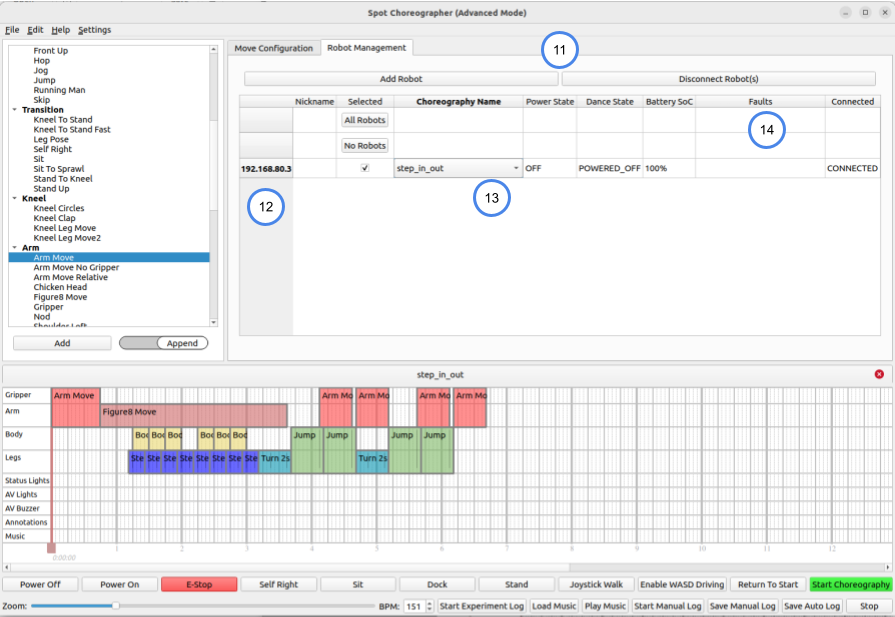
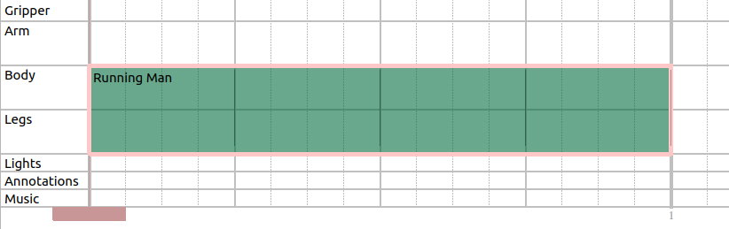
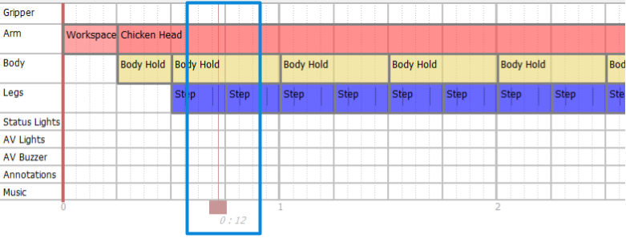

<!--
Copyright (c) 2021 Boston Dynamics, Inc.  All rights reserved.

Downloading, reproducing, distributing or otherwise using the SDK Software
is subject to the terms and conditions of the Boston Dynamics Software
Development Kit License (20191101-BDSDK-SL).
-->

# Boston Dynamics Choreographer User Guide

Choreographer is a tool for authoring dances and executing them on robots. It lets you construct choreography sequences from a list of predetermined and customizable moves. You simply have to add moves to the choreography timeline, adjust their parameters to your liking, and press “Start Choreography”.

## Running Choreographer

Choreographer is an executable program we will provide you via a download link at the [Support Center](https://support.bostondynamics.com/). To run the program, simply download it at the link we will provide you, and execute it. Note that the Choreographer executable is only available for Windows and Linux.

If you wish to run Choreographer connected to a Spot, please see the “Connecting Robots to Choreographer” section.

## Choreography Safety

When testing your choreography sequence on a robot, always keep in mind basic safety procedures. Make sure there is plenty of space around your Spot, keep all Spots at least two meters apart from each other, and be sure that neither you nor anyone else approach the dancing Spot. Never approach your Spot unless its motors have been powered off.

### Beginner vs Advanced Mode

One of the goals for Choreographer is to provide a tool that gives the user as much freedom as they could possibly want. As such, you will be able to find combinations of moves, parameters, and BPM that Spot cannot reliably perform under all conditions.

Beginner mode provides a more controlled experience that will be more likely to yield reliable results. This mode has smaller parameter ranges which allows for less energetic but generally more reliable dances. Additionally, it has some of the more dynamic dance moves removed from the Moves List and does not provide any support for animated dance moves.

By default, in the 2.4 released Choreographer executable, it will automatically load in Beginner mode. You can enable it by using the `--restricted` argument when starting Choreographer from the command line. As well, if you are in Advanced mode and go to the Settings menu and select load in Beginner mode, it will take effect and load in this mode next time you open Choreographer.

You can switch to Advanced mode by selecting the load in Advanced mode checkbox in Choreographer's welcome menu, or navigating to "Settings" and selecting load in Advanced mode (which will take effect next time you open Choreographer). Note that if you create a dance in Advanced mode, Choreographer may not be able to load it while in Beginner mode if the dance’s parameters are outside its reduced range.

It is highly recommended that Choreographer users start in Beginner mode until they are comfortable using the robot and creating/executing choreographies!

## Interface Overview

 

The Choreographer interface consists of the following important key sections/buttons:

1) **Moves List** - Here you can find all of our predefined moves (both stock moves and animation moves), sorted by general category, such as "Body" or "Transition".
1) **Dance Timeline** - This is the main area of the Choreographer, and it shows a representation of your dance over time. Each move is a different block, which can be clicked to edit the parameters, dragged around, copy-pasted, or potentially stretched or shrunk if the move parameter's allow it.
1) **Dance Tabs** - Multiple choreography sequences can be opened at once, and will appear as different tabs above the timeline.
1) **Move Name** - When you select a move in the Moves List, its name and description will appear here.
1) **Robot Preview** - This section gives you a preview of the robot’s body and arm during your selected move. Note that this section only appears for select moves that directly position the body of the robot or moves which control the arm.
1) **Move Parameters** - When you select a move that is customizable, its different, adjustable parameters will appear here. You can modify them to adjust how the robot will act during this move. Be sure to test and make sure the robot can handle your parameters! Sometimes more extreme parameters can be too much for the robot during high or low BPM songs, so if a combination of parameters don’t work, adjust them until they do for your situation! Near each parameter's name, a blue question mark may appear which will provide a description of the specific parameter if you hover the mouse over it.
1) **Robot Controls** - The robot controls are a row of buttons you can use to send commands to any robots connected to Choreographer, including starting and stopping your dance, and powering on or off your robot’s motors. (Note, this row is disabled when you are not connected to any robots, as shown above.)
1) **Music Controls** - This row of controls lets you load and play a song to play during your robot’s dance, manually adjust the BPM of your robot’s moves to match that of your song or the volume of the music, and stop the music and the robot's dancing if one is connected.
1) **Move Configuration/Robot Management Tabs** - Tabs to toggle between the move configuration tab (displays move name and parameters), and the robot management tab (displays all active robot connections and health statistics).
1) **Mode Indicator** - Choreographer has "Beginner" and "Advanced" modes. The title provides an indicator to help remember which mode the application is loaded in. There is an option in the "Settings" menu to switch modes when the application is next re-opened.
1) **Add/Disconnect Buttons** - Buttons which enable dynamically changing which robots are connected and controlled by Choreographer.
1) **Robot Connections** - Each row indicates the robot hostname and other information regarding the robot currently connected to Choreographer. The checkbox indicates whether or not the robot is being controlled (e.g. when unchecked, pressing robot control buttons like "sit" will do nothing to the unselected robot).
1) **Dance Selector** - Drop down menu to choose which of the open choreographies the robot will execute when both checked (in the "Selected" column) and start choreography is clicked.
1) **Health Stats** - Columns which show the power state (on/off), battery state of charge, and any faults for each robot.

## Choreography File Basics

Spot choreography sequence files consist mainly of a sequence of predefined moves that can be arranged in the timeline of Choreographer. Each move can contain any combination of Gripper, Arm, Body, Legs, Lights or multiple body parts that it affects, and will appear on the appropriate track(s) within the timeline. You can mix and match so that the legs can do a move such as Step while the body does a move such as Rotate Body. However, moves may not overlap on any tracks.

All choreography files are assumed to be 4/4 signatures in the Choreographer UI. The timeline is broken up into quarter notes (thick vertical lines), each of which is broken up by four lighter vertical lines. Each of those 16th-note intervals is known as a Slice. All moves must be a whole number of slices, and each move must begin and end at a slice boundary. How many slices a move takes is dependent on the BPM (Beats Per Minute) of your song. See Loading Music for more information on how to change your BPM.

All choreography files are assumed to be 4/4 signatures in the Choreographer UI. The timeline is broken up into quarter notes (thick, vertical lines labeled with the note number). Each quarter note is further divided into four beats (light grey, vertical lines). Then, each 16th-note interval is known as a slice (dotted, vertical lines). Specifically, Choreographer considers there to be 4 slices per every beat, and 4 beats per every note. All moves must be a whole number of slices, and each move must begin and end at a slice boundary. The number of slices a move will take is dependent on the BPM (beats per minute) of your song. This can be adjusted in the "Music Controls" bar; see the Loading Music section for more information.

For example, this "Running Man" move has been extended from the default number of slices, and will now control the legs track for the first 12 slices of this script:

## Adding Moves

There are multiple different methods to add moves to the timeline. You can single click the move in the Moves List, which will open the name, description, and parameters of the move in the Move Configuration Tab, but will not add it to the timeline. As well, the up and down arrow keys will navigate between different moves in the Moves List once one is selected. While you have a move selected in the Moves List, you can adjust its parameters in the Move Parameters section.

Once the parameters are adjusted to the desired values, the move can be added to the dance timeline by any of the following methods:
1. Pressing the Add button beneath the moves list, which appends the move to the end of the timeline with any parameter changes.
2. Double clicking the move name in the Moves List, which appends the move to the end of the timeline with any parameter changes.
3. Click the toggle to go from "Append" to "Insert" (under the Moves List). In "insert" mode, hovering the mouse of the timeline will show a "ghost" move block, which when clicked will be added to the timeline with any parameter changes. To exit "insert" mode, hit the escape key on the keyboard or press the toggle again to return to "append" mode.

4. Drag a move from the Moves List into the timeline with any parameter changes. Like insert mode, a ghost move block will appear and the mouse can be moved to determine the location to drop and insert the move into the timeline.

## Modifying Move Blocks

Once a move is added to your Timeline, it can be dragged left and right to the appropriate time. Some, but not all, of the moves can be resized by clicking and dragging on the edge of the move’s block; hover the mouse over the edge of the move and if it can be resized it will show an arrow instead of the regular mouse. The move will automatically enforce any requirements it has about minimum or maximum duration. Note, to help you with longer moves, the Timeline can be zoomed in/out using the Zoom bar below it.

## Modifying Move Parameters

To modify a move’s parameters, simply click it on the timeline to select it, and modify the parameters that appear in the Move Parameters section. Each move has different parameters, and some may not have any parameters at all. Please see the [Moves Reference Guide](move_reference.md) for descriptions of what each parameter does for each move type. Each numerical parameter can be modified by editing its text field, adjusting its slider, or pressing the Up or Down arrow buttons. Boolean parameters can be changed by checking or unchecking the box. Enum parameters are changed by choosing new values in the drop down menu.

A move's parameters can be modified before it is added to the timeline as well. Once the move is selected in the Moves List, the parameters can be edited and when the move is ultimately added to the timeline, it will contain these parameter modifications.

## Robot Preview

The Robot Preview pane will appear for certain applicable moves. You can adjust the camera position and angle of that pane in order to get a better view of your move. Use the scroll wheel to zoom in and out, left click and drag to pan the camera, and right click and drag to rotate it around the preview robot.

## Selecting Multiple Moves

To select multiple moves, click on empty space in the Timeline view, and then drag over the moves that should be selected. To unselect all the moves, click in empty space on the Time view. Note that you cannot edit the parameters of multiple moves at once, but you can drag them around the timeline, delete them all, or copy and paste them all.

## Copy / Pasting / Deleting Moves

When you have any number of moves selected, you can Copy (Ctrl+C, Edit->Copy) and Paste (Ctrl+V or Edit->Paste) them as you wish. When you paste moves into a choreography sequence, the new moves will attempt to appear as close as they can to the original move’s location, moving right on the timeline until they can find a place they fit. Moves can be copied and pasted between different open dance tabs.

You can also right click a single move or move grouping and choose “Clone” to instantly create a copy of your selected moves in the currently opened dance, which will also be inserted as close as they can fit into your choreography sequence.

To delete moves, simply select them and either press the Delete or Backspace keys, choose Edit->Delete in the top-left menus, or right click and select "Delete".

## Loading Music

In order to let you easily test your choreography against real songs, we have included a music player that can load and sync music to your dance. To use it, simply press the “Load Music” button in the Music Controls section of the Choreographer. This will open a music file to be played alongside the dance. Note that a reference to this file will be saved in your Choreographer Save File, so you will only need to do this process once per save.

Once a dance is loaded, you can preview it by hitting the “Play Music” button, and stop it with the “Stop” button. The “Play Music” button will not initiate a dance on any connected robots. The music will play from the computer running Choreographer and the music volume can be adjusted using the slider at the bottom in the music controls section.

After loading a dance, you must manually set the BPM (Beats Per Minute) of your dance to that of the song. There are many online tools to help you calculate the BPM of any song, but we also provide a metronome to help you with that process if you choose to do it manually.

## Red Slider

The red slider allows the user to start the dance at a different location than the beginning; the dance will start at the move associated with the closest slice to the slider's location and the music will start at the timestamp within the song associated with the slider's location. The line drawn at the center of the sliders show exactly where in the timeline the slider's location is, as shown in the image below. It can be moved by clicking on the colored boxes and dragging it to the desired location.

## Previewing Moves

If you have a robot connected to the Choreographer, you can preview moves before adding them to the Timeline. Simply select a move from the Moves List, modify its parameters however you want, and press the Preview Move button. This will cancel all current dances and actions on the robot, and it will perform the one move you have selected. This is a great way to test out parameter modifications before adding it to your move sequence.

## Performing Choreography Sequences

The “Start Choreography” button in the Robot Controls bar will upload the choreography (whichever is selected in the drop down for the robot in the Robot Management Tab - by default, this is the current open choreography tab) to the robot, and then send a command to execute the routine to the robot while beginning the music at the same starting time specified in the choreography sent to the robot. There will be at least a three second delay (programmed into the button) to ensure that the music and routine can begin at the same time on the robot. To adjust this delay, the command line argument `--delay DELAY_IN_SECONDS` can be passed when starting the Choreographer application from the command line.

Note, if the robot is not started in the proper position (sprawl, sit, stand) and has to automatically make transitions to be ready for the first move in the routine, then the timing of the music starting and the choreography sequence starting will likely be incorrect.

To stop the choreography routine (or just stop the music from playing if no robot is connected/executing a choreography), the “Stop” button will freeze the robot with all four feet on the ground and stop the music. In an emergency, use "E-Stop" or "Power Off" buttons instead.

## Saving and Loading Choreography Files

You can save and load Choreographer routines that you create. To save your current file, either press Ctrl+S or go to File->Save. Your routine will be saved in protobuf text format, which you can then open and easily read with your own scripts if you wish. To then load a file you’ve saved, press Ctrl+L or go to File->Load Choreography.

Additionally, you can append an existing choreography sequence at the end of your current dance by going to File->Append Choreography (Ctrl+E), which will automatically add all of the move blocks from that file to the end of your current routine. This is particularly useful if you want to construct a choreography sequence from smaller premade sequences.

## Keyboard Controls

Choreographer has specific hotkey mappings available to make common actions used when editing choreographies more easily accessible While using Choreographer, a table of available keystrokes can be accessed as a reminder using the menus Help->Hotkeys Documentation.

Key | Function
----|-----
i | Enter "insert" mode
Esc | Exit "insert" mode
p | Play music
Shift + Click | Select multiple moves, adding each one to the selected group when clicked.
Left/Right Arrow Keys | Nudge a move (or group of selected moves) left/right by one slice in the timeline. Cannot cross other moves with nudging; this can only be done when dragging a move (or group).
Shift + Left/Right Arrow Keys | Expand a move on the left/right side by one slice if possible. This only works when a single move is selected (and not a group of moves).
Ctrl + Left/Right Arrow Keys | Shrink a move on the left/right side by one slice if possible. This only works when a single move is selected (and not a group of moves).
Ctrl+C | Copy the move (or group of selected moves).
Ctrl+V | Paste the copied move (or group of selected moves).
