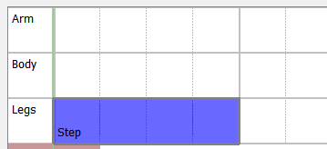
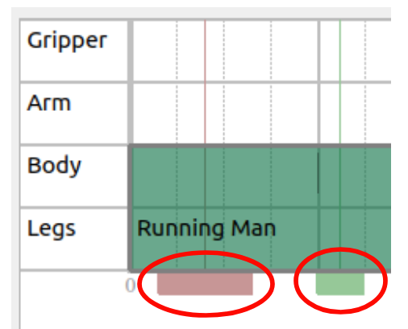
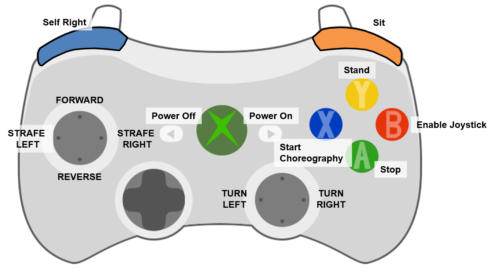

<!--
Copyright (c) 2021 Boston Dynamics, Inc.  All rights reserved.

Downloading, reproducing, distributing or otherwise using the SDK Software
is subject to the terms and conditions of the Boston Dynamics Software
Development Kit License (20191101-BDSDK-SL).
-->

# Boston Dynamics Choreographer User Guide

Choreographer is a tool for authoring dances and executing them on robots. It lets you construct choreography sequences from a list of predetermined and customizable moves. You simply have to add moves to the choreography timeline, adjust their parameters to your liking, and press “Start Choreography”.

## Running Choreographer

Choreographer is an executable program we will provide you via a download link at the [Support Center](https://support.bostondynamics.com/). To run the program, simply download it at the link we will provide you, and execute it. Note that the Choreographer executable is only available for Windows. If you wish to run Choreographer from Mac or Linux, we will need to provide you with Python wheels and installation instructions (advanced usage only). Please contact us if that is the case.

If you wish to run Choreographer connected to a Spot, please see the “Connecting Robots to Choreographer” section.

## Choreography Safety

When testing your choreography sequence on a robot, always keep in mind basic safety procedures . Make sure there is plenty of space around your Spot, keep all Spots at least two meters apart from each other, and be sure that neither you nor anyone else approach the dancing Spot. Never approach your Spot unless its motors have been powered off.

## Interface Overview

The Choreographer interface consists of seven main areas. They are:

1) **Moves List** - Here you can find all of our predefined moves, sorted by general category.
1) **Dance Timeline** - This is the main area of the Choreographer, and it shows a representation of your dance over time. Each move is a different block, which can be clicked to edit the parameters, dragged around, copy-pasted, or potentially stretched or shrunk if the move parameter's allow it.
1) **Robot Controls** - The robot controls are a row of buttons you can use to send commands to any robots connected to Choreographer, including starting and stopping your dance, and powering on or off your robot’s motors. (Note, this row is disabled when you are not connected to any robots, as shown above.)
1) **Move Name** - When you select a move in the Moves List, its name and description will appear here.
1) **Robot Preview** - This section gives you a preview of the robot’s body and arm during your selected move. Note that this section only appears for select moves that directly position the body of the robot or moves which control the arm.
1) **Move Parameters** - When you select a move that is customizable, its different, adjustable parameters will appear here. You can modify them to adjust how the robot will act during this move. Be sure to test to make sure the robot can handle your parameters! Sometimes more extreme parameters can be too much for the robot during high or low BPM songs, so if a combination of parameters don’t work, adjust them until they do for your situation! Near each parameter's name, a blue question mark may appear which will provide a description of the specific parameter.
1) **Music Controls** - This row of controls lets you load and play a song to play during your robot’s dance, manually adjust the BPM of your robot’s moves to match that of your song or the volume of the music, and stop the music and the robot's dancing if one is connected.

## Choreography File Basics

Spot choreography files consist mainly of a sequence of predefined moves that can be arranged in the timeline of the choreographer (Interface #2). Each move can contain any combination of Gripper, Arm, Body, Legs, or multiple body parts that it affects, and will appear on the appropriate track(s) within the timeline. You can mix and match so that the legs can do a move such as Step while the body does a move such as Rotate Body. However, moves may not overlap on any tracks.

All choreography files are assumed to be 4/4 signatures in the Choreographer UI. The timeline is broken up into quarter notes (thick vertical lines), each of which is broken up by four lighter vertical lines. Each of those 16th-note intervals is known as a Slice. All moves must be a whole number of slices, and each move must begin and end at a slice boundary. How many slices a move takes is dependent on the BPM (Beats Per Minute) of your song. See Loading Music for more information on how to change your BPM.

All choreography files are assumed to be 4/4 signatures in the Choreographer UI. The timeline is broken up into quarter notes (thick, vertical lines labeled with the note number). Each quarter note is further divided into four beats (light grey, vertical lines). Then, each 16th-note interval is known as a slice (dotted, vertical lines). Specifically, Choreographer considers there to be 4 slices per every beat, and 4 beats per every note. All moves must be a whole number of slices, and each move must begin and end at a slice boundary. The number of slices a move will take is dependent on the BPM (beats per minute) of your song. This can be adjusted in the "Music Controls" bar; see the Loading Music section for more information.

For example, this "Running Man" move has been extended from the default number of slices, and will now control the legs track for the first 12 slices of this script:

## Adding Moves

To add a move to the timeline, there are multiple different methods. You can single click the move in the Moves List, which will open the parameters of the move, but not add it to the timeline. As well, the up and down arrow keys will navigate between different moves in the Moves List once one is selected. While you have a move selected in the Moves List, you can adjust its parameters in the Move Parameters section.

Once the parameters are adjusted to the desired values, the move can be added to the dance timeline by either 1) pressing the Add button beneath the moves list, 2) double clicking the move name in the Moves List, or 3) entering Insert Mode (described below). If you adjust a move’s parameters and then add it to the timeline, the new Move block that appears in the timeline will have those same modified parameters.

The icon , in the upper left of the Timeline view, will enter Insert Mode when pressed. When in Insert Mode, you can click anywhere in the Timeline to add the selected move (with any of the parameter modifications you have made) to the Timeline at that point. To then exit Insert Mode and re-enter the default Choreographer mode, press the  button or hit the escape key on the keyboard.

## Modifying Move Blocks

Once a move is added to your Timeline, it can be dragged left and right to the appropriate time. Some, but not all, of the moves can be resized by clicking and dragging on the edge of the move’s block. The move will automatically enforce any requirements it has about minimum or maximum duration. Note, to help you with longer moves, the Timeline can be zoomed in/out using the Zoom bar above it.

## Modifying Move Parameters

To modify a move’s parameters, simply click it on the timeline to select it, and modify the parameters that appear in the Move Parameters section. Each move has different parameters, and some may not have any parameters at all. Please see the [Moves Reference Guide](move_reference.md) for descriptions of what each parameter does for each move type. Each numerical parameter can be modified by editing its text field, adjusting its slider, or pressing the Up or Down arrow buttons. Boolean parameters can be changed by checking or unchecking the box. Enum parameters are changed by choosing new values in the drop down menu.

## Robot Preview

The Robot Preview pane will appear for certain applicable moves. You can adjust the camera position and angle of that pane in order to get a better view of your move. Use the scroll wheel to zoom in and out, left click and drag to pan the camera, and right click and drag to rotate it around the preview robot.

## Selecting Multiple Moves

To select multiple moves, click on empty space in the Timeline view, and then drag over the moves that should be selected. To unselect all the moves, click in empty space on the Time view. Note that you cannot edit the parameters of multiple moves at once, but you can drag them around the timeline or copy and paste them all.

## Copy / Pasting / Deleting Moves

When you have any number of moves selected, you can Copy (Ctrl+C or Edit->Copy) and Paste (Ctrl+V or Edit->Paste) them as you wish. When you paste moves into your choreography sequence, the new moves will attempt to appear as close as they can to the original move’s location, moving right on the timeline until they can find a place they fit. You can also right click them and choose “Clone” to instantly create a copy of your selected moves, which will also be inserted as close as they can fit into your choreography sequence.

To delete moves, simply select them and either press Delete or Backspace, or choose Edit->Delete in the menus.

## Loading Music

In order to let you easily test your choreography against real songs, we have included a music player that can load and sync music to your dance. To use it, simply press the “Load Music” button in the Music Controls section of the Choreographer. This will open a music file to be played alongside the dance. Note that a reference to this file will be saved in your Choreographer Save File, so you will only need to do this process once per save.

Once a dance is loaded, you can preview it by hitting the “Play Music” button, and stop it with the “Stop” button. The “Play Music” button will not initiate a dance on any connected robots. The music will play from the computer running Choreographer and the music volume can be adjusted using the slider at the bottom in the music controls section.

After loading a dance, you must manually set the BPM (Beats Per Minute) of your dance to that of the song. There are many online tools to help you calculate the BPM of any song, but we also provide a metronome to help you with that process if you choose to do it manually.

## Red+Green Sliders

The red slider allows the user to start the dance at a different location than the beginning; the dance will start at the move associated with the closest slice to the slider's location. The green slider allows the user to adjust when the music starts; the music will begin playing when the dance reaches the slice closest to the slider's location. The picture below circles the two sliders; the lines drawn at the center of the sliders show exactly where in the timeline the slider's location is. They can be moved by clicking on the colored boxes and dragging them to the desired location.

## Previewing Moves

If you have a robot connected to the Choreographer, you can preview moves before adding them to the Timeline. Simply select a move from the Moves List, modify its parameters however you want, and press the Preview Move button. This will cancel all current dances and actions on the robot, and it will perform the one move you have selected. This is a great way to test out parameter modifications before adding it to your move sequence.

## Performing Choreography Sequences

The “Start Choreography” button in the Robot Controls bar will upload the choreography from the sequence viewer to the robot, and then send a command to execute the routine to the robot while beginning the music at the same starting time specified in the choreography sent to the robot. There will be at least a three second delay (programmed into the button) to ensure that the music and routine can begin at the same time on the robot. Note, if the robot is not started in the proper position (sprawl, sit, stand) and has to automatically make transitions to be ready for the first move in the routine, then the timing of the music starting and the choreography sequence starting will likely be incorrect.

To stop the choreography routine or the music playing, the “Stop” button will return the robot to a standing position and stop the music. In an emergency, use E-Stop or Power Off instead.

## Saving and Loading Choreography Files

You can save and load Choreographer routines that you create. To save your current file, either press Ctrl+S or go to File->Save. Your routine will be saved in protobuf text format, which you can then open and easily read with your own scripts if you wish. To then load a file you’ve saved, press Ctrl+L or go to File->Load Choreography.

Additionally, you can append an existing choreography sequence at the end of your current dance by going to File->Append Choreography (Ctrl+E), which will automatically add all of the move blocks from that file to the end of your current routine. This is particularly useful if you want to construct a choreography sequence from smaller premade sequences.

## Connecting Robots to Choreographer

Robots cannot currently be connected to or disconnected from Choreographer while it is running. In order to connect your robot to Choreographer, you must start Choreographer from the command line and pass in the arguments `--hostname {IP/Hostname of your Spot} --user {Username you use to log in to your Spot} --password {Password for your Spot}`. If you wish to connect to multiple Spots at once, simply add more copies of those command line arguments, one set for each Spot. Note that all Spots will do the exact routine, and the Choreographer program does not yet support individual routines for each Spot. In order to accomplish that, you can save your individual routine files and write a custom script to execute them both at the same time on each robot.

## Robot Controls

The Robot Controls bar is disabled if there are no robots connected to the Choreographer program. If a robot is connected, the buttons will have the following effects:

Button|Function
----|----
Power Off| Powers off the Spot’s motors. Always press this before approaching your Spot.
Power On | Powers on your Spot’s motors. You must activate this before your Spot can stand or start choreography.
E-Stop | Enables or disables your Spot’s E-Stop. In an emergency, use this to stop the Spot immediately.
Self-Right | If your Spot has fallen, this will attempt to right it into a sitting position
Sit | Sits the Spot in-place. Cancels all current choreography and music, but E-Stop or Power Off should be used in an emergency.
Stand | Brings Spot to a stand. Cancels all current choreography and music, but E-Stop or Power Off should be used in an emergency.
Enable Joystick | Activated Joystick Controls (see Joystick Controls section)
Enable WASD Driving | Activates "WASD" keyboard driving (see WASD Controls section)
Start Choreography | Sends your choreography sequence to your Spot, then starts a 3 second countdown before the robot begins dancing. Any loaded music will automatically start as soon as Spot begins to dance.

## Joystick Controls

A X-Box gamepad controller can be used with the GUI for convenience of moving and positioning the robot.  The button layout is set up for X-Box 360 controllers, which are readily available, and can be connected to a computer through a USB port.  Many of the buttons in the GUI are linked to gamepad buttons, and the gamepad button will behave the same as the corresponding GUI button.  As shown in the diagram above they are:

Button | Function
----|-----
A | Stop
B | Enable Joystick
X | Start Choreography
Y | Stand
Left-Bumper | Self Right
Right-Bumper | Sit
Start | Power On
Back | Power Off

When the joystick is enabled (either through hitting the "B" button on the gamepad or through the GUI button), the robot will walk, and can be driven by the joysticks. As shown in the diagram above, the left joystick controls translation, and the right joystick controls yaw. When the robot is controlled through any of the other Robot Controls buttons, when WASD mode is enabled, or when a dance routine has been started, joystick driving will be disabled however other buttons will still work.

While using Choreographer, the joystick controller mapping diagram can be accessed as a reminder using the menus Help->Joystick Controller Mapping.

## Keyboard Controls

Similar to the joystick control, we provide the ability to drive the robot using the WASD keys on the keyboard. When enabled (either through hitting the GUI button or by pressing "v" on the keyboard), the robot will walk and can be driven using the WASD keys. Joystick mode will be disabled while driving in WASD mode. The hotkeys are setup to mimic the joystick button key presses when applicable. When the robot is controlled through any of the other Robot Controls buttons, when joystick mode is enabled, or when a dance routine has been started, the WASD driving will be disabled, however other keypresses will still be available.

Key | Function
----|-----
v | Enable WASD mode
b | Enable Joystick mode
k | Power On
l | Power Off
y | Stand
x | Start Choreography
[ | Sit
] | Self-right
w | Walk forward
a | Strafe left
s | Walk backwards
d | Strafe right
q | Turn left
e | Turn right

While using Choreographer, a table of available keystrokes can be accessed as a reminder using the menus Help->Hotkeys Documentation.

## Restricted Mode

One of the goals for Choreographer is to provide a tool that gives the user as much freedom as they could possibly want. As such, you will be able to find combinations of moves, parameters, and BPM that Spot cannot reliably perform under all conditions. If, however, you want a more controlled experience that will be more likely to provide more reliable results, we have offered a Restricted Mode for Choreographer. To enable Restricted Mode, simply start Choreographer with an extra `--restricted` argument. Several of the more dynamic moves will be missing, and parameter ranges will generally be smaller, allowing for less energetic and generally more reliable dances.

Note that if you create a dance in normal mode, Choreographer may not be able to load it while in Restricted Mode if the dance’s parameters are outside its reduced range.
