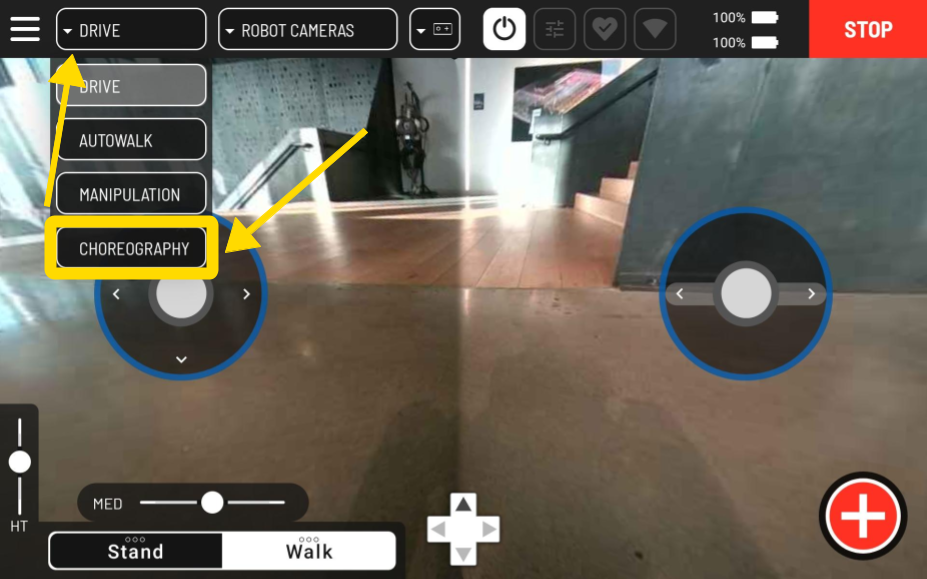
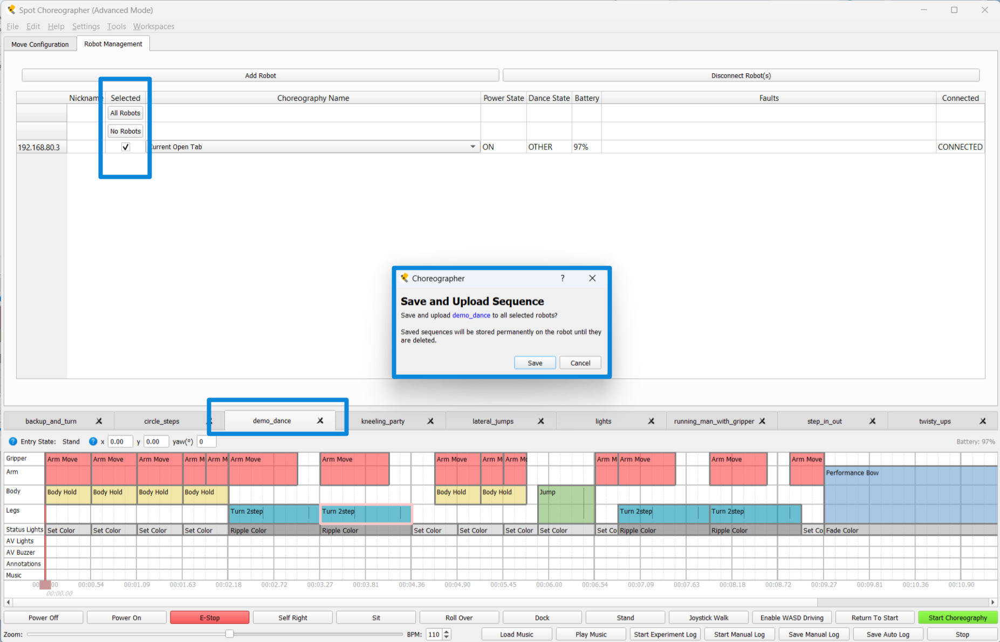
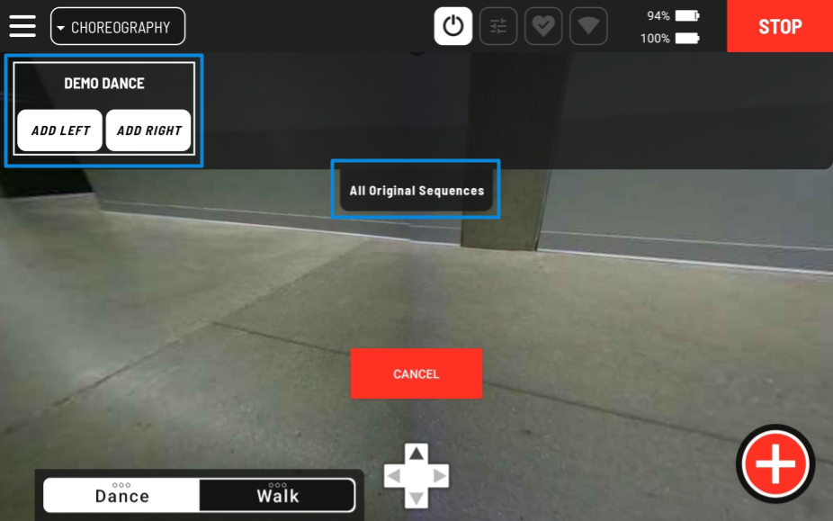
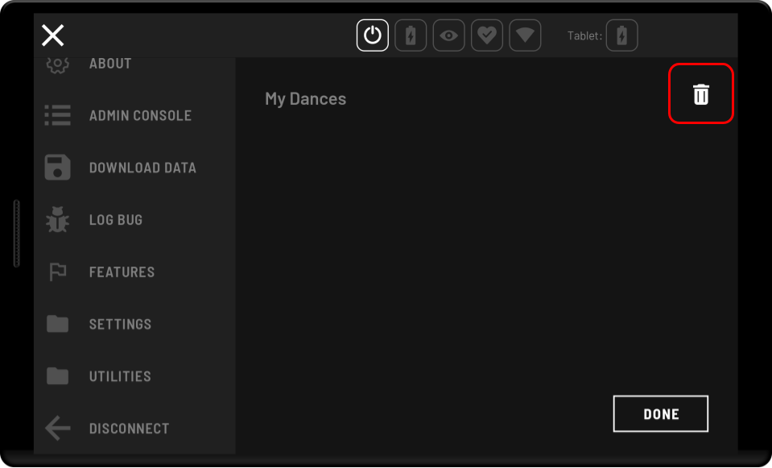
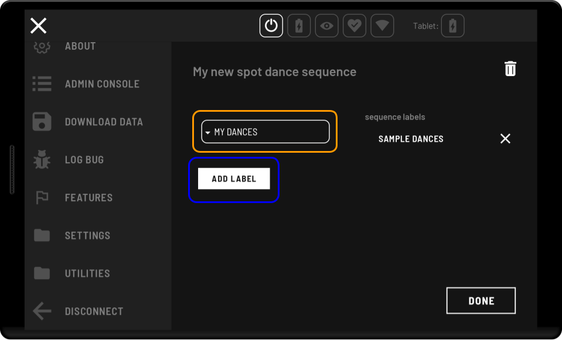

<!--
Copyright (c) 2023 Boston Dynamics, Inc.  All rights reserved.

Downloading, reproducing, distributing or otherwise using the SDK Software
is subject to the terms and conditions of the Boston Dynamics Software
Development Kit License (20191101-BDSDK-SL).
-->

# Choreography tablet UI

Dances authored and executed using Choreographer can also be played through the tablet using the Choreography drive mode. In addition, Spot comes with a set of pre-uploaded sample dances created by Boston Dynamics which can found under the **Sample Dances** and **Sample Emotes** categories when first connecting Spot to a Tablet.

### License Requirements

Users must have a choreography license for Spot to upload and play user-authored choreography sequences (sequences created by the user) through the tablet interface. Users without choreography license features will still have access to Boston Dynamics' pre-uploaded sample dances.

_Note: Prior to 5.1.0, users without a choreography license did not have permissions to view choreography features through the tablet. If the choreography option does not appear, or no selectable sample dances are available, ensure both the tablet and connected Spot are on a 5.1.0 or greater release version._

### Choreography Safety

The choreography framework is less robust than other Spot behaviors. It should only be used on a flat floor with plenty of space and good traction. **Choreography is not recommended for use with payloads**. Please refer to the [choreography safety](choreographer.md#choreography-safety) overview before running choreography sequences through the tablet interface.

## Playing choreography sequences through the tablet

1. **Enter choreography drive mode** - Enter Choreography drive mode from the upper left dropdown menu where it appears with Drive and Autowalk.

   

2. **Add Sequence buttons to the screen** - Lists of the choreography sequences that the robot can perform are viewable by pressing the tabs at the top of the screen. You can choose to place any sequence to the left or right side of the tablet screen, where it will be added to a list of buttons which each trigger the playback of the selected choreography sequence.

   Remove a specific button from the screen by pressing the minus symbol next to it, or remove all buttons from the screen by using the "clear screen" button in the gear icon menu in the upper right corner.

   

3. **Play the Choreography sequence** - Press the added sequence buttons to start sequences. The name on the button indicates the choreography sequence that will play. Once a sequence has started a progress bar will appear in the center of the screen.

   _Note: When a tablet does not have hardware joysticks connected for driving the robot, sequence buttons are hidden in modes like "Sit" and "Stand" so the on screen software joysticks may be displayed instead. To make the sequence buttons reappear, select "Dance" mode from the lower left list, or click on any dance dropdown menu._

   

### Stopping Active Sequences

Stop a choreography sequence that is playing by pressing **CANCEL** in the center of the screen. If a sequence is canceled while it is playing, the robot will stop the sequence and attempt to freeze in place.

**Warning**: Interrupting a dance in the middle of a dynamic movement (such as a jump), or starting a different dance before the previous dance finishes, may cause falls. For the best behavior avoid stopping a dance partway through unless necessary for safety reasons, and start dances from a stable stance or from seated. If a dance must be stopped partway through regardless of risk, try to pick a moment when Spot isn't moving too quickly, and has at least 3 feet on the ground. This will lower the risk of falls.

## Uploading your own Choreography sequences

_Note: It is recommended that before uploading a choreography sequence to the robot through Choreographer for use with the tablet that you verify your sequence is playable and stable through Choreographer first._

1. Start by connecting your Spot(s) to Choreographer and opening the choreography sequence(s) you wish to upload. Refer to the [Choreographer Overview](choreographer.md) and [Robot Connections in Choreographer](robot_controls_in_choreographer.md) documentation if you have trouble with this step.

   _Note: Make sure you have saved your choreography sequence(s) with names that will allow you to easily identify them later._

2. Select the robot connections you wish to upload your sequence to, then make sure the sequence you wish to upload is the current open tab. When these settings are correct, open the "File" menu and select the "Save and Upload Choreography to Robot(s)" option. Press **Save**.

   

3. Repeat **step 2** for all the choreography sequences you want to upload. Then sit the robot(s) and disconnect from Choreographer.

4. Now connect to Spot through the tablet, and navigate to the **Settings** section of the Hamburger menu. In **Settings** select **Choreography**. All the sequences you uploaded to the robot with Choreographer will appear under the **All Original Sequences** category.

   

5. Make sure the checkbox next to **All Original Sequences** has been selected, then enter the **Choreography drive mode** screen. The uploaded sequence(s) will appear under the **All Original Sequences** dropdown and can be added and played like any other choreography sequence option.

   

## Managing uploaded Choreography sequences

### **Deleting Saved Choreography Sequences**

The original choreography sequences you save to Spot will be retained indefinitely until you actively choose to delete them. To delete a sequence go to the Choreography settings screen and select the edit button next to sequence you wish to delete. In that screen, find the trash icon next to the sequence name and press it.

### **Adding and Removing Labels**

**Add a Label** 

To add a new label go to the Choreography settings screen and press the button that says **Add New Label**. Enter your label name into the provided text field and press the **Create** button.

**Delete a Label** 

Select the edit icon next to the label you want to delete. Find the trash icon next to the label's name in the edit screen and press it.

**Remove a label from a Sequence** 

Select the edit icon next to the sequence you wish to modify. Find the label you wish to remove in the list under _sequence labels_ on the right side of the screen, and remove it by pressing the **X** icon next to it.

**Add a label to a Sequence** 

Select the edit icon next to the sequence you wish to modify. Select the label you wish to add in the dropdown on the left hand side of the screen, and then press the **Add Label** button.
