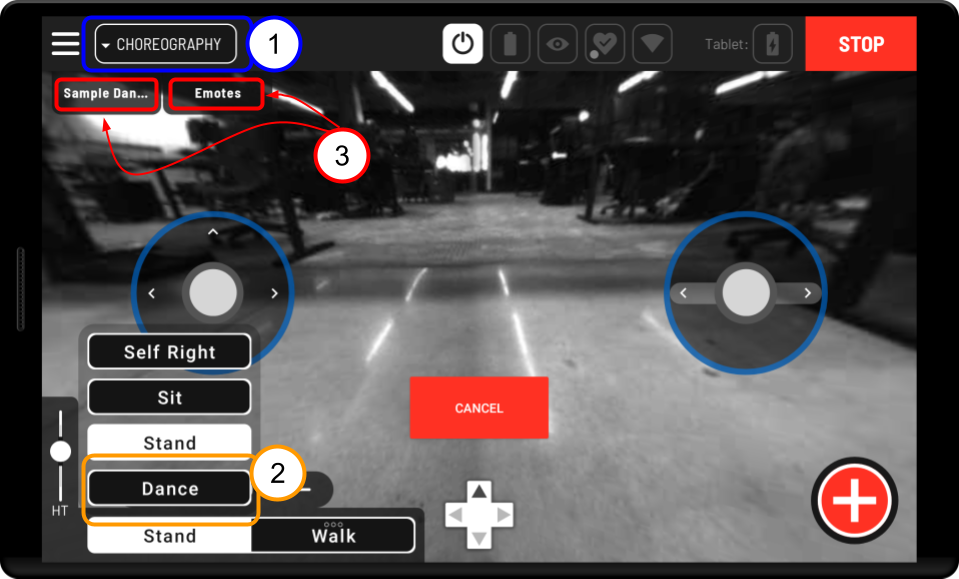
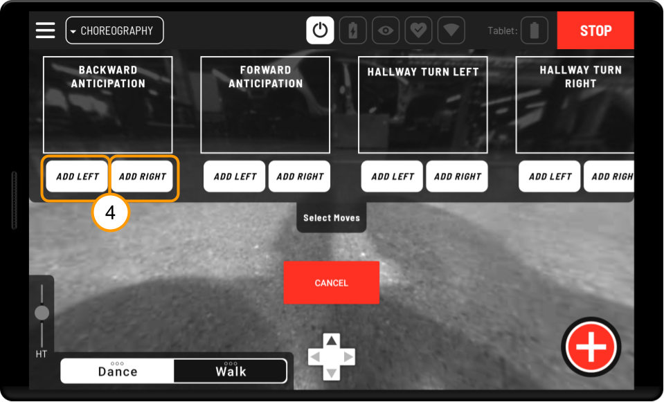
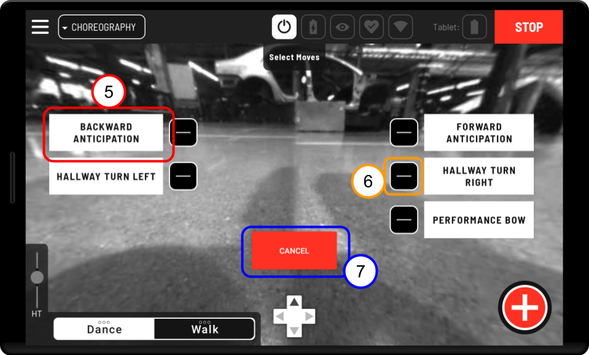
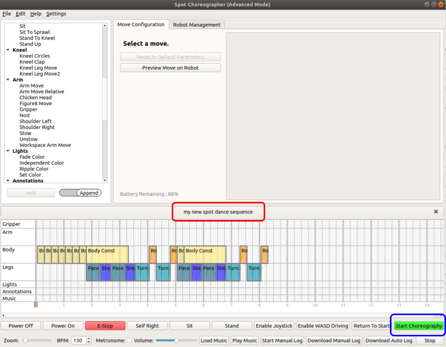
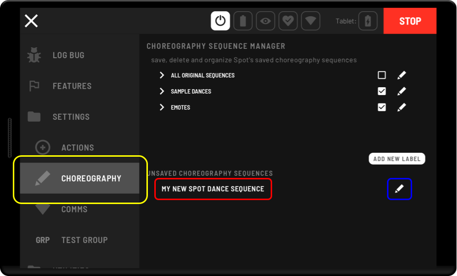
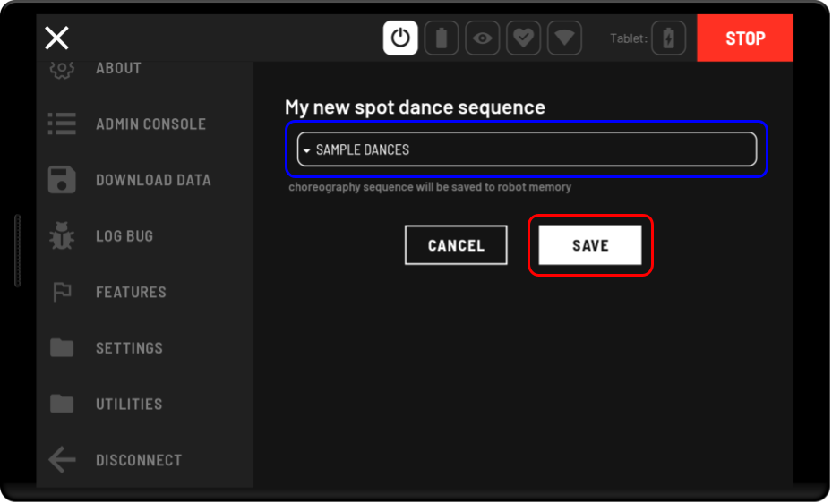
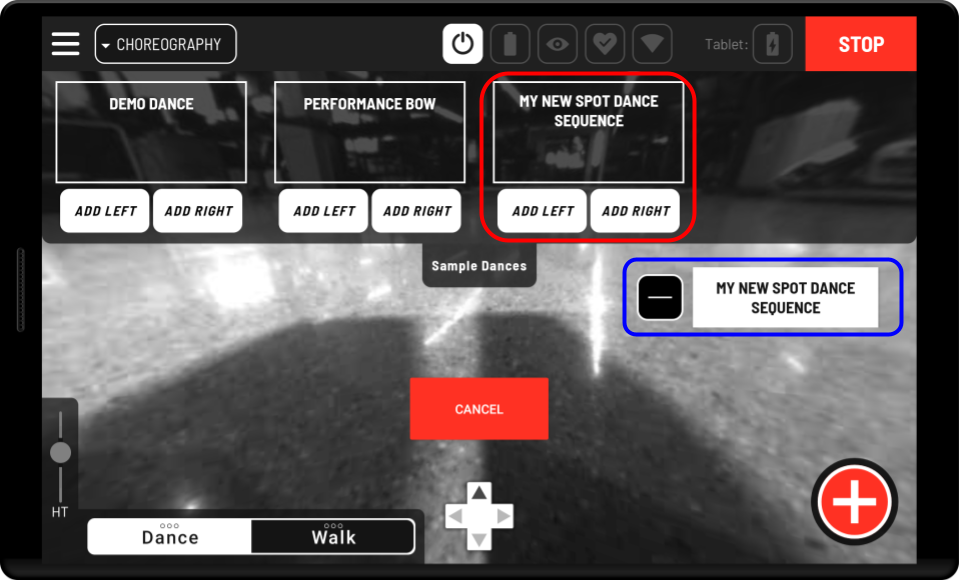
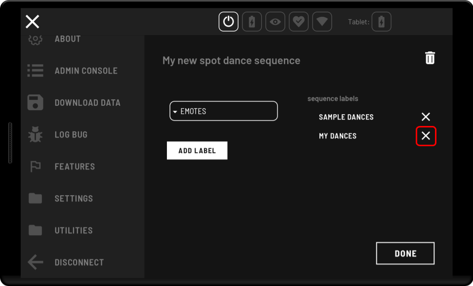

<!--
Copyright (c) 2023 Boston Dynamics, Inc.  All rights reserved.

Downloading, reproducing, distributing or otherwise using the SDK Software
is subject to the terms and conditions of the Boston Dynamics Software
Development Kit License (20191101-BDSDK-SL).
-->

# Boston Dynamics Choreography tablet UI

Dances authored and executed using Choreographer can also be played through the Tablet using the Choreography drive mode.

*Only users with a Spot choreography license will be able to view the Choreography drive screen.*
## Choreography safety

When playing any choreography sequence on a robot, always keep in mind basic safety procedures. Make sure there is plenty of space around your Spot, keep all Spots at least two meters apart from each other, and be sure that neither you nor anyone else approach the dancing Spot. Never approach your Spot unless its motors have been powered off.

## Using the Choreography drive mode

  

1) **Application selection** - Enter Choreography drive mode from the upper left dropdown menu where it appears with Drive and Autowalk.

2. **Exiting and entering Dance mode** - For Tablets without hardware joysticks, exiting and entering dance mode allows you to toggle between playing choreography sequences and using other robot modes. For tablets with hardware joysticks, selected choreography sequences will always appear on screen.

3) **Select and View Choreography Sequences** - Lists of the choreography sequences that the robot can perform are viewable by pressing the tabs at the top of the screen. Opening these menus will allow you to add dance sequences to the Choreography screen as buttons which are used to play the sequences on the robot. These tabs are configurable, and you can choose which tabs will appear as options on screen by going to the **Choreography** option in the **Settings** menu.

    *See below for information on configuring the Choreography drive screen.*

   

4. **Adding moves to the screen** - You can choose to place any sequence to the left or right side of the tablet screen, where it will be added to a list of buttons which each trigger the playback of the selected choreography sequence. Swipe horizontally left and right across the dropdown menu to scroll through the known moves.

   

5. **Play the Choreography sequence** - Once a sequence appears on screen as a white button you can press that button to play the choreography sequence. The name on the button indicates the choreography sequence that will play.

6. **Removing buttons from the list** - Remove a button from on screen by pressing the minus symbol next to it. This does not remove the move from the dropdown menu it was selected from.

7. **Cancel moves** - Stop a choreography sequence that is playing by pressing **CANCEL** in the center of the screen. If a move is canceled while it is playing, the robot will stop the move and come to a stand. A sequence can also be aborted by entering any other mode such as Sit, Stand, Walk, or Self Right.

Take caution when stopping choreography sequences and playing choreography sequences when the robot is not in a neutral stance. Interrupting a dance in the middle of a dynamic movement, or starting a different dance before the previous dance finishes, may cause falls. For the best behavior avoid stopping a dance partway through unless necessary for safety reasons, and start dances from a stable stance or from seated. If a dance must be stopped partway through regardless of risk, try to pick a moment when Spot isn't moving too quickly, and has at least 3 feet on the ground. This will lower the risk of falls.

## Using the tablet to play your own Choreography sequences

Spot comes with a small library of sequences. Some of these are intended for performance. Some gestures can be used to communicate intent through body language. These sequences are always available in the **Select Moves** dropdown. The Tablet can also play custom sequences uploaded by users. The easiest way to author choreography sequences and upload them to the robot is through the Choreographer application.

*Only users with a Spot choreography license can upload original sequences.*

### Uploading choreography sequences with Choreographer

1. Start by opening your completed choreography sequence in Choreographer and connecting your robot to Choreographer. Refer to the “Choreographer User Guide” and “Connecting Robots to Choreographer” if you have trouble with this step.

2. Make sure you have given your choreography sequence a name that will allow you to easily identify it later, and then play the sequence on the robot using the Choreographer application. Playing the sequence on the robot uploads it to Spot’s memory.

3. After repeating steps 1 and 2 for all the choreography sequences you want to play through the tablet or save to your Spot, sit the robot and disconnect it from Choreographer.

5) Now connect to Spot through the Tablet, and navigate to the **Settings** section of the Hamburger menu. In **Settings** select **Choreography**. All the moves you uploaded with Choreographer should appear in a list near the bottom of the screen under **Unsaved Choreography Sequences**. 

6) To play these sequences through the tablet you will need to save them and give them a label. To save a sequence, select the edit symbol next to its name on the right side of the screen, choose a label from the dropdown, and press save. Complete this step for each sequence you wish to save and have accessible for execution through the tablet.

*All animation moves (moves loaded from .cha files), included in a saved sequence will also be saved. Once a sequence is saved no further upload action will be required for it to be playable from the tablet or through an `ExecuteChoreography` RPC call using the sequence's name. If all sequences requiring an animation move are deleted, the stored animation move will also be removed on the next reboot. Make sure different animations have different names, or saved choreography sequences will attempt to replace the old version with the new version of the animation.*

7) Locate the checkbox for the label(s) you saved your sequences to, and make sure they are checked. Checking the checkbox for a label will make it appear as an option when you enter the Choreography drive screen. 

8) Enter the Choreography drive screen and locate the dropdown tabs with the labels you selected in the Choreography settings screen. You will now be able to add and play your custom choreography sequences in the same way you would play the sample choreography sequences included with your robot release. 
## Managing your uploaded Choreography sequences
### **Deleting Saved Choreography Sequences**

The original choreography sequences you save to Spot will be retained indefinitely until you actively choose to delete them. To delete a sequence go to the Choreography settings screen and select the edit button next to sequence you wish to delete. In that screen, find the trash icon next to the sequence name and press it.
### **Adding and Removing Labels**

**Add a Label** 

To add a new label go to the Choreography settings screen and press the button that says **Add New Label**. Enter your label name into the provided text field and press the **Create** button.

**Delete a Label** 

Select the edit icon next to the label you want to delete. Find the trash icon next to the label's name in the edit screen and press it.

**Remove a label from a Sequence** 

Select the edit icon next to the sequence you wish to modify. Find the label you wish to remove in the list under *sequence labels* on the right side of the screen, and remove it by pressing the **X** icon next to it.

**Add a label to a Sequence** 

Select the edit icon next to the sequence you wish to modify. Select the label you wish to add in the dropdown on the left hand side of the screen, and then press the **Add Label** button.

