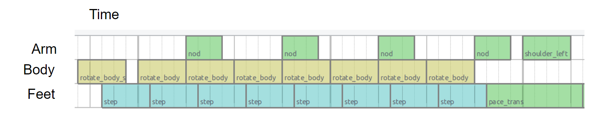
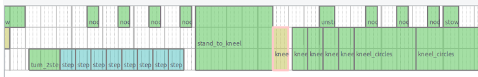
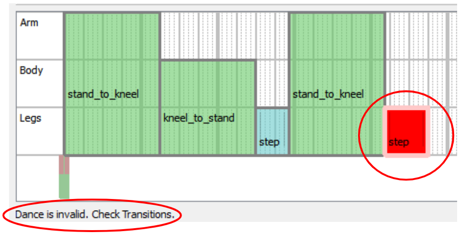

<!--
Copyright (c) 2020 Boston Dynamics, Inc.  All rights reserved.

Downloading, reproducing, distributing or otherwise using the SDK Software
is subject to the terms and conditions of the Boston Dynamics Software
Development Kit License (20191101-BDSDK-SL).
-->

# Choreography Service

## Overview

### What is it?
This is a framework for producing precisely scripted motion, currently focused on dancing.

An example script can be seen on [YouTube](https://www.youtube.com/watch?v=kHBcVlqpvZ8).

A choreography sequence consists of a series of moves.  We can achieve a wide variety of possible behavior from a moderate list of available moves:

1) Combining multiple moves (see the tracks/layering section).
2) Many moves have parameters that allow an author to vary the behavior.

### Note on Reliability

The choreography framework is much less robust than other Spot behaviors.  It should only be used on a flat floor with plenty of space and good traction.  Some combinations of moves will be incompatible and will result in the robot falling.  The same is true for some combinations of parameters for an individual move.  The robot **will** fall down.  It may take some trial-and-error to produce a script that looks good and succeeds reliably.

***Not recommended for use with payloads.***

### Slices

We divide time up into slices.  In the context of Choreographer, a slice is ¼ beat (a 1/16th note for 4/4 music).  The duration of a slice can be adjusted, but must remain constant throughout the entire script.

Moves always run for an integer number of slices.  Some moves require a fixed number of slices, and some are extendable.  See the Config Files section for more details.

Note that while any number of slices_per_minute can be selected, very fast or very slow slices will cause some moves to be unreliable.  Most moves will be most reliable in the range of 250-450 slices per minute.

### Tracks/Layering

We divide the robot’s motion into three distinct tracks:

* Legs
* Body
* Arm

Each dance move requires one or more of these tracks.  Moves that use different tracks can be run simultaneously in any combination.  For example, here is a screenshot from Choreographer of a script that combines moves in all three tracks:

And the resulting behavior looks like this:

Some moves require multiple tracks such as in this example:

The various kneel moves require the legs and body tracks, while the stand_to_kneel move requires all three tracks, and cannot be run simultaneously with any other moves.

### Entry/Exit conditions

Some choreography sequences don’t make any sense. For example:
You can’t do a kneel-to-stand transition if you’re not kneeling
You can’t go directly from a step move to a kneeling-clap move without a stand-to-knee transition in between.

To represent and enforce these requirements, all moves that use the legs track have an exit transition state and an entry transition state.  The options for transition state are:

* Stand
* Sit
* Kneel
* Sprawl

The first leg-track move can have any entry state, and the robot will automatically transition to an acceptable entry state for that move before starting the choreography sequence.  If the robot is not already in the correct starting pose, it may delay the start of the choreography sequence beyond the requested start time.

All subsequent legs-track moves must have an entry state that corresponds to the previous legs-track move’s exit state.  Scripts that violate this requirement will be rejected and the offending move will be highlighted in red within Choreographer, such as in this example:

## API

The API defines a choreography sequence by a unique name, the number of slices per minute, and a repeated list of moves. Each move consists of the move’s type, its starting slice, duration (in slices), and the actual parameter (MoveParams proto message). The MoveParams describe how the robot should behave during each move. For example, a move parameter could specify positions for the body.  Each parameter may have specific limits/bounds that are described by the MoveInfo proto message; this information can be found using either the ListAllMoves rpc.

Once a choreography sequence is created, the UploadChoreography rpc will send the routine to the robot. The choreography service will validate and check the structure of the routine to ensure it is feasible and within bounds.

The service will return a list of warnings and failures related to the uploaded choreography sequence. A failure is something the choreography service could not automatically correct and must be fixed before the routine can be executed. A warning is something that could be automatically corrected for and won’t block the execution of the routine in certain scenarios. If the boolean non_strict_parsing is set to true in the UploadChoreography rpc, then the service will fix any correctable errors within the routine (ex. rounding down values the maximum allowed value) and allow a choreography sequence with warnings to be completed.

The ExecuteChoreography rpc will run the choreography sequence to completion on the robot. A choreography sequence is identified by the unique name of the sequence that was uploaded to the robot. Additionally, a starting time (in robot’s time) and a starting slice will fully specify to the robot when to start the choreography sequence and at which move.

The choreography service has a python client library which provides helper functions for each rpc as well as functions that help convert the choreography sequence from a protobuf message into either a binary or test file.

The [upload_choreographed_sequence example](../../../python/examples/upload_choreographed_sequence/README.md) demonstrates how to read an existing routine from a saved text file, upload it to the robot, and then execute the uploaded choreography.

## Config Files

There are two config files that describe the individual moves that are used by the Choreographer to compose different choreography sequences.

## MoveInfoConfig.txt

This can be parsed by a protobuf parser into the moves field of the ListAllMovesResponse proto.  Each MoveInfo proto provides metadata about a particular move.  The fields and their meanings are:

* name: The name of this move.
* move_length_slices: The default duration of this move in slices.
* is_extendable: Whether this move can be extended to last longer than it normally would.  If is_extendable is true, the desired duration can be specified in the requested_slices field in the MoveParams proto.
* entrance_state: Which transition state the robot must be in prior to entering this move.  Only applicable if controls_legs=true.  Structure can support multiple allowed entry states, but all current moves only accept a single entry state.
* exit_state: Which transition state the robot will be in after completing this move.  Only applicable if controls_legs=true.  The next legs-track move must have the same entrance_state.
* min_time: Some moves have a minimum duration and cannot go any faster.  For moves where this is specified, they may take more than the normal number of slices if the slice duration is very short (slices per minute is very high).
* max_time: Some moves have a maximum duration and cannot go any slower.  This applies to moves that are extendable, but cannot be made arbitrarily long.
* controls_arm: Does this move require the arm track.
* controls_legs: Does this move require the legs track.
* controls_body: Does this move require the body track.
* display: Several bits of information for how Choreographer should draw the move.
   * color: What color to draw the box for the move in the tracks at the bottom of the display.
   * markers: At what slices to draw small grey vertical lines.  These usually correspond to events such as touchdown and liftoff, and help the user line those events up as desired (e.g. on the beat).  Negative values here indicate slices before the end of the move.
   * description: A text description of the move.
   * image: The location of an image to display for the move.  Currently unused.

### MoveParamsConfig.txt

This config file gives the default value for each of the parameters associated with individual moves.  For those moves that are double or int32, it also gives the minimum and maximum values.

There will be a block of text separated by empty lines for each available move.

The first line of each block will have two values.

2) The name of the moves.
1) Which option in the oneof params within the MoveParams proto this move uses to specify its parameters.  For moves with no parameters, the second entry in the first line should say NONE, and there will be no further lines in that block of text

The remaining lines describe the default (and possibly min/max) values for one parameter per line.  The first field in each of these lines will be the name of the parameter.  Dots (“.”) indicate a level of hierarchy within the proto.  For parameters that are of type bool or Enum, there will be two fields in the line, and the second field will be the default value.  For parameters that are of type double or int32, there will be 4 fields in the following order:

1) Parameter name
1) Minimum value
1) Default value
1) Maximum value

Default values are used if no value is specified within the proto.  Values outside of the allowable range will ordinarily result in the script being rejected.  However, if non-strict-parsing is enabled, the value will be forced into the required range and a warning will be thrown.
