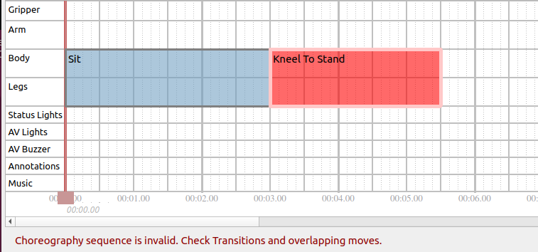

<!--
Copyright (c) 2023 Boston Dynamics, Inc.  All rights reserved.

Downloading, reproducing, distributing or otherwise using the SDK Software
is subject to the terms and conditions of the Boston Dynamics Software
Development Kit License (20191101-BDSDK-SL).
-->

# Choreography service

## Overview

### What is it?

The Choreography service is a framework for producing precisely scripted motion, which are currently focused on dancing. Example choreography scripts can be seen on the Boston Dynamics YouTube channel, showing the robot dancing to [Bruno Mars's "Uptown Funk"](https://www.youtube.com/watch?v=kHBcVlqpvZ8) and [The Contours' "Do You Love Me"](https://www.youtube.com/watch?v=fn3KWM1kuAw).

A choreography sequence consists of a series of moves. A wide variety of possible behaviors can be created from a list of available moves by:

1. Combining multiple moves (see the tracks/layering section)
2. Altering move parameters to vary the behavior of the move
3. Adjusting the BPM of the choreography sequence to change the speed of the moves

### Note on reliability

The choreography framework is less robust than other Spot behaviors. It should only be used on a flat floor with plenty of space and good traction.  Some combinations of moves will be incompatible and can result in the robot falling.  The same is true for some combinations of parameters for an individual move.  The robot **will** fall down.  Trial-and-error might be needed to produce a script that looks good and succeeds reliably.

***Not recommended for use with payloads.***

## Choreography terminology

### Slices

In Choreographer, time is divided into slices.  A slice is ¼ beat (also, a 1/16th note for 4/4 music). For example, a dance with a BPM of 100 beats/minute has 400 slices per minute. The duration of a slice can be adjusted but must remain constant throughout the entire script.

Moves always run for an integer number of slices.  Some moves require a fixed number of slices, and some are extendable.  See the Config Files section for more details.

Note that any number of slices per minute can be selected, however very fast or very slow slices will cause some moves to be unreliable.  Many moves will be most reliable in the range of 250-450 slices per minute.

### Tracks and layering

The robot’s motion is divided into the following distinct tracks:

* Legs
* Body
* Arm
* Gripper

In addition to the base motion, there are also tracks for:

* Lights: Control the robot's front two sets of LEDs.
* Annotations: Enable dance annotations that are separate from any specific move.
* Music (Choreographer only): Control the audio played from the Choreographer application when dancing.

Each dance move requires one or more of these tracks.  Moves that use different tracks can be run simultaneously in any combination. In Choreographer, a track is represented as a horizontal section in the timeline view.  Example: the following script combines moves in three of the four tracks:

The resulting behavior looks like this:

Some moves require multiple tracks, such as the "Jump" move which uses the body and the legs tracks. The "Arm Move" uses the Arm and Gripper tracks, as shown:

### Entry and exit conditions

All moves that use the legs track have logical entry and exit positions that the body must be in before or after the move. These entry and exit positions help to prevent nonsensical choreographies.  Example: Completing a kneel-to-stand transition where the robot moves to a kneeling-clap move without an intervening stand-to-knee transition.

To represent and enforce these requirements, all moves that use the legs track must use one of the following exit and entry transition states:

* Stand
* Sit
* Kneel
* Sprawl

The first leg-track move can have any entry state. The robot automatically transitions to an acceptable entry state for that move before starting the choreography sequence.  If the robot is not already in the correct starting pose, it may delay the start of the choreography sequence beyond the requested start time.

All subsequent legs-track moves must have an entry state that corresponds to the exit state of a previous legs-track move.  Scripts that violate this requirement are rejected by the API and return warnings indicating which moves violate this rule. Routines made in Choreographer highlight moves red when the entry state does not match the previous exit state, as in this example:

## APIs

### Choreography API

The Choreography API defines a choreography sequence by a unique name, the number of slices per minute, and a repeated list of moves. Each move consists of:  

* Move type
* Starting slice
* Duration (in slices)
* Actual parameters (`MoveParams` proto message).

The `MoveParams` message describes how the robot should behave during each move.

Example: A move parameter could specify positions for the body.  Each parameter may have specific limits/bounds that are described by the `MoveInfo` proto. This information can be found using the `ListAllMoves` RPC.

Once a choreography sequence is created, the `UploadChoreography` RPC sends the routine to the robot. The choreography service validates and checks the structure of the routine to ensure it is feasible and within bounds.

The service returns a list of warnings and failures related to the uploaded choreography sequence. A failure is something the choreography service could not automatically correct and must be fixed before the routine can be executed. Warnings are automatically corrected and do not block the execution of the routine in certain scenarios. If the boolean `non_strict_parsing` is set to true in the `UploadChoreography` RPC, the service fixes any correctable errors within the routine (for example, by limiting parameters to the acceptable range) and allows a choreography sequence with warnings to be completed.

The `ExecuteChoreography` RPC runs the choreography sequence to completion on the robot. A choreography sequence is identified by the unique name of the sequence that was uploaded to the robot. Starting time (in robot’s time) and starting slice specifies when the robot when starts the choreography sequence and at which move.  Named sequences can be returned using the `ListAllSequences` RPC.

### Interacting With a Sequence During Execution
The `ChoreographyStatus` RPC returns information about whether the robot is currently executing a sequence or why it isn't.  If it is executing a sequence, the response tells you where (what slice) within the sequence Spot currently is, as well as listing which moves are currently active and the sequence name.

Some moves (e.g. [CustomGait](custom_gait.md)) can respond to commands through the `ChorographyCommand` RPC.  When such moves are active, they will provide information about what commands they are currently able to accept in the `command_limits` field as part of the Status response.  The `ChoreographyCommand` RPC sends `MoveCommand`s, which are targeted at specific moves.  The `move_type` and `move_id` can (optionally) be used to restrict which moves will accept the command and ensure that only the intended recipient can respond to it.

### Saving Choreography Sequences to your Spot

The `SaveSequence` RPC will save a sequence and all information required to play that sequence to a library of permanently retained choreography sequences stored on the robot. These sequences load automatically when Spot boots up, and are playable through the Tablet Choreography screen or with an `ExecuteChoreography` RPC. Sequences can be saved with additional information called labels, which are used to categorize and group retained sequences in the tablet UI. The labels associated wih a sequence can be added or removed with the `ModifyChoreographyInfo` RPC. Sequences saved to the robot can be removed using the `DeleteSequence` RPC, which deletes a single sequence, or by using the `ClearAllSequenceFiles` RPC, which deletes every saved choreography file from Spot. The `GetChoreographySequence` RPC can be used to request the full sequence proto with a given name from Spot, along with all the `Animation` moves required to play the sequence (if any).

### Animation API

The Animation API defines an animated move (`Animation` proto message) by:

* Its unique name
* A repeated list of `AnimationKeyFrames` that describes the robot's motion at each timestamp
* Additional parameters and options that describe how the move should be executed.

Unlike other dance moves, the information about the minimum and maximum parameters must be specified in the `Animation` protobuf.

The `Animation` can be uploaded to the robot using the `UploadAnimatedMove` RPC, which sends the animation to the robot. The choreography service validates and checks the structure of the animation to ensure it is fully specified and is feasible. If the animation does not pass this validation, the RPC responds with a failure status and a set of warning messages indicating which parts of the animation failed.

If the animation uploads successfully, it can be used within choreography sequences. The animation appears as a move option in Choreographer along with any parameters specified in the initial `Animation` protobuf message. The move type associated with the uploaded animation is "animation::" +  the animation's name. The animations persist on the robot until either the robot is powered off or an animation with exactly the same name is uploaded and overwrites the previous animation.

While animations can be written manually using protobuf in any application, we have also provided a way to create animations from human-readable text files.
* Animation text file extension: *.cha
* The animation file format is described in the [animation file specification document](animation_file_specification.md).

The animation *.cha file can be converted into an `Animation` protobuf message using the `animation_file_to_proto.py` script provided in the choreography client library.

### Choreography logs API

The Choreography logs API defines a choreography log using the `ChoreographyStateLog` protobuf message.  ChoreographyStateLog consists of a repeated series of timestamped key frames that contain:

* The joint state of the entire robot
* The foot contacts
* The SE3Pose for the robot body relative to the animation frame.

The animation frame is defined based on the feet position at the beginning of the animation. The position is the center of all four feet. The rotation is yaw-only as computed from the feet positions.

### Choreography log types

Choreography logs are divided into two types:

* Automatic logs: The recording starts when the `ExecuteChoreography` RPC is first received and continues 3 seconds after the completion of the choreography.
* Manual logs: The recording starts when the `StartRecordingState` RPC is first received and continues until the `StopRecordingState` RPC is received. Manual log recordings are limited to 5 minutes.

Choreography logs can be used to review how the robot actually executed a choreography or animated dance move. For example (specifically for animations): If the move is not completely feasible, the robot attempts to get as close to what was asked as possible, but may not succeed. The choreography log can be used to understand and update the animated move to make it more likely to succeed.

Use the `DownloadRobotStateLog` RPC to download choreography logs. The request specifies which type of log should be downloaded. The response is streamed over grpc and recombined by the choreography client to create a full log message. The robot keeps only one auto log and one manual log in its buffer (2 total logs) at a time. The log must be downloaded immediately after completing the move on the robot.

### Time Adjust API

The `ChoreographyTimeAdjust` RPC can be used to slightly modify the start time of the next `ExecuteChoreography` RPC request that will be received by the robot in the future. If the new start time is within the right thresholds to be valid, the `start_time` of the `ExecuteChoreography` request will be ignored, and the `override_start_time` from the `ChoreographyTimeAdjust` request will be used instead. Values for `override_start_time` are limited to at most 5 minutes in the future from the time when the `ChoreographyTimeAdjust` request is sent, and can have a maximum of 2 minutes difference from the `ExecuteChoreography` request's original `start_time` value. Within those constraints, those thresholds are configurable by the user, but default to a `validity_time` threshold of 1 minute and an `acceptable_time_difference` threshold of 20 seconds.

In nearly all cases the `ChoreographyTimeAdjust` RPC will not be necessary. The purpose of this RPC is the rare case where one isolated system will be sending the `ExecuteChoreography` RPC, and using a separate system the user would like to make a small adjustment to the start time of that request. If it's possible to set the desired start time using the system that sends the `ExecuteChoreography` RPC the user should just set that `start_time` in the `ExecuteChoreography` RPC and avoid using the `ChoreographyTimeAdjust` RPC.

### Choreography client

The choreography service python client library provides helper functions for each RPC as well as functions that help convert the choreography sequence from a protobuf message into either a binary or text file.

### Python examples using the Choreography API

The [upload_choreographed_sequence example](../../../python/examples/upload_choreographed_sequence/README.md) demonstrates how to read an existing routine from a saved text file, upload it to the robot, and then execute the uploaded choreography.

## Config files

There are two config files that describe the individual moves that are used by the Choreographer to compose different choreography sequences.

## MoveInfoConfig.txt

`MoveInfoConfig` can be parsed by a protobuf parser into each moves field of the `ListAllMovesResponse` proto.  Each `MoveInfo` proto provides metadata about a particular move.  

The fields and their meanings are:

* name: Name of this move.
* move_length_slices: Default duration of this move in slices.
* min_move_length_slices: Minimum number of slices this move can complete in.
* is_extendable: Whether this move can be extended.  If is_extendable is true, the desired duration can be specified in the requested_slices field in the MoveParams proto.
* entrance_state: Which transition state the robot must be in prior to entering this move.  Only applicable if controls_legs=true.  Structure can support multiple allowed entry states, but all current moves only accept a single entry state.
* exit_state: Which transition state the robot will be in after completing this move.  Only applicable if controls_legs=true.  The next legs-track move must have the same entrance_state.
* min_time: Minimum move duration.  When specified, moves may take more than the normal number of slices if the slice duration is very short (slices per minute is very high).
* max_time: Maximum move duration.  This applies to moves that are extendable but cannot be made arbitrarily long.
* controls_arm: Move requires the arm track.
* controls_legs: Move requires the legs track.
* controls_body: Move requires the body track.
* controls_gripper: Move requires the gripper track.
* controls_lights: Move requires the front LED lights.
* controls_annotations: Move updates the overall dance state.
* display: How Choreographer should display the move.
   * color: Color of the box for the move in timeline tracks.
   * markers: Slices to draw the small grey vertical lines.  These usually correspond to events such as touchdown and liftoff. Intended to help the user line those events up as desired (for example, on the beat).  Negative values indicate slices before the end of the move.
   * description: Text description of the move.
   * image: Location of an image to display for the move.
   * category: Category name of the move as it appears in the move selector in Choreographer.

### MoveParamsConfig.txt

`MoveParamsConfig` provides the default value for each move parameter.  For moves that contain numerical parameters (for example, double, int32) the config file will also specify the minimum and maximum values.

The config file is formatted as a block of text separated by empty lines for each available move.

The first line of each block has two values:

1. The names of the moves.
2. Which option in the oneof `params` field within the `MoveParams` proto this move uses to specify its parameters.  For moves with no parameters, the second entry in the first line should say `NONE`. No further lines are used in that block of text

The remaining lines describe the default (and possibly min/max) values for one parameter per line.  

* The first field in each of these lines will be the name of the parameter.  
* Dots (“.”) indicate a level of hierarchy within the proto.  
* Parameters of type bool or Enum have two fields in the line. The second field is the default value.  
* Parameters of type double or int32 have 4 fields in the following order:

1. Parameter name
1. Minimum value
1. Default value
1. Maximum value

Default values are used if no value is specified within the proto.  Scripts are rejected if the values are outside the allowable range.  If `non_strict_parsing` is enabled, the value will be forced into the required range and a warning will be thrown.
