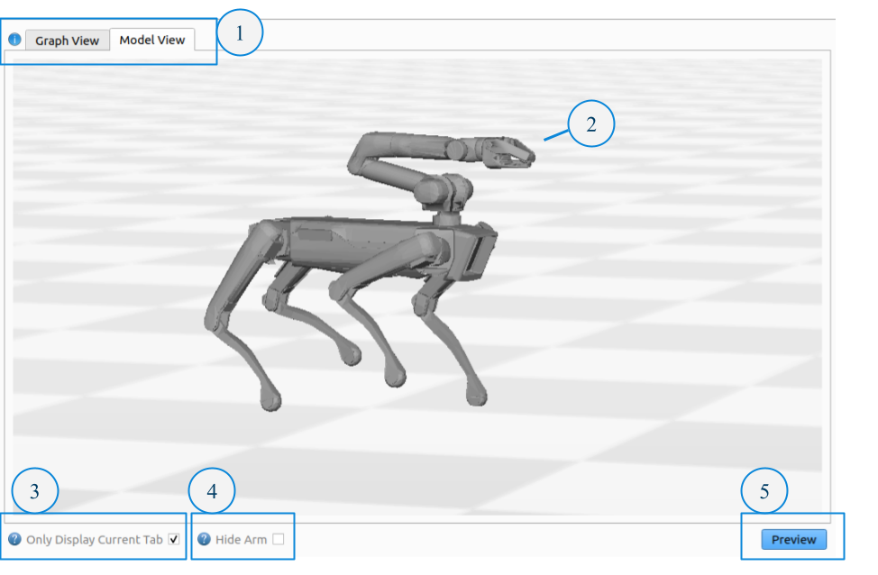
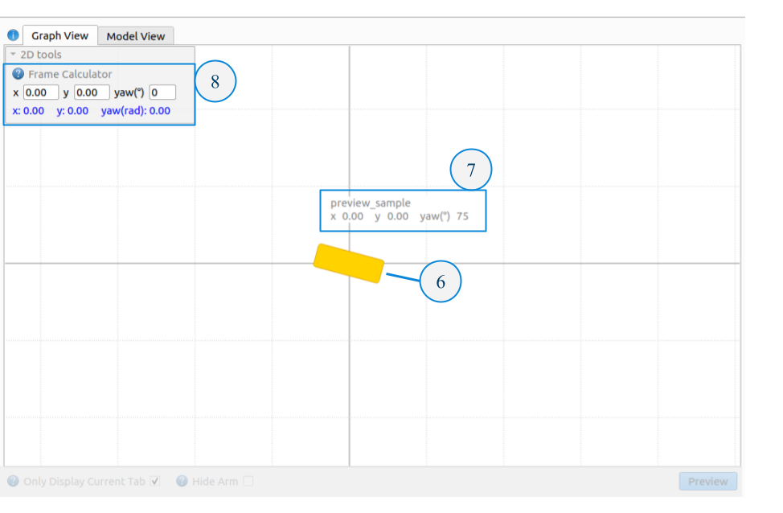
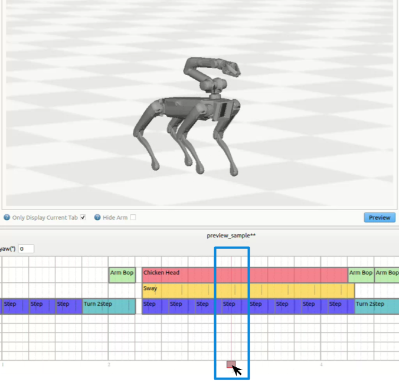
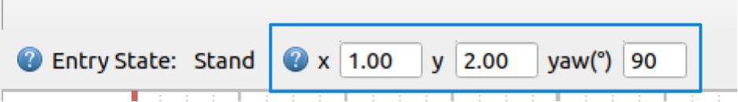
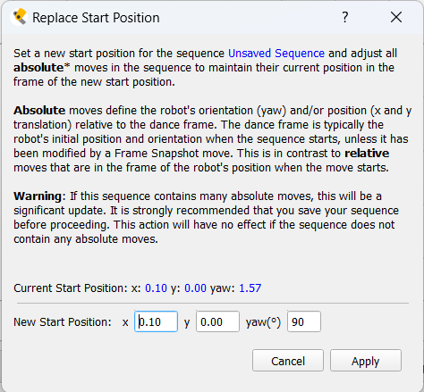

<!--
Copyright (c) 2023 Boston Dynamics, Inc.  All rights reserved.

Downloading, reproducing, distributing or otherwise using the SDK Software
is subject to the terms and conditions of the Boston Dynamics Software
Development Kit License (20191101-BDSDK-SL).
-->

# Dance Previews

Dance Previews is Choreographer's built in 3D and 2D tool for sequence visualization.

## Accuracy and Validity of Playback

Previews uses the unique characteristics and parameter values of moves to approximate sequence motion. However, while Choreographer aims to provide an accurate representation of sequences, Dance Previews is not a physically accurate simulation of real robot behavior or ability. Previewed sequence(s) shown may not match real world robot playback, and are not a prediction of sequence success or failure. Always make sure to observe proper [safety precautions](choreographer.md#choreography-safety) when testing choreography behaviors on real robots.

**Beta Notice**: Dance Previews is currently provided as a beta feature, and may have incomplete functionality or produce results that are not entirely accurate. We value your input and encourage you to report any discrepancies so we can continue to enhance the stability and performance of this feature. See a list below for known limitations.

## Dance Previews Interface

The Dance Previews interface consists of the following components:

1. **Model View/Graph View** - Toggle between the model view (3D), and the graph view (2D).
2. **3D Model** - 3D models of Spot.
3. **Only Display Current Tab** - When selected, only the currently selected sequence tab will be displayed in the playback view. When unselected, all sequences will be displayed.
4. **Hide Arm** - When selected hide all 3D models' arms.
5. **Preview Button** - Start 2D and 3D visualization. Music in the timeline will also play
6. **2D Model** - 2D model representation of the sequences position (x, y, yaw) in space.
7. **2D Model Label** - Label for a 2D model with the represented sequence and current position.
8. **Frame Calculator** - Quick-access tool for converting a position in the world frame to the current open tab's dance frame.

_Note: To hide the Dance Previews view and revert to the previous Choreographer layout, select **Legacy Mode** from the "Workspaces" menu._

## Scrubbing

Use the Red Slider to scrub through a sequence. If a sequence's move(s) are updated, you will need to either preview the sequence or move the slider to see updates.

_Note: Make sure to remember that when executing sequences on connected robots, the red slider position will be used for the robots' start time._

## Preview Tools

### Start position data

When Spot starts a choreography sequence it will assume that its starting position is x=0 meters and y=0 meters, and its orientation is yaw=0 degrees. This starting position defines the "dance frame".

When using multiple robots this does not provide enough information for the overall behavior of the group. You're going to want to place the robots in a formation where each robot is some distance apart from the others, and certain robots are oriented in non-zero directions.

To support this each choreography sequence can be given a start position, which can be set in the [Timeline Toolbar](choreographer.md#user-interface-overview). (Right-click the yaw entry field to switch between radians and degrees).

_Start Position data does not affect a sequence's behavior when executed on Spot, but it is a useful documentation tool to help the user remember where to place each robot before it starts a sequence._

### Frame Calculator tool

#### When to use the Frame Calculator tool:

The frame calculator tool is useful for multi-robot dances when different sequences have non-zero start position values (i.e. cases where the dance frame and world frame are different), and where moves with "absolute" options are being used.

Moves that have absolute parameter options include **pace2step**, **turn2step**, **jump** and **goto**. These moves also all have alternative, "relative" motion options which the below information does not apply to. **Using absolute motion is an advanced concept/technique** that is hidden when using Beginner mode.

**_Why use absolute motion?_** : Specifying motion with absolute parameters is useful when creating complex formation changes that require highly accurate or symmetrical positioning. Instead of trying to repeatedly calculate the required relative change to achieve a position, absolute moves make it possible to simply type in the desired end position.

#### Using the Frame Calculator tool to find Absolute Parameter values:

1. Start by going to the Graph View previews tab. Then select the desired tab and absolute move to calculate a position for. Make sure you've set the desired start position for the open tab.
2. Expand the 2D tools menu in the upper corner of the graph view. Then enter the world position (i.e. real position on your stage or dance space relative to what you've determined is the origin of the world) into the entry box. The corresponding position in the dance frame for the open tab will appear below as blue text.
3. Enter the dance frame values into the related parameter fields for the absolute move you selected.
4. Verify that the absolute motion looks correct by previewing the sequence.

### Replace Start Position tool

#### When to use the replace start position tool:

The replace start position tool seeks to cover the specific case where a sequence for a multi-robot dance, containing absolute moves, should now start from a new location in the world but still maintain the same spacing to other robots in the group once the dance starts.

Ex. Imagine you've created a sequence you like that's part of a set, but now one robot should actually start with a 90 degree rotation instead of facing forwards. If you simply change the start position alone, the sequence will no longer maintain the same spacing with the others sequences whose start positions were not modified.

The replace start position tool addresses this issue by automatically updating your sequence to the new start position, and going through your sequence to adjust each absolute parameter to a new value that maintains the original world position in the new dance frame. When everything works correctly, it will look like your sequence has a new start position, but nothing else has changed after the first translation.

_Since the Replace Start Position tool only modifies absolute moves, it only works to address the above case when absolute moves are used for at least one large position change at the beginning of the sequence, and has no affect on sequences that don't use absolute parameters._

Note: If you just want to change a sequence's start position without changing anything about the sequence, you do not need to use the replace start position tool, you can simply enter the new start position into the Timeline Toolbar.

#### Using the Replace Start Position tool:

_Note: Using the replace start position tool has the potential to make many edits to your sequence. It's highly recommended to save (or save a version) of your sequence prior to this action._

1. Start by making sure the sequence you want to modify is the current open tab displayed in the timeline. Then open the Replace Start Position tool menu from "Tools"->"Replace Start Position".
2. Enter the new start position.
3. Verify that the motion looks correct by previewing the sequence.

### Exporting preview cache data

Choreographer provides a way to export the joint data from the 3D Dance Previews model as a cha file, which provides a human-readable list of the joint values for the data (see: [Animation File Format](animation_file_specification.md)). Preview cache data is exported at 30 FPS.

To export preview data, select the tab you wish to export data from, then go to "Tools"->"Export Preview Cache". Data will be exported to a "previews" directory in the same location as your Choreographer application.

**Warning**: Exported preview cache data is not meant for direct playback on a robot. It is exported as a .cha to provide a human-readable format so the joint data can more easily be used for additional processing by the user. It is not exported in this format to try to facilitate direct playback on the robot. Trying to load and play exported preview cache data as an animation directly may either fail immeditiately or result in falls.

## Known Limitations

_See the [Move Reference Guide](move_reference.md) to correlate limitations with specific moves._

#### Unsupported Moves

- workspace arm move
- random generated moves, such as random rotate.
- Annotation category moves, including frame snapshot.
- Lights and A/V buzzer moves.

#### Entrance states

- Previews will assume a standing entrance state. Kneel, Sit and Sprawl entrance states will not be represented.

#### Translation/World position limitations

- Moves using yaw rate and velocity parameter values may be estimated to cover more distance than the real robot, where speed may be automatically limited.
- The Step move is capable of translating the robot. The current estimation will assume constant position and orientation.

#### Leg motion/moves

- Step velocity parameter values for leg moves will not be considered.
- Looping gait-like moves, such as goto and crawl may snap to the end position of the move if a swing is unfinished.
- "Linking" between moves that support it, such as bourree and goto, is not represented.
- The leg pose move, where balancing is not enabled, may not fully represent the accurate motion/position resulting from different leg positions and quick changes in leg joint position.
- The Kneel Clap move will not take direction parameters or the speed parameter into account.

#### Body motion/moves

- The robot will likely limit, or be slower to react to, different body position values which results in smoother and/or more muted motion during real playback.
- When performing legs moves with wider stances, Spot will often lower it's body to better perform these movements. This behavior may not be fully captured, or will not be represented as smoothly, in Preview playback.

#### Arm motion/moves

- Chicken Head and Figure8 Move, which use inverse kinematic arm and gripper positioning are have limited accuracy and support, especially in non-ideal positions that are not achievable by the robot. These moves are best tested/developed on a real robot.
- Arm move easing will always be represented as linear.

#### Animation Limitations

- Body translation and rotation multiplier values will not be considered.
- Gripper multiplier values will not be considered.
- Animations using joint angles for leg position will not consider the starting position of the foot before the move starts, and instead default to the initial start position specified in the animation.
- Parameters and options that affect stability/tracking, such as body_tracking_stiffness, track_swing_trajectories, and timing_adjustability will not be considered.
- Only the "joint_space" (default, joint values) arm_playback option for the arm track is supported.
- Lower FPS cha files will not blend smoothly between frames. If the motion of your .cha looks choppy in the Dance Previews viewer and has fewer keyframes please be assured that the robot will attempt to smoothly transition between these values during real playback.

#### Custom Gait limitations

- Custom gait will be represented with zero velocity in all cases.
- Step velocity parameter values will not be considered.
- Speed fraction options will not be considered.
- Arm moves will not blend properly within a custom gait looping region.
- When using animation options for Custom gait:
  - Swing trajectories will be incorrectly calculated when if 4 feet start in swing.
  - Using stance parameters set through Choreographer in combination with the animation's x-y swing motion may produce inaccurate motion.
  - The underlying body offset of an animation, if used, may not be fully accurate or correctly separated from the effect of body motion.
