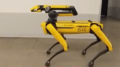
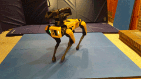
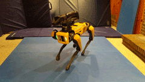
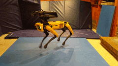
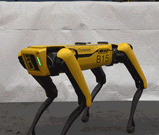
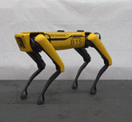
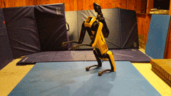
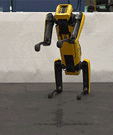
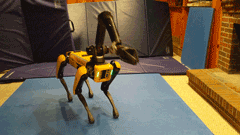
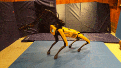

<!--
Copyright (c) 2023 Boston Dynamics, Inc.  All rights reserved.

Downloading, reproducing, distributing or otherwise using the SDK Software
is subject to the terms and conditions of the Boston Dynamics Software
Development Kit License (20191101-BDSDK-SL).
-->

# Choreography moves reference

This section describes each Choreographer move at a high level, including:

* Parameters used by the move
* Animated GIFs demonstrating the move with default parameters (for most moves)

More information about choreography moves can be found by looking at the choreography protos in the Spot [proto reference](../../../protos/bosdyn/api/README).

## Body moves

### rotate_body

Rotates the body to a desired orientation.  Nominally takes one beat (4 slices) but can be extended to go slower.

Parameter | Effect
--|--
rotation | The desired body orientation.
return_to_start_pose |  If true, returns to the previous body pose by the end of this move.  If false, remains in the specified position.

### rotate_body_sharp

Identical to the rotate_body move, but moves to the desired position quickly and returns (unless configured not to return) more slowly.

***No Parameters***

### body_hold

Moves the body to a specified position/orientation and holds it steady for the specified duration then optionally returns to a neutral pose.

Parameter | Effect
--|--
rotation/translation | The desired pose.
entry_slices | How long to spend transitioning to the desired pose.
exit_slices | How quickly to transition back to the original pose.  If set to 0, remains at the specified pose.

### body_const

Holds the body at the pose from the immediately preceding body-track move.  Applies to both orientation and translation.  Can be extended to any desired duration.

***No Parameters***

### sway

Sway back and forth to the beat.  A full back/forth cycle takes 2 beats.

Parameter | Effect
--|--
vertical/horizontal/roll | How much motion in the respective directions.
pivot | Which portion of the body remains stationary.
style | Modifies the velocity profile of the motion.
pronounced | How exaggerated the style is.  Smaller values will be closer to the SWAY_STYLE_STANDARD.
hold_zero_axes | If set to true, maintains the previous pose in whichever axes 0 motion is specified.  If false, those axes return to nominal.

### random_rotate

Rotate the body in a random, chaotic manner.  Rotation in each axis is generated independently.  Can be extended to any desired duration.

Parameter | Effect
--|--
amplitude | How far from the nominal pose to rotate in each axis.
speed | How quickly to rotate in each axis.
speed_variation | How much to vary the speed.  Controls the ratio between the slowest and fastest moves.  When 0, no variation (all moves are the same speed).
num_speed_tiers | Can create multiple tiers of speed.
tier_variation | Difference between the speed of the slowest tier compared to the fastest_tier.

### twerk

Lowers the robutt down and back up once.  Lasts for one beat (4 slices).

Parameter | Effect
--|--
height | How much to lower the robutt.

### butt_circle

Move the robutt, head, or both head and robutt in a circle.  Extendable to the desired duration.  Rotates about the previous pose.

Parameter | Effect
--|--
radius | Size of the rotation circle.
beats_per_circle | The duration of a circle in beats (4 slices each).  Mutually exclusive with number_of_circles.  Will be ignored unless number_of_circles = 0.
number_of_circles | The number of circles to perform.  Mutually exclusive with beats_per_circle.  If number_of_circles = 0, beats_per_circle will be used instead.
pivot | What part of the robot to pivot around.  Pivoting around the front means the robutt moves in circles.
clockwise | Which direction to rotate.
starting_angle | Where in the circle to start rotation.  Since it spirals outwards, it may not be obvious exactly where it starts.

### fidget_stand

A procedurally-generated idle animation.  It looks around, breathes, shifts its weight, and stamps.  Can use one of the preset configurations or customize the parameters.

Parameter | Effect
--|--
preset | Pre-designed parameter combinations that attempt to convey a specific emotion.  NOTE: All other sliders are only active if this is set to "Custom".
min_gaze_pitch | How far down the robot looks. (Radians)
max_gaze_pitch | How far up the robot looks. (Radians)
gaze_mean_period | How frequently the robot looks somewhere else. (Seconds)
gaze_center_cfp | Where the gaze array originates in the center-of-footprint frame. (Meters)
shift_mean_period | How frequently the robot shifts its weight. (Seconds)
shift_max_transition_time | Maximum amount of time the robot spends shifting its weight. (Seconds)
breath_min_z | Minimum amplitude of the "breathing" (meters)
breath_max_z | Maximum amplitude of the "breathing" (meters)
leg_gesture_mean_period | How frequently the robot does a leg gesture. (Seconds)
gaze_slew_rate | How quickly the robot shifts its gaze. (Meters/Second)
gaze_position_generation_gain | How much Brownian motion is applied to the gaze point.
gaze_roll_generation_gain | How much Brownian motion is applied to the gaze roll.

## Step moves

### step

Take a single step with one or two feet.  Nominally requires one beat (4 slices) but can be extended to step slower.  If stepping with two feet, especially both front or both hind feet, longer steps will be unreliable.  Lifts off one slice after the move begins and touches down one slice before it ends.

Parameter | Effect
--|--
foot/second_foot |  Which feet to step with.  If only a single foot is desired, second_foot should be set to LEG_NO_LEG.
offset | Where to step relative to a nominal stance for the first foot.
touch | If true, taps the foot near the ground midway through swing.
touch_offset | If touch is true, where the touch should occur relative to the nominal stance location.
mirror_x, mirror_y | Determines whether the second_foot (if there is one) has the same offset and touch_offset as the first foot (false) or the opposite offset (true).  Specified independently for the x and y axis.
swing_waypoint | Defines a waypoint that the swing leg must go through between liftoff and touchdown.  If left at {0,0,0}, no waypoint will be added and the system will take a normal swing.
waypoint_dwell | What fraction of the swing should be spent near the waypoint.
swing_height | How high to lift the foot/feet.  Does nothing if a swing_waypoint is specified.
liftoff_velocity | How quickly to raise the foot/feet. Does nothing if a swing_waypoint is specified.
touchdown_velocity | How quickly to lower the foot/feet. Does nothing if a swing_waypoint is specified.

### goto

Trot to a specified position in the dance frame.  Unless explicitly set, the dance frame is defined by where the dance begins.  Takes 1 step per beat.  Extend the duration to successfully move farther.

Parameter | Effect
--|--
absolute_position | Position the robot moves to in the dance frame.
absolute_yaw | Yaw orientation the robot moves to in the dance frame.
step_position_stiffness | How precisely the robot steps in the nominal locations.
duty_cycle | What fraction of the time a foot is on the ground.  0.5 is a standard trot.
link_to_next | Should the robot smoothly transition from this move to a subsequent goto move.

### trot

Runs the trot gait. Can be extended to run for an arbitrary duration.

Parameter | Effect
--|--
velocity/yaw_rate | The steering command.
stand_time | Duration before the end of the nominal move to start going to a stand.  If set too short, the robot may not finish transitioning and could fall.

### pace

Runs the pace gait. Can be extended to run for any desired duration.

Parameter | Effect
--|--
velocity/yaw_rate | The steering command.
stand_time | Duration before the end of the nominal move to start going to a stand.  If set too short, it may not finish transitioning and could fall.

### turn_2step

Take two steps to turn in place.  Requires 2 beats (8 slices).

Parameter | Effect
--|--
motion_is_absolute | Is motion in the dance frame (true) or relative to the current position (false).
motion | How far to move. (Meters)
absolute_motion | Where to move to in the dance frame. (Meters)
yaw_is_absolute | Is yaw in the dance frame (true) or relative to the current position (false).
yaw | How far to rotate. (Radians)
absolute_yaw | Where to rotate to in the dance frame. (Radians)
swing_height | How to pick up the feet.  Zero indicates to use a default swing.
swing_velocity | How quickly to lift off and touch down the feet. Zero indicates to use a default swing.

## pace_2step

Take two steps to translate using a pace gait (legs on the same side of the robot move together).  Requires 2 beats (8 slices).  Caution: Large lateral steps require a high-traction floor.

Parameter | Effect
--|--
motion_is_absolute | Is motion in the dance frame (true) or relative to the current position (false).
motion | How far to move. (Meters)
absolute_motion | Where to move to in the dance frame. (Meters)
yaw_is_absolute | Is yaw in the dance frame (true) or relative to the current position (false).
yaw | How far to rotate. (Radians)
absolute_yaw | Where to rotate to in the dance frame. (Radians)
swing_height | How to pick up the feet.  Zero indicates to use a default swing.
swing_velocity | How quickly to lift off and touch down the feet. Zero indicates to use a default swing.

### crawl

Locomotes, taking one step every beat.  Can be extended to run for any desired duration.

Parameter | Effect
--|--
velocity | Desired velocity of the robot.
swing_slices | Duration of a swing in slices.  An entire gait cycle takes 4 beats (16 slices). At the maximum value of 8 slices two of the robot's feet will always be on the ground, as in the Amble gait.  With a value of 4, the robot will always have one foot on the ground, as in the Crawl gait.
stance_width, stance_length | The dimensions and shape of the rectangle the stance feet make.

## Dynamic moves

### running_man

Spot’s version of the “running man” dance move.  Can be extended to run for any desired duration.

Parameter | Effect
--|--
velocity | By default, the robot dances in place but can move around in the world.
pre_move_cycles | How many slices to dance in place before moving at the specified velocity.
swing_height | How high to pick up the feet.
spread | How far to slide the feet backward from where they’re initially placed.
reverse | If true, will step backwards and slide forward: The reverse of the normal motion.
speed_multiplier | Run the move at something other than the song's overall beats-per-minute.
duty_cycle | What fraction of the time legs are in stance.
com_height | Desired height of the center-of-mass.

### bourree

Cross-legged tippy-taps, like the ballet move.

Parameter | Effect
--|--
velocity, yaw_rate | Steering command.
stance_length | Distance between front and hind legs.

### hop

Runs the hop gait. Can be extended to run for any desired duration.

Parameter | Effect
--|--
velocity/yaw_rate | The steering command.
stand_time | The duration before the end of the nominal move to start going to a stand.  If set too short, the robot may not finish transitioning and could fall.

### jog

Runs the jog gait. Can be extended to run for any desired duration.

Parameter | Effect
--|--
velocity/yaw_rate | The steering command.
stand_time | The duration before the end of the nominal move to start going to a stand.  If set too short, the robot may not finish transitioning and could fall.

### skip

Runs the skip gait. Is extendable to run for an arbitrary duration.

Parameter | Effect
--|--
velocity/yaw_rate | The steering command.
stand_time | The duration before the end of the nominal move to start going to a stand.  If set too short, the robot may not finish transitioning and could fall.

### front_up

Lifts the front feet then returns to a stand. Can be extended to adjust the duration of the hind-feet-only stance. Longer durations are unreliable.  Lifts off 2 slices from the start of the move and touches down one slice from the end of the move.

Parameter | Effect
--|--
mirror | If true, raises the hind legs instead of the front legs.

### jump

Jumps in place.  Nominally lasts one beat but may take more slices at faster tempos.

Parameter | Effect
--|--
translation_is_absolute | Is motion in the dance frame (true) or relative to the current position (false).
translation | How far to move. (Meters)
absolute_translation | Where to move to in the dance frame. (Meters)
yaw_is_absolute | Is yaw in the dance frame (true) or relative to the current position (false).
yaw | How far to rotate. (Radians)
absolute_yaw | Where to rotate to in the dance frame. (Radians)
flight_slices | How long the jump should last with all feet off the ground measured in slices.  Depending on tempo, higher values will be unreliable.
stance_width/stance_length | The footprint the robot should land its jump in.
swing_height | How how to pick up the feet.
split_fraction | Splits the liftoff and touchdown into two pairs of two legs.  In fraction of of swing with two legs in flight, so 0 means all legs fully synchronized.
lead_leg_pair | If split_fraction is not 0, indicates which legs lift off first. Default AUTO mode will select a pair based on the translation vector.

## Transition moves

### sit

Sit the robot down or remain seated.  Requires at least 3 seconds.

***No Parameters***

### stand_up

Stand the robot up from a seated position.   Requires at least 2 seconds.

***No Parameters***

### sit_to_sprawl

Starting from a seated position, rolls the robot onto its side/back.  Intended to prep the robot for a more dramatic self-right.

Parameter | Effect
--|--
side | Which side to roll to.

### random_stretch

Extends any extendable moves immediately prior to it by a random number of slices between 0 and the duration of the stretch move.  The robot then immediately jumps to the end of this move.  Note: This changes the duration of a choreography sequence.

***No Parameters***

### stand_to_kneel

Transitions from standing to kneeling on the hind legs.  Requires 2 seconds.

***No Parameters***

### kneel_to_stand

Transitions from kneeling on the hind legs to a stand.  Requires 2.4 seconds.

***No Parameters***

### kneel_to_stand_fast

Transitions from kneeling on the hind legs to a stand.  Faster and smoother than kneel_To_stand, but might be less reliable in some combinations.

***No Parameters***

### self_right

Activate the self-right behavior.  Primarily useful as the first move in a dance if you wish to start from a non-standard posture.  Nominally requires 5 seconds, but can be extended to ensure that it completes.

***No Parameters***

### leg_pose

Directly pose Spot's legs by specifying joint angles.  Spot will make no attempt to balance.

Parameter | Effect
--|--
angles | The specified joint angles.

## Kneel moves

### kneel_leg_move

While kneeling, move the front legs to a specified joint configuration.  Nominally takes one beat (4 slices) but can be extended to go slower.

Parameter | Effect
--|--
hip_x, hip_y, knee | Joint angles for the front-left leg.
mirror | If true, move the legs in a mirrored manner.  If false, front-right leg moves to the same joint configuration as the front-left.  If true, the front-right hip_x angle has the opposite sign: The front-left leg and the other joint angles will be the same.
easing | Controls the velocity profile of the motion.

### kneel_leg_move2

Similar to kneel_leg_move, but allows you to independently set the front-left and front-right leg joint angles.  Additionally allows linking for smoother transitions between multiple consecutive moves.

Parameter | Effect
--|--
left_hip_x, left_hip_y, left_knee | Joint angles for the front-left leg.
right_hip_x, right_hip_y, right_knee | Joint angles for the front-left leg.
easing | Controls the velocity profile of the motion.  Does nothing for linked moves.
link_to_next | Links this move to a second kneel_leg_move2 that immediately follows it if there is one.  Multiple moves can be linked in this way.  Linked moves form a combined trajectory where the joints travel through each waypoint but not necessarily come to a zero-velocity stop at the end of each move.
### kneel_clap

While kneeling, clap the front feet together.  Takes one beat (4 slices).

Parameter | Effect
--|--
direction | The movement direction of the clap in the flat_body frame (z is up, x is direction the robot faces).
location | The location of the clap in body frame.
speed | The speed of the clap.
clap_distance | How far apart the feet will be prior to clapping.

### kneel_circles

While kneeling, move the front feet in circles in the body-XZ (sagittal) plane.  The two feet will be 180 degrees out of phase. Can be extended to run for any duration.

Parameter | Effect
--|--
location | The location of the center of the circles in body frame.
beats_per_circle | The duration of a full circle in beats.  Ignored unless number_of_circles = 0.
number_of_circles | Number of circles to perform.  If 0, then use beats_per_circle.
offset | Distance between the circle plane and the body centerline.
radius | Size of the circles that the feet move in.
reverse | Reverses the circle direction.  Nominal direction is away from the body on top.

## Arm moves

### nod

Moves the WR0 joint up and back down for one beat (4 slices).  If done from a stow pose, will raise the hand.

***No Parameters***

### stow

Returns the arm to a stowed configuration.  Nominally takes one beat (4 slices) but can be extended to go slower.

***No Parameters***

### unstow

Moves the arm to a deployed configuration. Nominally takes one beat (4 slices) but can be extended to go slower.

***No Parameters***

### shoulder_left

Rotate the SH0 joint to move the gripper to the left.   Nominally takes one beat (4 slices) but can be extended to go slower.

***No Parameters***

### shoulder_right

Rotate the SH0 joint to move the gripper to the right.   Nominally takes one beat (4 slices) but can be extended to go slower.

***No Parameters***

### arm_move

Moves the arm to the specified joint angles.   Nominally takes one beat (4 slices) but can be adjusted to go faster or slower.

Parameter | Effect
--|--
angles | The specified joint angles, including the gripper angle.
easing | Controls the velocity profile of the motion.

### arm_move_no_gripper

Identical to arm_move, but excluding the gripper track.

### arm_move_relative

Moves the arm incrementally, relative to the previous pose.   Nominally takes one beat (4 slices) but can be adjusted to go faster or slower.

Parameter | Effect
--|--
angles | The specified joint angles, including the gripper angle.
easing | Controls the velocity profile of the motion.

### workspace_arm_move

Moves the gripper to a location specified in the world (not joint angles).

Parameter | Effect
--|--
frame | Frame in which the motion is specified.
absolute | If true goes to a position/orientation relative to the origin of the given frame.  If false, direction is defined by the specified frame, but motion is relative to previous pose.
rotation, translation | The pose to move to.
easing | Controls the velocity profile of the motion.

### figure8_move

Moves the gripper in a figure-8 pattern centered on the previous pose.  Repeats for the specified duration.

Parameter | Effect
--|--
height, width | The size and shape of the figure-8 pattern.
beats_per_cycle | How long to complete one cycle of the figure-8 pattern.

### gripper

Moves the gripper to the specified angle.  Duration can be set to any number of slices but speed will be determined by parameter.  Once the gripper reaches the specified angle it will stop.  If the selected duration is too short to complete the move given the configured speed, the robot remains at whatever angle it reaches when move ends.

Parameter | Effect
--|--
angle | The desired gripper angle.
speed | The desired velocity of the gripper in rad/s.

### frame_snapshot

This move sets the frame to be used by future moves that are in an absolute frame.  Some moves will always be in the dance frame (frame_id = 0) and some allow you to explicitly select a frame_id.  This move can set frames relative to either a fiducial or to the robot's footprint.

Parameter | Effect
--|--
frame_id | Which frame to set. The dance frame 0 is used by moves that do absolute motion but don't explicitly select a frame.
fiducial_number | Which fiducial to set the frame relative to.  If set to -1 or if the fiducial has not been seen recently, the fiducial number is set according to the robot's footprint.
include_each_leg | Should each leg be included when determining the footprint.
compensated | If a foot is not included, should we offset the footprint as if that foot were in a nominal stance?  Otherwise, we'll take the center of the included feet.

### chicken_head

Holds the arm stationary in the world while the body is moving.  Can also be configured to move in a fixed oscillation in the world.

Parameter | Effect
--|--
bob_magnitude | A vector describing the amplitude and direction of a periodic motion of the gripper in the world.
beats_per_cycle | How long it takes to complete 1 cycle of the motion described by bob_magnitude
follow | If set to true, the gripper position will adjust if the robot steps to a new location.

## Lights moves

All colors are specified as RGB on a 0-255 scale.

### set_color

Sets the color of the robot's face lights.  Left and right lights can be independently set.  Lights can be set to fade in and out.

Parameter | Effect
--|--
left_color | Color of the left lights. Color of all lights if right_same_as_left specified.
right_same_as_left | If true, all lights are left_color.  If false, left and right are independently specified.
right_color | Color of the right lights.  Does nothing if right_same_as_left specified.
fade_in_slices | How long to spend brightening at the beginning, measured in slices (1/4 beats).
fade_out_slices | How long to spend darkening at the end, measured in slices (1/4 beats).

### fade_color

Sets the lights to show one color at the top fading towards another color at the bottom.

Parameter | Effect
--|--
top_color | The color of the topmost lights.
bottom_color | The color of the bottommost lights.
fade_in_slices | How long to brighten, measured in slices (1/4 beats).
fade_out_slices | How long to dim at the end, measured in slices (1/4 beats).

### independent_color

Independently specifies the color of all 8 lights.

Parameter | Effect
--|--
top_left | Color of the top left light.
upper_mid_left | Color of the second from top left light.
lower_mid_left | Color of the second from bottom left light.
bottom_left | Color of the bottom left light.
top_right | Color of the top right light.
upper_mid_right | Color of the second from top right light.
lower_mid_right | CColor of the second from bottom right light.
bottom_right | Color of the bottom right light.
fade_in_slices | How long to brighten, measured in slices (1/4 beats).
fade_out_slices | How long to dim at the end, measured in slices (1/4 beats).

### ripple_color

Sets the lights in a variety of moving patterns.

Parameter | Effect
--|--
main | Color to make the lights.
secondary | Second color to make the lights, used only by some patterns.
pattern | Select from a variety of light motion patterns.
light_side | Which side lights to use for the pattern.
increment_slices | How quickly to move the pattern in slices (1/4 beats) between updates to the pattern.

### custom_gait
See [CustomGait](custom_gait.md)