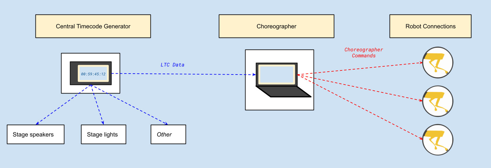
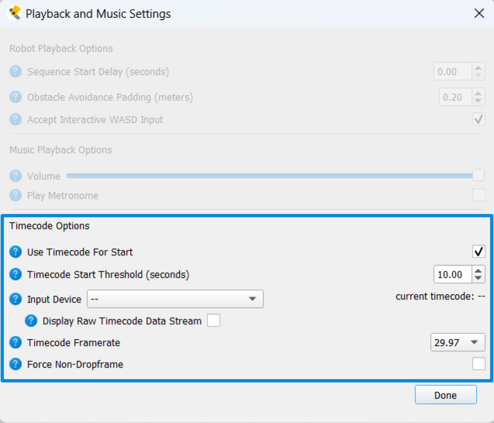

<!--
Copyright (c) 2023 Boston Dynamics, Inc.  All rights reserved.

Downloading, reproducing, distributing or otherwise using the SDK Software
is subject to the terms and conditions of the Boston Dynamics Software
Development Kit License (20191101-BDSDK-SL).
-->

# Timecode in Choreographer

## What Is Timecode?

Timecode is a standardized timestamp format that is often used in live performance to keep lights, music, and other elements in sync. It takes the form of hours, minutes, seconds frames:

**
hh:mm:ss:ff.
**

Timecode can be used and embedded in several ways. Choreographer specifically supports a SMPTE Linear Timecode (LTC) integration, which is common in film and music production. LTC data is transmitted as an audio signal, and can be sent and received with the same hardware that can be used to transmit or play a music track.

Linear Timecode is regularly used in live production environments, where lights, music, video and other stage equipment and effects must be synchronized. For performances of this scale, LTC is commonly used as the master timing reference for programming and executing cues. Essentially, all components of the show read from one timecode source and this timecode stream acts as a common reference for when components should execute their individual actions.

## Synchronization Between Choreographer and Other Stage Components

Choreographer can become a component of a larger stage system by receiving and parsing timecode cues from a central timecode source, and using this timecode input to determine when to start choreography sequences for its robot connections. All stage components (ex. audio, lights) including Choreographer connected to this central timecode generator share the same timing reference point, which means choreography sequences can be near perfectly synchronized to these other stage components without directly communicating with them.

In most situations Choreographer will be the best or only interface for controlling Spot. However in many professional performance environments the artists and engineers working to program non-Spot related stage effects, like lights and music, will have their own preferred methods and equipment. By becoming part of this larger stage system using LTC data, Choreographer can take responsibility for controlling Spot while leaving these other tasks to other specialized hardware.

_The most obvious use case would be to have Choreographer start a dance, while having the performance venue's speaker system play the music for the dance separately._

## Using Timecode Input to Start Choreography Sequences

### Events Overview

Choreographer has specific, user-configurable settings and checkpoints it looks for when using timecode input to start dances. An example timeline of the events leading up to using timecode to start a dance is provided below.

1. The source timecode generator starts sending timecode values to Choreographer and other equipment.
2. Choreographer starts displaying valid timecode input matching the source. It may take Choreographer a few seconds to pick up the signal.
3. User sets the timecode when the dance should begin, and queues the dance using the timecode checkbox in the Robot Control bar.
4. At a set time before the dance should start (the "Timecode Threshold"), Choreographer begins pre-loading dances to all robot connections. These commands include a countdown to start the dance, based on the difference between the current timecode and the user-selected start time.

5. Robot connections receive their dance commands. This may take a few seconds. When successful, dance status will be displayed as "Waiting to Start" in the Robot Management Table.
6. At the set start time, robots begin dancing. This is triggered by the robot countdown communicated by Choreographer at step 4, not by a live timecode signal.

### Configuring Timecode Settings

Note: Timecode functionality in Choreographer depends on a local PortAudio (https://www.portaudio.com/docs/) installation. If timecode functionality is disabled in Choreographer, you will likely need to install this package before moving forward. See [Installing Optional Choreographer Dependencies](choreographer_setup.md#installing-optional-choreographer-dependencies) in the Choreographer setup guide for details.

1. **Open the "Playback and Music Settings" menu under "Settings".** Find the "Use Timecode for Start" checkbox option and enable it.

   

2. **Select the timecode audio input device from the dropdown.** If the expected audio device that should be sending timecode isn't present, you may need to close Choreographer and adjust your laptop's audio settings.
   _Note for Windows OS: Choreographer currently is unable to read ASIO driver input options directly. To circumvent this limitation, you can use a non-ASIO audio driver for input, or use additional software to reroute the ASIO input to a compatible output._

3. **Set the framerate of the incoming timecode.** If the incoming framerate is 29.97 or 59.94 and is non-dropframe, also set the non-dropframe option (this will have no effect on other framerates). Setting Choreographer's timecode framerate to the framerate of the incoming audio stream will be important for accurate timecode calculations. Once the correct audio input device is selected, you should begin to see the timecode values appear next to the dropdown. The "Display Raw Timecode Data Stream" option can be used to display timecode input exactly as it is received from the audio stream as a debugging tool. Other timecode displays and values in Choreographer will differ from the raw stream as they are corrected for misreads/corrupted bits and read time.

4. **Set the Timecode Start Threshold**. This value determines how far before the start timecode to start trying to initialize the sequences on each robot (How much time is given to "pre-load" a sequence). We recommend a non-zero value, as higher values provide more time to initialize playback (which helps ensure synchronization between multiple robots) and check that sequences have all been initialized successfully.

5. **Set and queue the timecode trigger.** After timecode is being read, Choreographer will still wait for the user to queue a dance before using timecode to execute any sequences. To queue a dance, look to the left of the Robot Control bar for the start timecode entry box. When "Use Timecode for Start" is enabled, it will appear in the same location that the "Start Choreography" button usually occupies. Set the desired timecode value for when the dance should begin, and then check the check box next to the start value to queue the dance. No dance will start until the checkbox has been enabled. The checkbox includes a 1-second "grace" window. Enabling it within this window after the start time has passed will start the dance immediately; after that, enabling it will have no effect. When Choreographer uses timecode to execute the dance, this box will automatically be unchecked.

   Note: While timecode is in use, the "Start Choreography" button can still be used to launch dances, and will continue to use the separate "Sequence Start Delay" value set in the "Playback and Music Settings" menu when executing sequences.

   
