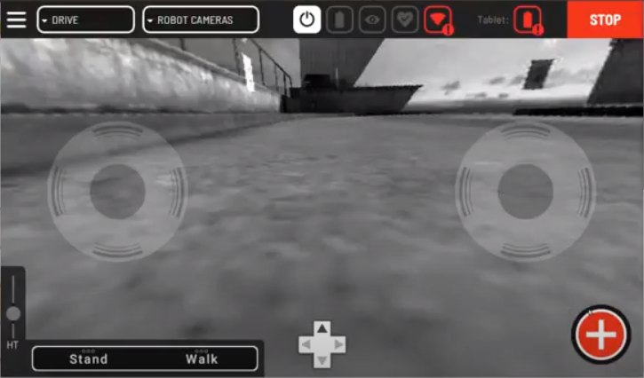
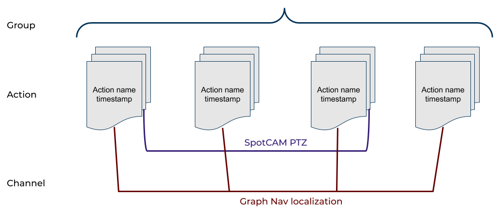
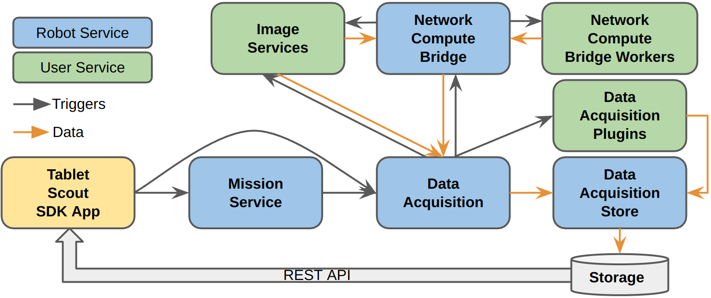

<!--
Copyright (c) 2023 Boston Dynamics, Inc.  All rights reserved.

Downloading, reproducing, distributing or otherwise using the SDK Software
is subject to the terms and conditions of the Boston Dynamics Software
Development Kit License (20191101-BDSDK-SL).
-->

# Data Acquisition Overview

Spot 2.1 release features a new system for acquiring, storing, and retrieving sensor data. These features are available in teleop mode, where users are controlling the robot from a client, such as the tablet, and in `Autowalk` mode, where the tablet is controlling the robot by replaying a recorded mission. This data acquisition functionality consists of several new services and their associated clients.

- `Data Acquisition` service: The coordinating service that will capture images, robot metadata, and delegate to plugins to capture custom sensor data.
- `Data Acquisition Plugin` services: User-implemented services that can capture data from sensors and save it into the store.
- `Data Acquisition Store` service: Interface for saving data and metadata to disk for later retrieval.
- `Image` services: Existing interface used in a new way. User-implemented image services will now be displayed in the tablet for driving, and be automatically capturable by the `Data Acquisition` service.

## High-level concepts

### Capture capabilities

Capture capabilities are human-readable identifiers for the type of data captured by `Data Acquisition Plugin` services or `Image` services. The `Data Acquisition` service compiles this list of capture capabilities from all the `Data Acquisition Plugin` services and `Image` services registered in the system.
Each `Data Acquisition Plugin` service reports the capture capabilities it provides. For example, a plugin that captures `GPS` data can report a capture capability named “GPS”. The `Data Acquisition` service requests this information from a plugin when the plugin registers with the directory service. The `Data Acquisition` service also reports all image sources listed by the `Image` services registered in the system as capture capabilities.
The tablet requests this complete list of capture capabilities from the `Data Acquisition Plugin` services and the `Image` services from the `Data Acquisition` service.

### Actions

To simplify the data acquisition process, the tablet contains functionality to combine the capture capabilities described above into actions with unique names. So, actions are combinations of capture capabilities, configured with a specific timeout to wait for the capture completion. These capture actions can then be triggered programmatically through the SDK or by the tablet during teleop of the robot or mission recording using the Red Plus button on the tablet, shown in the screenshot below.

### Acquisition request:

During teleop or `Autowalk`, a triggered action sends an acquisition request, which is an `AcquireDataRequest` message, to the `Data Acquisition` service. An acquisition request contains four parts:

1. Action identifier: The action identifier in each acquisition request is created automatically by the tablet. It contains three fields:
   1. `action_name`: Unique name for each acquisition request based on the action name it is configured to trigger for acquisition.
   2. `group_name`: Name for a collection of actions, such as a mission or a teleop capture session, which includes multiple acquisition actions. [See Groups section below.](#groups)
   3. `timestamp`: Timestamp when the acquisition request is triggered.
2. Acquisition requests: List of data acquisitions to trigger from image services or data acquisition plugins. This list corresponds to the list of capture capabilities configured in the action being triggered.
3. Metadata: User-specified strings to associate with the captured data. This information can be specified in the tablet in the action trigger screen.
4. Minimum timeout: Optional duration used to extend the amount of time that the data request may take, in the event that a plugin is incorrectly specifying its timeout. The amount of time allowed will be the maximum of this duration and any requests made to plugins or other capture sources. This is the value the user specifies when they configure an action.

The outcome of an acquisition request is `Image` services and `Data Acquisition Plugin` services collecting the requested data and storing it in the robot for downloading at a later time.

### Groups

Groups are a set of acquisition requests, such as a mission or a teleop capture session. They simplify the organization of the captured data. For example, all the captured data for a specific group is stored in the same folder in the downloaded data. The `Data Store` client interface also provides methods for listing actions for a specific group.

### Data Channels

Each type of data is stored in different channels in the system. In the case of `Data Acquisition Plugin` services, the plugin determines what the channel name is when storing the data in the system. In the case of `Image` services, the channel used to store an image is specified as {image service name}\_{camera source name}. The system uses the channel name together with the action and group name to organize the data as shown in the diagram below.

### Downloaded Data

Users can download acquired data using the tablet or any other client through a `REST` endpoint on the robot. The `REST` endpoint takes a start and end time for the data to download, as well as a set of channel names, in case the user is interested in downloading only a specific set of data types. The data is downloaded as a zip file with separate folders for each group. Each group folder contains all metadata combined in a file called `metadata.json` and a set of files for images and non-image data.

## System architecture

The functionality described above is architected in the system as shown in the diagram below. During system initialization, the `Data Acquisition` service aggregates the list of capture capabilities from `Image` services, `NetworkComputeBridge` services (described [here](./network_compute_bridge.md)) and `Data Acquisition Plugin` services. The users configure actions in the tablet as collections of capabilities. The tablet, Scout, an application using the Spot SDK, or the mission service sends acquisition requests to the `Data Acquisition` service to acquire data. The `Data Acquisition` service farms out the acquisition requests to the right `Image` service, `NetworkComputeBridge` service and `Data Acquisition Plugin` service. `Data Acquisition Plugin` services save their captures directly to the `Data Acquisition Store` service through helper functions, while `Image` and `Network Compute Bridge` services send their data back to the `Data Acquisition` service, which is then responsible for storing it to the `Data Acquisition Store` service. The `Data Acquisition Store` service writes the collected data to a database so they are available for download from the `REST` interface, as described [here](./data_buffer_overview.md#data-acquisition-download).

The Data Acquisition service provides the following RPCs:

1. `GetServiceInfo` - This RPC is defined in `Data Acquisition` services, as well as `Data Acquisition Plugin` services. It reports a full list of acquisition capabilities provided by the `Data Acquisition` or `Data Acquisition Plugin` service. On startup, the `Data Acquisition` service pings all registered `Image` services, the `Network Compute Bridge` service, which aggregates the models from all the `Network Compute Bridge Worker` services, and `Data Acquisition Plugin` services for their capabilities. It does that through the `ListImageSources` RPC for `Image` services, the `ListAvailableModels` RPC for the `Network Compute Bridge` service and `GetServiceInfo` for `Data Acquisition Plugin` services. The `Data Acquisition` service then aggregates all those capabilities into the list that it reports through this RPC. The tablet uses this RPC to determine the acquisition capabilities
2. `AcquireData` - This RPC commands the `Data Acquisition` service to acquire and store data. It contains a subset of the capabilities reported by the `GetServiceInfo` RPC. The Data Acquisition service breaks down the request into `GetImage` RPC requests to the corresponding `Image` services, `NetworkCompute` RPC request to the `NetworkComputeBridge` service and `AcquirePluginData` RPC requests to the corresponding `Data Acquisition Plugin` services. The `AcquirePluginData` `Data Acquisition Plugin` RPC is very similar to this RPC.
3. `GetStatus` - This RPC is defined in the `Data Acquisition` service, as well as `Data Acquisition Plugin` services. It reports the status of a particular `AcquireData` or `AcquirePluginData` request.
4. `CancelAcquisition` - This RPC is defined in the `Data Acquisition` service, as well as `Data Acquisition Plugin` services. It cancels a particular `AcquireData` request or `AcquirePluginData` request.
5. `GetLiveData` - This RPC is used to request live data from DAQ plugins during teleoperation. This RPC is defined in the `Data Acquisition` service, as well as `Data Acquisition Plugin` services. It contains a subset of the capabilities reported by the `GetServiceInfo` RPC. The Data Acquisition service breaks down the request into `GetLiveData` RPC requests to the corresponding `Data Acquisition Plugin` services. The `GetLiveData` `Data Acquisition Plugin` RPC is very similar to this RPC. This RPC was added in the 4.0 release.

## Implementing Data Acquisition services

Please refer to [this document](developing_api_services.md) on how to implement services in general and [this document](writing_services_for_data_acquisition.md) on how to implement `DataAcquisitionPluginService` or `ImageService` to integrate a payload with the data acquisition capabilities of the robot.
