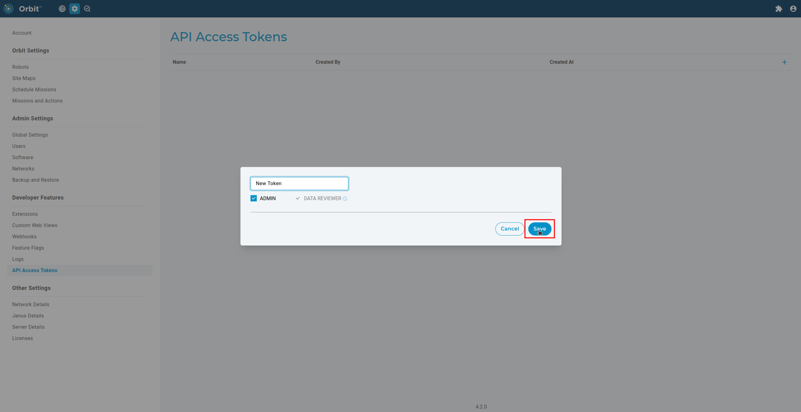

<!--
Copyright (c) 2023 Boston Dynamics, Inc.  All rights reserved.

Downloading, reproducing, distributing or otherwise using the SDK Software
is subject to the terms and conditions of the Boston Dynamics Software
Development Kit License (20191101-BDSDK-SL).
-->

# Orbit API

The Orbit API is a web API served by an Orbit instance. The API is interacted with by sending HTTPS requests to a number of resource endpoints. Each resource endpoint is prefixed with the API route `/api/v0/`. For example, a list of `run_events` may be retrieved by sending a `GET` request to `/api/v0/run_events`. A complete URL would add this to the URL of the Orbit instance - e.g. `https://my-orbit.com/api/v0/run_events/`.

The Orbit API is language-agnostic and may be programmed against using any programming language that supports sending HTTP requests.

For a complete list of resources and their methods, see the <a href="../../../docs/orbit/docs.html">Orbit API Reference</a>.

## Contents

- <a href="../../../docs/orbit/docs.html">RESTful API Reference</a>
- [Authentication](#authentication)
- [Object Structure](#orbit-object-structure)
- [Facets](#facets)
- [Orbit API Python SDK](../../../python/bosdyn-orbit/src/bosdyn/orbit/README.md)
- [Orbit API Python SDK Examples](../../../python/examples/docs/orbit.md)

### Authentication

Resources can only be requested by authorized Orbit users. In order to be authorized, users need to provide headers with an API token obtained from an Orbit instance's admin settings.


A variety of options are available with different authorities. Pick the one that is most appropriate for you or your application.



Make sure to copy and save the token in a safe place as this token will not be accessible again.

To authorize with the obtained API token, send a `GET` request to the authentication endpoint at `/api/v0/api_token/authenticate`:

```py
"""Authenticate with an API token obtained from an Orbit instance."""
import json
import requests

# Set API token in headers
headers = {'Authorization': 'Bearer ' + <MY ORBIT API TOKEN>}
# Check the validity of the API token
authenticate_response = requests.get(
    f'https://{my-orbit.com}/api/v0/api_token/authenticate', headers=headers)
if authenticate_response.ok:
    print('Client: Auth succeeded')
else:
    print('Client: Auth failed: {} Please, obtain a valid API token from the instance!'.
          format(authenticate_response.text))
```

Now that we have a valid API token, we can use it to request resources. When requesting, the API token needs to be provided as part of the `headers` argument:

```py
"""Use the cookies to fetch some robots. The same authorization strategy is used for other http methods."""
robots_response = requests.get(f'https://{hostname}/api/v0/robots', headers=headers, verify=False)
if not robots_response.ok:
  print(f'Encountered a problem while requesting robots: {robots_response.text}')
else:
  robots_json = robots_response.json()
  print("Fetched robots!")
```

The API token must be provided in every request aside from the request. If an unauthorized request is made, a `401` response is sent. Likewise, if an API link is visited in the browser without the user being authorized, `Forbidden` is shown.

## Orbit Object Structure

### Data

Below is a simple example of the data structure of a mission run that was uploaded from a robot to Orbit. This mission has two RunEvents (actions) and three total data points (RunCaptures), two of which are associated with a single action. Runs may have many actions while RunEvents may have many RunCaptures, much like missions can have many actions, and each action can save many pieces of data.


#### Run (Mission Archive)

A `Run` represents a period of robot operation. Both teleoperation and autonomous operations are represented as `Runs`. They provide other information such as: status, start/end times, action count, and robot name. It is important to to note that the end time may not be populated when a mission is currently in progress so it is a good idea to check for this. `Runs` can have many `RunEvents` which depict the output from each action that transpired during the operation period, these `RunEvents` are linked to the `Run` by the `Run`’s uuid.

#### RunEvent (Action Archive)

A `RunEvent` represents the output of an action executed during a `Run`. It contains all the RunCaptures associated with the action. A `RunEvent` can only be associated with a singular `Run`. It also contains a list of all `RunCaptures` (data captures) associated with the action. `RunCaptures `are linked to the `RunEvent` by the `RunEvent`’s uuid.

#### RunCapture (Data Archive)

A `RunCapture` describes a data point captured during a particular `RunEvent`. There can be many `RunCaptures` for a given `RunEvent`. A `RunCapture` can only be linked to one `RunEvent` through the `runEventUuid` field.

#### Note

It is best practice to query and refer to `Runs`, `RunEvents`, and `RunCaptures` with their uuid as this is a unique identifier. Using the names of these objects may not correctly refer to the desired object as there may be duplicates. Ex: the same mission run twice will have two `Runs` with the same `missionName` field.

### Missions

Below is a simple representation of what a mission looks like in the context of Orbit.


#### SiteWalk (Mission)

A `SiteWalk` describes a series of tasks that define autonomous robot operation. It contains `SiteElements` and `SiteDocks` together with other parameters that define autonomous operation. A `SiteWalk` has a list of `SiteElements` which are attempted in sequential order. `SiteWalks` also have a list of `SiteDocks` that define which charging station locations are allowed to be used during a specific `SiteWalk`. The robot will choose which `SiteDock` is best at runtime.

#### SiteElement (Action)

A `SiteElement` describes what a robot should do and where to do it. `SiteElements` are normally associated with a specific waypoint where the action is to be performed. These performed actions are then represented as `RunEvents` once the data is transferred to Orbit. `SiteElements` can be utilized in many `SiteWalks`.

#### SiteDock (Charging Station)

A `SiteDock` is a representation of a robot's docking station. The robot can utilize `SiteDocks` during and after `SiteWalks` to ensure the battery never runs out.

The same SiteDock can be used in multiple `SiteWalks`, but as of 4.1.0, users are responsible for ensuring the physical dock is not taken if they need the robot to dock there. This may change in the future (and we may forget to update this page accordingly).

## Facets

Facets are API endpoints that return a more specific output. Facets can simplify client code and reduce network traffic by returning useful descriptions of different objects. For example, the `/runs/facets/missions` returns every unique mission that produced a `Run`, a count of how many times the mission ran, and the last start time.

See <a href="../../../docs/orbit/docs.html">Orbit API Reference</a> for a full list of facets.

## Orbit API and the Python SDK

The Spot Python SDK includes a `bosdyn-orbit` Python package and client implementation for the Orbit API. The `bosdyn-orbit` package documentation is [here](../../../python/bosdyn-orbit/src/bosdyn/orbit/README.md).

The package provides `OrbitClient` - an implementation for the Orbit API. Once instantiated and authenticated, it provides a number of helpful methods which abstract away the details of HTTP to simplify building programs with the Orbit API. Please refer to the [Hello Orbit](../../../python/examples/orbit/hello_orbit/README.md) SDK example to get started developing with the Orbit API Python client.

### Deprecation Warning

Following the rebranding of "Scout" to "Orbit" in 4.0.0, the pre-existing Python package `bosdyn-scout` is deprecated. All [SDK examples](../../../python/examples/docs/orbit.md) now use `bosdyn-orbit` instead. Any previous applications that used `bosdyn-scout` will continue to work. It is highly recommended that `bosdyn-orbit` be used moving forward.
