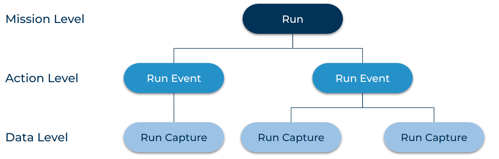
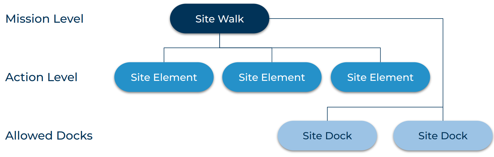

<!--
Copyright (c) 2023 Boston Dynamics, Inc.  All rights reserved.

Downloading, reproducing, distributing or otherwise using the SDK Software
is subject to the terms and conditions of the Boston Dynamics Software
Development Kit License (20191101-BDSDK-SL).
-->

# Orbit API

The Orbit API is a web API served by an Orbit instance, accessed by sending HTTPS requests to resource endpoints. As of Orbit v5.2, the API is offered in two tiers:

- **v0** (`/api/v0/`) is the original API and has been available since Orbit's initial release. It covers the full breadth of Orbit functionality (runs, run events, captures, anomalies, schedules, webhooks, work orders, robots, site walks, site elements, and more). v0 is considered **beta/experimental**: endpoint behavior and the OpenAPI spec structure may change in any future release.
- **v1** (`/api/fleet/v1/`, `/api/facilities/v1/`, …) is the new service-oriented API introduced in v5.2. v1 is **stable and its endpoints the recommended choice for new integrations**. It uses opaque string identifiers, groups endpoints by service domain, paginates list responses by default, and returns a uniform error shape. Boston Dynamics will continue to promote additional v0 capabilities into stable v1 resources in future releases.

For resources available in both tiers (robots, site walks, site elements), v1 is preferred. Use v0 only for resources that v1 does not yet cover.

The Orbit API is language-agnostic and may be programmed against using any programming language that supports sending HTTP requests.

## Contents

- [Authentication](#authentication)
- [Interactive API Reference](#interactive-api-reference)
- [Orbit v1 API](#orbit-v1-api)
- [Stability and Migration](#stability-and-migration)
- [Object Structure](#orbit-object-structure)
- [Facets](#facets)
- [Orbit API Python SDK](../../../python/bosdyn-orbit/src/bosdyn/orbit/README.md)
- [Orbit API Python SDK Examples](../../../python/examples/docs/orbit.md)

### Authentication

Resources can only be requested by authorized Orbit users. To be authorized, the web client provides an `Authorization` header with an API token obtained from an Orbit instance's admin settings. The same token works for both v0 and v1 endpoints.

To create a token, navigate to **Settings > Developer Features > API** in the Orbit dashboard, then press the plus button (its tooltip reads "Create New API Access Token").

A variety of options are available with different authorities. Pick the one that is most appropriate for the application, then click "Save".

Make sure to copy and save the token in a safe place; this token will not be accessible again.

Web clients must supply the `Authorization: Bearer <token>` header on every v0 and v1 request.

For example, the same header is used to fetch robots from either tier:

```py
"""Use the API token to fetch some robots. The same authorization strategy is used for other HTTP methods and for v1 endpoints."""
import requests

headers = {'Authorization': 'Bearer ' + <MY ORBIT API TOKEN>}

# v0
robots_response = requests.get(f'https://{hostname}/api/v0/robots', headers=headers)
if not robots_response.ok:
    print(f'Encountered a problem while requesting robots: {robots_response.text}')
else:
    robots_json = robots_response.json()
    print("Fetched robots from v0!")

# v1 (same token, different path)
robots_v1_response = requests.get(f'https://{hostname}/api/fleet/v1/robots', headers=headers)
if not robots_v1_response.ok:
    print(f'Encountered a problem while requesting v1 robots: {robots_v1_response.text}')
else:
    robots_v1_json = robots_v1_response.json()
    print("Fetched robots from v1!")
```

The API token must be provided in every request, with a few exceptions for unauthenticated endpoints (e.g. `/api/v0/status`, `/api/v0/version`, `/api/v0/login`). If an unauthorized request is made to a protected endpoint, a `401` response is sent. Likewise, if an API link is visited in the browser without the user being authorized, `Forbidden` is shown.

## Interactive API Reference

Each Orbit instance hosts live, interactive Swagger UI documentation for both API tiers. These are the canonical references for endpoint paths, parameters, request bodies, and response schemas.

### v0 (`/api/v0/docs`)

- Browse all v0 endpoints interactively at `https://{my-orbit.com}/api/v0/docs`.
- The Swagger UI page title includes a hyperlink to the raw OpenAPI JSON spec. You can open that link in a new browser tab or copy the URL into code generation tools.
- The raw spec is also reachable directly at `https://{my-orbit.com}/api/v0/docs/spec`.

The v0 spec has been resynchronized with the implementation in v5.2 and now more accurately reflects the actual request and response shapes used by the server. See [Stability and Migration](#stability-and-migration) for stability expectations.

### v1 (`/api/v1/docs`)

- Browse all v1 services interactively at `https://{my-orbit.com}/api/v1/docs`. The page exposes a dropdown selector to switch between the available service specs (Fleet and Facilities in v5.2).
- Per-service Swagger UIs are also available at `https://{my-orbit.com}/api/v1/docs/fleet` and `https://{my-orbit.com}/api/v1/docs/facilities`.

Each operation in both specs is annotated with an `x-stability-level` extension (`draft`, `alpha`, `beta`, or `stable`) declaring its stability contract. See [Stability and Migration](#stability-and-migration) for what each level means.

## Orbit v1 API

The v1 API is a new, more RESTful API tier introduced in v5.2. It is organized by service domain rather than a flat, single namespace, identifies resources with opaque string ids, and is fully described by OpenAPI specs available at `/api/v1/docs`.

List endpoints support filtering and pagination via query parameters (for example `?limit=`, `?offset=`, `?assetId=`). See the per-service Swagger UI for the full set of supported query parameters.

### v1 Response Shape

All v1 list endpoints return a `items`/`page` envelope:

```json
{
  "items": [],
  "page": {
    "count": 42,
    "limit": 25,
    "offset": 0
  }
}
```

All v1 error responses share a uniform shape with a resource-specific `code` and a human-readable `message`:

```json
{
  "code": "ROBOT_NOT_FOUND",
  "message": "Robot with ID 00000000-0000-0000-0000-000000000000 not found"
}
```

### v1 Example

The following Python snippet fetches the first page of robots from the v1 Fleet service alongside the equivalent v0 call:

```py
"""List robots from both v0 and v1 to compare response shapes."""
import requests

headers = {'Authorization': 'Bearer ' + '<MY ORBIT API TOKEN>'}

# v0: flat list of robot objects
v0 = requests.get(f'https://{hostname}/api/v0/robots', headers=headers).json()
print(f'v0 returned {len(v0)} robots')

# v1: paginated envelope with items + page metadata
v1 = requests.get(
    f'https://{hostname}/api/fleet/v1/robots',
    params={'limit': 25, 'offset': 0},
    headers=headers,
).json()
print(f'v1 returned {v1["page"]["count"]} robots (limit={v1["page"]["limit"]}, offset={v1["page"]["offset"]})')
for robot in v1['items']:
    print(robot['id'], robot.get('nickname'))
```

For a more complete walkthrough, see the [`orbit_v1_api`](../../../python/examples/orbit/orbit_v1_api/README.md) SDK example.

### v1 vs v0: When to use which

- **Prefer available v1 endpoints** for new integrations. v1 is the stable, supported API tier and will be expanded to cover more resources in future releases.
- **Use v0** for resources not yet available in v1 (runs, run events, captures, anomalies, schedules, webhooks, work orders, and others remain v0-only). Be aware that v0 is **beta/experimental**: endpoint behavior and the spec structure may change between releases.

## Stability and Migration

> **Important**
>
> - **v0 is not deprecated**, but it is **experimental/beta**. Boston Dynamics may make breaking changes to v0 endpoints or to the v0 OpenAPI spec in any future release. Web clients that depend on a v0 endpoint should pin to a specific Orbit release and review the changelog before upgrading if unintended consequences with downstream integrations must be avoided.
> - **v1 is stable**. It follows semantic versioning intent: breaking changes will not be introduced within the v1 major version. New resources and optional fields may be added.
> - For resources available in both tiers (robots, site walks, site elements), **v1 is strongly preferred** for new integrations. Migrate existing integrations as your release cycle allows.
> - **ID format**: v0 uses a mix of integer IDs, serial numbers, and UUIDs depending on the resource. v1 identifiers are **opaque strings**. Many are UUIDs, but some resources carry ids in other formats (site map ids, for example, are numeric strings). Treat every `*Id` value as an opaque token: store and echo it verbatim, compare only for exact equality, and do not parse it, validate it as a UUID, or depend on its length or character set.

### Per-operation stability tags

Beginning in v5.2, every operation in the OpenAPI specs carries an `x-stability-level` extension that declares its individual stability contract. The value is one of four levels:

| Level    | Meaning                                                                     |
| -------- | --------------------------------------------------------------------------- |
| `draft`  | Under active development; may change or be removed without notice.          |
| `alpha`  | Experimental; breaking changes may occur in any release.                    |
| `beta`   | Largely settled; breaking changes are possible but communicated in advance. |
| `stable` | Stable contract; no breaking changes within the major version.              |

In v5.2, all v0 operations are tagged `alpha` and all v1 operations are tagged `stable`. An operation with no tag should be assumed to be `alpha`. An operation's stability may only increase over time (`draft` → `alpha` → `beta` → `stable`), never decrease.

## Orbit Object Structure

### Data

Below is a simple example of the data structure of a mission run that was uploaded from a robot to Orbit. This mission has two RunEvents (actions) and three total data points (RunCaptures), two of which are associated with a single action. Runs may have many actions while RunEvents may have many RunCaptures, much like missions can have many actions, and each action can save many pieces of data.



#### Run (Mission Archive)

A `Run` represents a period of robot operation. Both teleoperation and autonomous operations are represented as `Runs`. They provide other information such as: status, start/end times, action count, and robot name. It is important to note that the end time may not be populated when a mission is currently in progress so it is a good idea to check for this. `Runs` can have many `RunEvents` which depict the output from each action that transpired during the operation period; these `RunEvents` are linked to the `Run` by the `Run`’s uuid.

#### RunEvent (Action Archive)

A `RunEvent` represents the output of an action executed during a `Run`. It can only be associated with a singular `Run` and contains a list of all `RunCaptures` (data captures) associated with the action. `RunCaptures` are linked to the `RunEvent` by the `RunEvent`’s uuid.

#### RunCapture (Data Archive)

A `RunCapture` describes a data point captured during a particular `RunEvent`. There can be many `RunCaptures` for a given `RunEvent`. A `RunCapture` can only be linked to one `RunEvent` through the `runEventUuid` field.

#### Note

It is best practice to query and refer to `Runs`, `RunEvents`, and `RunCaptures` with their uuid as this is a unique identifier. Using the names of these objects may not correctly refer to the desired object as there may be duplicates. Ex: the same mission run twice will have two `Runs` with the same `missionName` field.

### Missions

Below is a simple representation of what a mission looks like in the context of Orbit.



#### SiteWalk (Mission)

A `SiteWalk` describes a series of tasks that define autonomous robot operation. It contains `SiteElements` and `SiteDocks` together with other parameters that define autonomous operation. A `SiteWalk` has a list of `SiteElements` which are attempted in sequential order. `SiteWalks` also have a list of `SiteDocks` that define which charging station locations are allowed to be used during a specific `SiteWalk`. The robot will choose which `SiteDock` is best at runtime.

`SiteWalks` are also accessible via the v1 Facilities service at `/api/facilities/v1/site-walks`.

#### SiteElement (Action)

A `SiteElement` describes what a robot should do and where to do it. `SiteElements` are normally associated with a specific waypoint where the action is to be performed. These performed actions are then represented as `RunEvents` once the data is transferred to Orbit. `SiteElements` can be utilized in many `SiteWalks`.

`SiteElements` are also accessible via the v1 Facilities service at `/api/facilities/v1/site-elements`.

#### SiteDock (Charging Station)

A `SiteDock` is a representation of a robot's docking station. The robot can utilize `SiteDocks` during and after `SiteWalks` to ensure the battery never runs out.

The same SiteDock can be used in multiple `SiteWalks`, but as of 4.1.0, users are responsible for ensuring the physical dock is not taken if they need the robot to dock there. This may change in the future (and we may forget to update this page accordingly).

## Facets

Facets are v0 API endpoints that return a more specific output. Facets can simplify client code and reduce network traffic by returning useful descriptions of different objects. For example, `/api/v0/runs/facets/missions` returns every unique mission that produced a `Run`, a count of how many times the mission ran, and the last start time.

See the [Interactive API Reference](#interactive-api-reference) for a full list of facets.

## Orbit API and the Python SDK

The Spot Python SDK includes a `bosdyn-orbit` Python package and client implementation for the Orbit API. The `bosdyn-orbit` package documentation is [here](../../../python/bosdyn-orbit/src/bosdyn/orbit/README.md).

The package provides `OrbitClient`, an implementation that targets the **v0** Orbit API. Once instantiated and authenticated, it provides a number of helpful methods which abstract away the details of HTTP to simplify building programs with v0. Please refer to the [Hello Orbit](../../../python/examples/orbit/hello_orbit/README.md) SDK example to get started.

For v1, no dedicated client is bundled in v5.2. Call the v1 endpoints directly with any HTTP client (for example `requests`). The [`orbit_v1_api`](../../../python/examples/orbit/orbit_v1_api/README.md) example demonstrates this pattern.

### Deprecation Warning

Following the rebranding of "Scout" to "Orbit" in 4.0.0, the pre-existing Python package `bosdyn-scout` is deprecated. All [SDK examples](../../../python/examples/docs/orbit.md) now use `bosdyn-orbit` instead. Any previous applications that used `bosdyn-scout` will continue to work. It is highly recommended that `bosdyn-orbit` be used moving forward.
