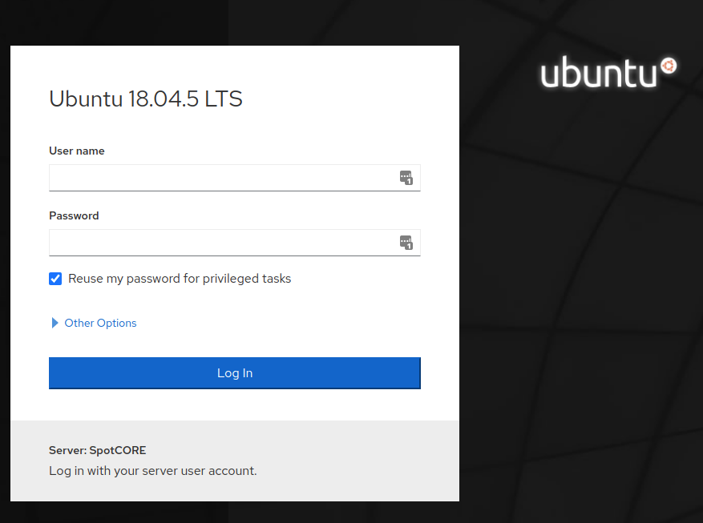
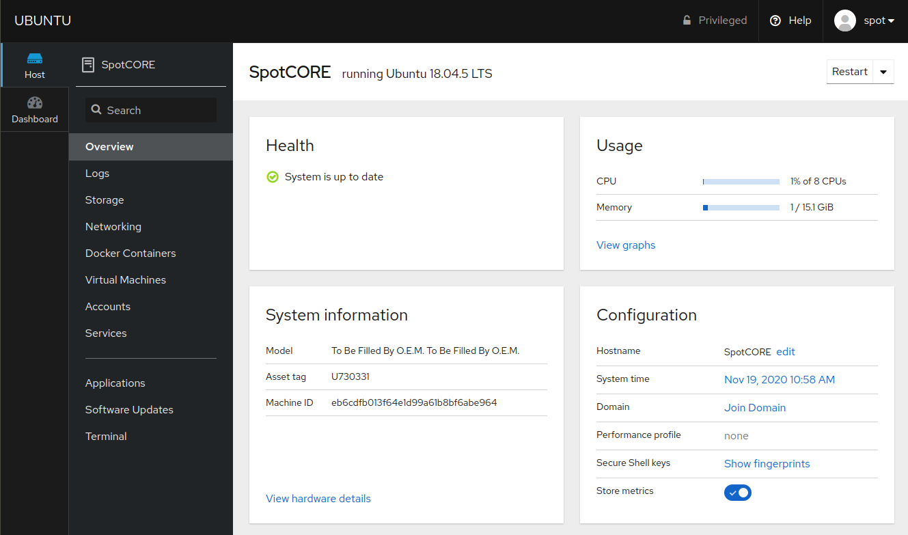
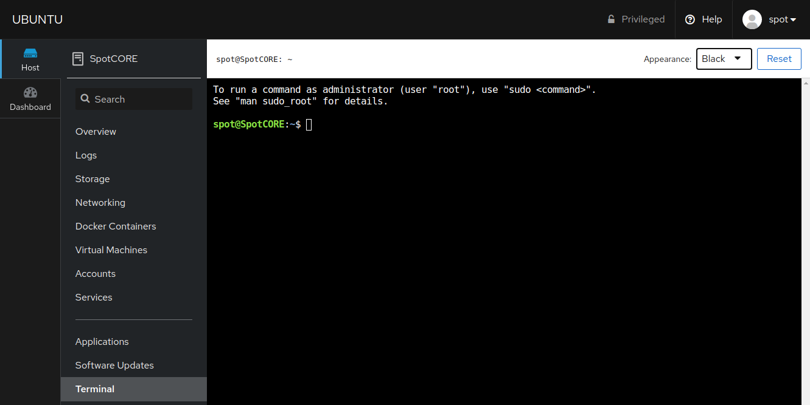
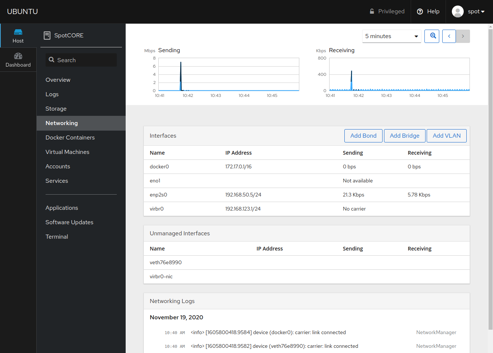
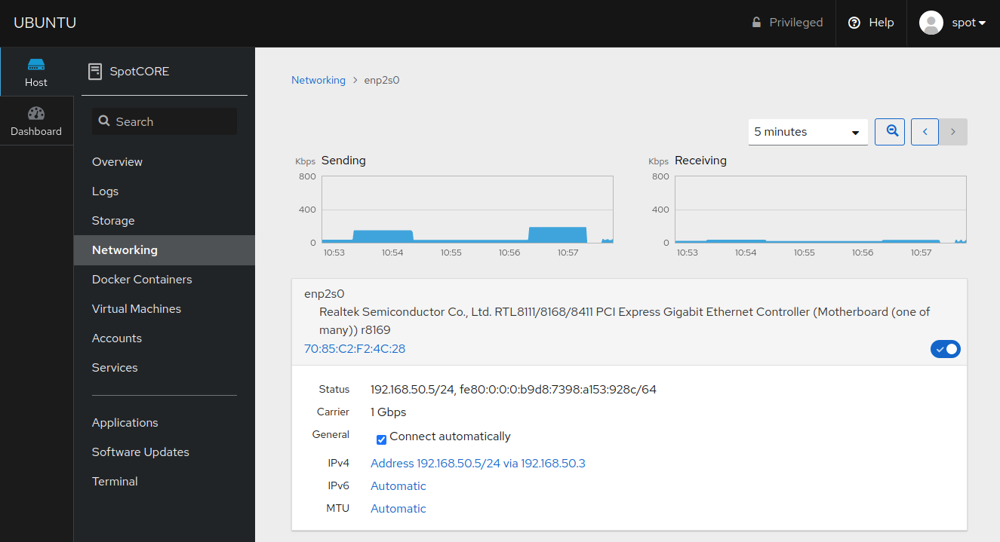
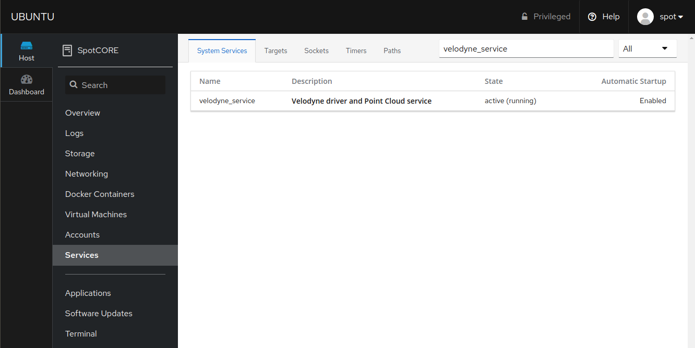
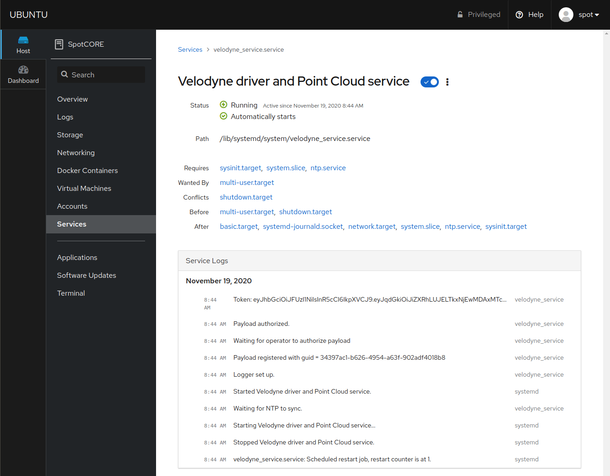
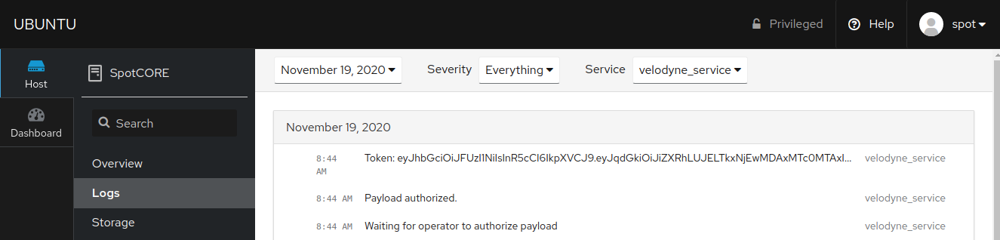

<!--
Copyright (c) 2023 Boston Dynamics, Inc.  All rights reserved.

Downloading, reproducing, distributing or otherwise using the SDK Software
is subject to the terms and conditions of the Boston Dynamics Software
Development Kit License (20191101-BDSDK-SL).
-->

# Spot CORE Cockpit - System Management Tool

Cockpit is an interactive Linux server admin interface, licensed under: GNU LGPL version 2.1. More details can be found at https://cockpit-project.org/.

We have installed this tool **on** the Spot CORE to make system management a little bit easier for developers and end users. 

## Prerequisites
- Spot CORE must be powered on.
- Spot CORE should be connected to the robot with a working Ethernet connection.

## Setup

This document will quickly cover the recommended features for Spot CORE users. Cockpit is readily available on forwarded port 21443. In the future, a direct link will be provided on the Admin Console Spot CORE Payloads page. To access this port through the robot, use the following address: https://INSERT_ROBOT_IP:21443/. If a PC is connected to the robot over WiFi, go to https://192.168.80.3:21443/. Click "Advanced" and "Proceed ..." to reach the login page.




Log in using your standard Spot CORE account username & password credentials. Ensure you select "Reuse my password for privileged tasks". This will be required in order to adjust network settings for example. 

The landing page gives you an "Overview" of the Spot CORE. Notice near the top right corner there is a "Restart" option which is very handy if the Spot CORE is in a remote location. IMPORTANT NOTE: Do not adjust system time if you are using the Spot CORE EAP with the Velodyne LiDAR VLP-16.



See additional instructions below to specifically cover how to use the following tools with the Spot CORE.

- [Terminal](#terminal)
- [Networking](#networking)
- [Docker Containers](#docker-containers)
- [Services](#services)

## Terminal
Jumping down to the bottom option, take a quick look at the Cockpit Terminal page which will be used in the following examples.



### Check Spot CORE Software Version
Our support team may ask you what Spot CORE version you are running. This information can be found on the registered payload page of the admin console or the settings page of the tablet app. This information can also be found with more detail by running the following command on the Spot CORE. An example is included below using the Cockpit Terminal.

```
cat /etc/spotcore-release
```


## Networking
The Networking page will likely be the most frequently used interface for Spot CORE users. The default base image for the release 2.1.0 or later Spot CORE now uses NetworkManager for configuring network settings which provides a clean interface with Cockpit. 



### Spot CORE WiFi Network Settings
Below is the recommended procedure for release 2.1.0 or later of how to connect Spot CORE to the internet with a WiFi adapter.

1. Insert Ubuntu 18.04 compatible USB WiFi adapter.
2. Connect WiFi adapter to an access point.
3. Adjust network settings to communicate with the internet.

Insert a USB WiFi adapter into the Spot CORE and notice the device appears as an additional interface. If the WiFi adapter does not appear, it is possible the adapter does not support the default Linux Kernel 4.15 shipped with Ubuntu 18.04. Use a different adapter or install a driver update.


The next step is to connect the WiFi adapter to a wireless access point. There are a couple methods to perform this task, but we recommend using the Cockpit Terminal as this will be the fastest. Please note, connecting to a wireless access point can also be achieved using SSH, VNC, or the standard desktop environment with a monitor, keyboard, and mouse plugged into the Spot CORE.

Return to the Cockpit Terminal and use the condensed instructions included below or follow [the detailed instructions here](https://ubuntu.com/core/docs/networkmanager/configure-wifi-connections) to configure your WiFi adapter from the terminal.

```
nmcli d # List interface names.
nmcli r wifi on # Turn WiFi radio on.
nmcli d wifi list # List available WiFi networks.
```
From the listed wireless access points, replace the capitalized letters of the command below with your desired WiFi network and password.
```
sudo nmcli d wifi connect "MY_WIFI" password "MY_PASSWORD"
```

Included below is an example of running the above commands.


A successful connection will appear as follows.


However, to test the internet connection, attempt a ping to `google.com`. Press Crtl + C to exit.


You will notice the ping requests do not go through. `Destination Host Unreachable`. Notice in the routing table after command `ip route`, Boston Dynamics has interface `enp2s0` configured with a default gateway at the lowest metric in order to route all network traffic to the robot by default.

Return to the Networking page to adjust the interfering interface settings. Notice the new wireless interface is now enabled. Select interface `enp2s0` and review the following options.



In order to connect to the internet, remove the IPv4 default route of enp2s0. Select the IPv4 settings by clicking `Address 192.168.50.5/24 via 192.168.50.3`.


**IMPORTANT NOTES:**

1. By default, Boston Dynamics has included 2 pre-defined Routes which will route outbound communication from the Spot CORE to the explicitly defined gateways, Spot's Access Point `192.168.80.0` and Spot's Ethernet port `10.0.0.0`, rather than the default gateway.
1. These routes are only required if the default gateway is removed for internet access. 
1. The route to `10.0.0.0` is only valid if the user has not adjusted the Ethernet network settings on the robot admin console.
1. To access the internet, remove the default gateway (the third field) under Addresses as pictured below and Apply these changes. Instead of routing all traffic to the robot, we will instead route to the internet.
1. Making the above change may affect Boston Dynamics integrations or Customer integrations. Adjust additional network settings if necessary.


Without the gateway, attempt to ping `google.com` from the terminal again. Press Crtl + C to exit.


Ping requests work! The Spot CORE can now reach the internet. Notice in the routing table after command `ip route`, the only default route is the new WiFi adapter. 

## Docker Containers
This is a minimal interface to manage docker containers running on the Spot CORE. Boston Dynamics recommends using Portainer for docker management instead with instructions available [here](./docker_containers.md). Unfortunately, the Cockpit Docker Containers application does not allow local docker image .tar uploads at this time.


## Services
The Services and Logs pages are helpful. The Boston Dynamics `velodyne_service` runs by default on all Spot COREs. This service performs two mains tasks:

1. Communicates with the Velodyne LiDAR VLP-16 model for enhanced Spot autonomy. 
1. Provides automatic payload registration.

If you are running into Spot CORE LiDAR or Payload registration problems, please [reach out to Support](https://support.bostondynamics.com/s/contactsupport) with log files. Log files are easily retrievable using the Cockpit interface as follows:

Type `velodyne_service` into the search bar near the top right.



And select the `velodyne_service`.



On this page, notice the service is properly running and registered. A similar search process can be performed on the Logs page for more detailed information. 



Note: you can also use the terminal to access system service status and logs. 

```bash
systemctl status velodyne_service
```
or 
```bash
journalctl -f -u velodyne_service
```

## Additional Cockpit Documentation
Clicking `? Help` in the top right corner of the Cockpit interface will lead you to documentation about the [Web Console](https://access.redhat.com/documentation/en-us/red_hat_enterprise_linux/8/html/managing_systems_using_the_rhel_8_web_console/index) or the specific page itself.
