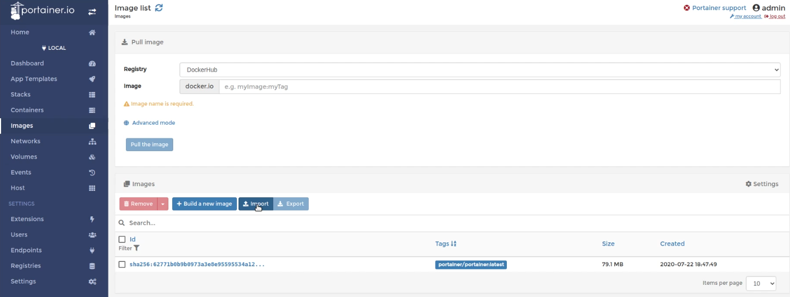
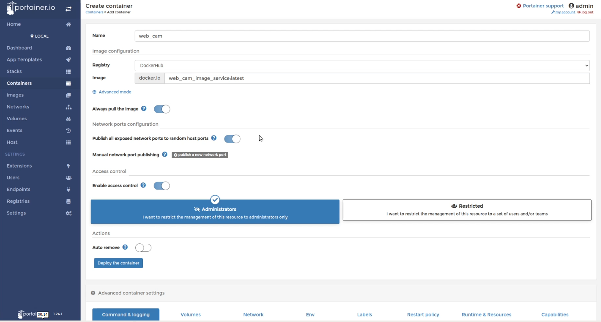

<!--
Copyright (c) 2022 Boston Dynamics, Inc.  All rights reserved.

Downloading, reproducing, distributing or otherwise using the SDK Software
is subject to the terms and conditions of the Boston Dynamics Software
Development Kit License (20191101-BDSDK-SL).
-->

## Manage Docker Containers in Spot CORE

This section describes two ways to manage docker containers on a computation payload, using Portainer already included in Spot CORE as of release 2.1.

### Portainer Configuration

In Spot release 2.1, Spot CORE comes preloaded with [Portainer](https://www.portainer.io) software to manage the docker containers. Portainer is a complete software solution for container management to speed up software deployments and troubleshooting on the Spot CORE. It is the recommended method for managing docker containers on Spot CORE. We also recommend using Portainer and following these instructions with other computation payloads as well.

Check the Spot CORE version to make sure it is 2.1 or higher by ssh-ing onto the Spot CORE and running `cat /etc/spotcore-release`. If it is not up to date, upgrade to the latest Spot CORE release by following the [instructions to upgrade](https://support.bostondynamics.com/s/article/How-to-update-Spot-CORE-software).

If you are having issues with Portainer running on the Spot CORE, refer to the support site [Spot CORE payload reference](https://support.bostondynamics.com/s/article/Spot-CORE-payload-reference)

Once the Spot CORE is updated, the docker file can be deployed from the Portainer web console. To access the web console, go to `https://192.168.80.3:21900`, log in, and then click the "Local" endpoint. To upload the tar file, click the "Image" tab on the left side of the web console, and then click the "Import" button in the "Images" section, as shown below.


Select the tar file created by the `docker save` command above, and then click "Upload". If the upload fails, try changing the permissions of the tar file using the command:

```
sudo chmod a+r {IMAGE_NAME}.tar
```

Once the upload completes, go to the "Containers" tab in Portainer and add a container by clicking the "Add Container" button. In the configuration page shown below:


set the follow fields:

- "Name" = Name of the container. This should be set to a unique string that describes the container.
- "Image" = {IMAGE_NAME}:latest. {IMAGE_NAME} represents the image name used to build the docker image.
- Under the "Command & logging" tab in the container configuration page, add all of the arguments in the "Command" field. Specifically, these arguments `--host-ip {HOST_COMPUTER_IP} --guid {PAYLOAD_GUID} --secret {PAYLOAD_SECRET} ROBOT_IP` should be required by all software applications running on Spot CORE that need to communicate with on-board services. Make sure the {HOST_COMPUTER_IP} matches the computation payload's IP (by default, this is `192.168.50.5` for the CORE), and ROBOT_IP matches the robot IP from the perspective of the Spot CORE (by default, this is `192.168.50.3`). {PAYLOAD_GUID} and {PAYLOAD_SECRET} should correspond to the computation payload credentials. The list of arguments specified in this section should also include additional arguments expected by the application.
- Under the "Network" tab in the container configuration page, set the "Network" field to `host` so ports are forwarded correctly between the host OS and the docker container.
- Under the "Restart policy" tab in the container configuration page, set the policy to "Unless stopped". This will allow the docker container to continue to keep running all the time (even after rebooting the spot core) unless it is manually stopped by a user in Portainer.

Once all the necessary fields are configured, select "Deploy the container" to run the software application configured in the docker container on Spot CORE. The screenshot below shows the web console view of a running container.

The log statements generated by the software application running in the docker container can be seen by clicking the "Logs" link, as shown in the screenshots below.

