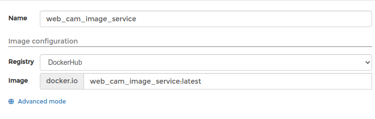
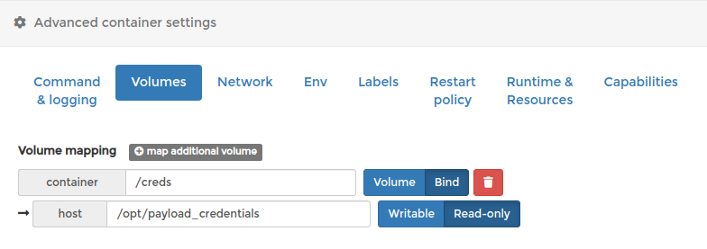
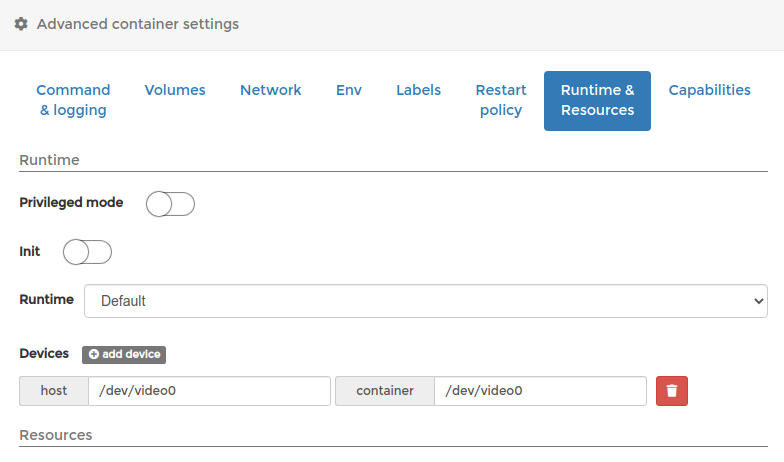
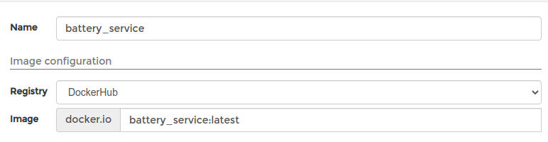
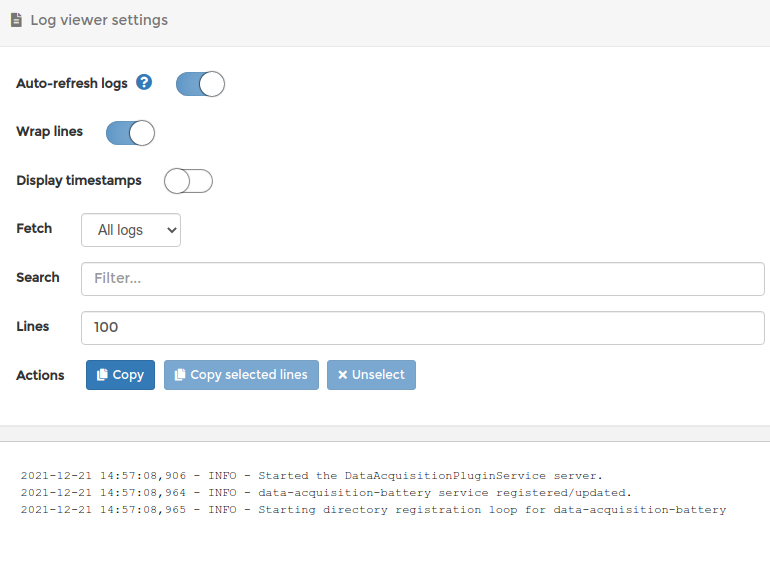

<!--
Copyright (c) 2022 Boston Dynamics, Inc.  All rights reserved.

Downloading, reproducing, distributing or otherwise using the SDK Software
is subject to the terms and conditions of the Boston Dynamics Software
Development Kit License (20191101-BDSDK-SL).
-->

<script type="text/javascript" src="video_play_at_scroll.js"></script>
<link rel="stylesheet" type="text/css" href="tutorial.css">
<link href="prism.css" rel="stylesheet" />
<script src="prism.js"></script>

[<< Previous Page](daq3.md) 
| 
[Next Page >>](daq5.md)

---

# Part 4: Deploying to the Spot CORE

In this part of the tutorial, you will:
* Build docker images for the image service and data plugin.
* Run and test the docker images.
* Deploy the docker images to the robot's payload.

The instructions included use the Spot CORE payload, but docker images can be deployed to many different kinds of payload computers.

## Packaging the services for deployment

The previous sections  described how to test the [image service](daq2.md) or the [data acquisition plugin](daq3.md) on your laptop. The next step is to package the services for deployment. The suggested approach is to package everything as Docker containers and run them on a SpotCORE payload attached to the robot. 

### Creating Docker images
A variety of Spot SDK examples include a `Dockerfile` file with instructions to package the example as a docker image. An example `Dockerfile` for the web_cam_image_service example is shown below. 

The file contains instructions to start from the `python:3.7-slim` image with an additional command to install a few necessary system packages. 

```docker
FROM python:3.7-slim

# Requirements for opencv to work.
RUN apt-get update && apt-get install -y libsm6 libglib2.0-0 libxrender1 libxext6
```

It then uses the `docker-requirements.txt` file to install all the wheels necessary to run the example. We recommend keeping a separate `requirements.txt` file that specifies the range of dependencies that you require, and then use `pip freeze` to lock those dependencies into a `docker-requirements.txt` file so that the docker builds are repeatable with known versions.
```docker
COPY docker-requirements.txt .
RUN python3 -m pip install -r docker-requirements.txt
```

Finally, it copies the rest of the files into the image and sets `web_cam_image_service.py` as the entrypoint when starting docker containers from this image.  We also provide some default arguments designed for running on the Spot CORE. These can be overridden for local testing, but make deployment to a payload computer.
```
COPY . /app
WORKDIR /app

ENTRYPOINT ["python3", "/app/web_cam_image_service.py"]
# Default arguments for running on the Spot CORE
CMD [ "192.168.50.3", "--host-ip=192.168.50.5", "--payload-credentials-file=/creds/payload_guid_and_secret"]
```

To build the docker image, run the commands:

```sh
docker build --tag web_cam_image_service .
docker save web_cam_image_service > web_cam_image_service.tar
```
This will build the image and create a file to upload to the robot.
The above commands assume that your user is in the `docker` group. If not, you may need to run them with `sudo`.

An example `docker_requirements.txt` for [the web cam image service](https://github.com/boston-dynamics/spot-sdk/blob/master/python/examples/web_cam_image_service/docker-requirements.txt) and [a point cloud data acquisition plugin](https://github.com/boston-dynamics/spot-sdk/blob/master/python/examples/data_acquisition_service/pointcloud_plugin/docker-requirements.txt) can be found in the examples directory. The main difference is the OpenCV dependency in image services.
## Testing Docker container locally
Now that we have a docker image, the next step is to test the docker image locally on your laptop. The Spot SDK documentation contains instructions how to do that [here](../../payload/docker_containers.md#test-docker-images-locally).

Specifically, to test the image service and the data acquisition plugin docker images, you would run the following, if connected to the robot’s wifi:

```sh
export DEVICE_PATH=/dev/video0
export WEBCAM_PORT=5000
export BATTERY_PORT=5050
docker run --device=$DEVICE_PATH --network=host web_cam_image_service $ROBOT_IP --payload-credentials-file $CRED_FILE --host-ip $SELF_IP --port $WEBCAM_PORT --device-name $DEVICE_PATH
docker run --network=host battery_service $ROBOT_IP --payload-credentials-file $CRED_FILE --host-ip $SELF_IP --port $BATTERY_PORT
```
You will need to ensure that `$WEBCAM_PORT` and `$BATTERY_PORT` are accessible on your computer and not blocked by any firewall or networking rules.

## Testing Docker container on a Compute Payload
Once you have tested and verified that the docker containers work correctly on your laptop, it is time to install them on the computation payloads on the robot, such as SpotCORE. The Spot SDK documentation contains instructions how to do that [here](../../payload/docker_containers.md#manage-docker-containers-in-computation-payloads).

### Configure image service docker container
After importing the web_cam_image_service.tar docker image file in Portainer as described in the section above, we will configure a docker container.

In the main configuration page, enter the name of the container and the image to use.



In the **Volumes** tab, set up a read-only bind mount from `/opt/payload_credentials` on the host to `/creds` in the container:


Then,
- In the **Network** tab, change type to "host".
- In the **Restart Policy** tab, change policy to "Unless stopped",
- In the **Runtime & Resources** tab, add a device mapping for the USB web cam, as shown in the screenshot below:



At the end, click the "Deploy the container" button.

### Configure battery service docker container
After importing the battery_service.tar docker image file in Portainer, we will configure a docker container.

Same as with the image service container, in the main configuration page enter the name of the container and the image to use.



In the **Volumes** tab, set up a read-only bind mount from `/opt/payload_credentials` on the host to `/creds` in the container:


Then,
- In the **Network** tab, change type to "host".
- In the **Restart Policy** tab, change policy to "Unless stopped",

At the end, click the "Deploy the container" button.

## Confirming deployment
After deploying the two containers, the "Containers" Portainer page will show them both as "running":


Click on the logs icon to verify that they are running correctly or to debug any errors that occur.  Common problems at this stage are often typos in the volume configuration or command arguments.


Now that the containers are deployed to the robot, use the tester programs again to verify that they are operating and responding correctly.

```sh
# In examples/tester_programs
$ python3 image_service_tester.py $ROBOT_IP --service-name web-cam-service --check-data-acquisition

$ python3 plugin_tester.py $ROBOT_IP --service-name data-acquisition-battery
```


## Head over to [Part 5: Collecting Data](daq5.md) >>


[<< Previous Page](daq3.md) 
| 
[Next Page >>](daq5.md)
