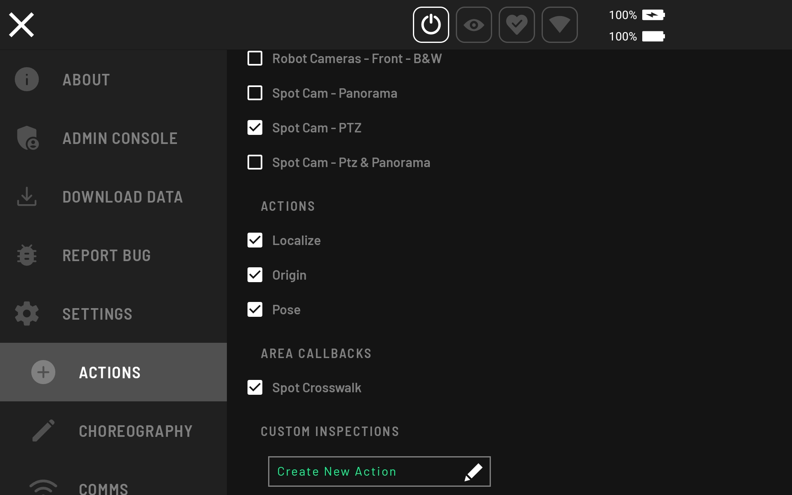
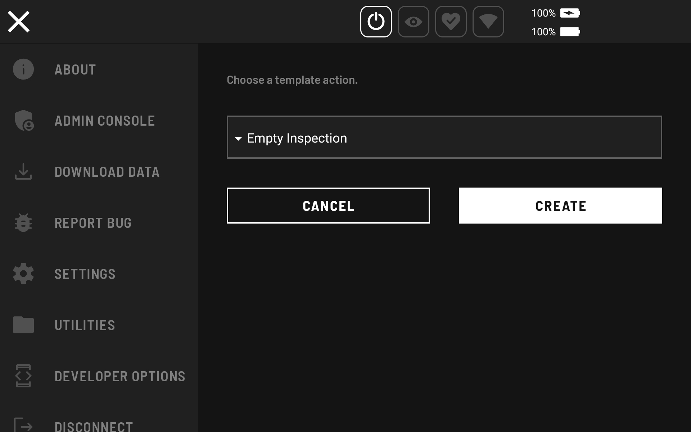
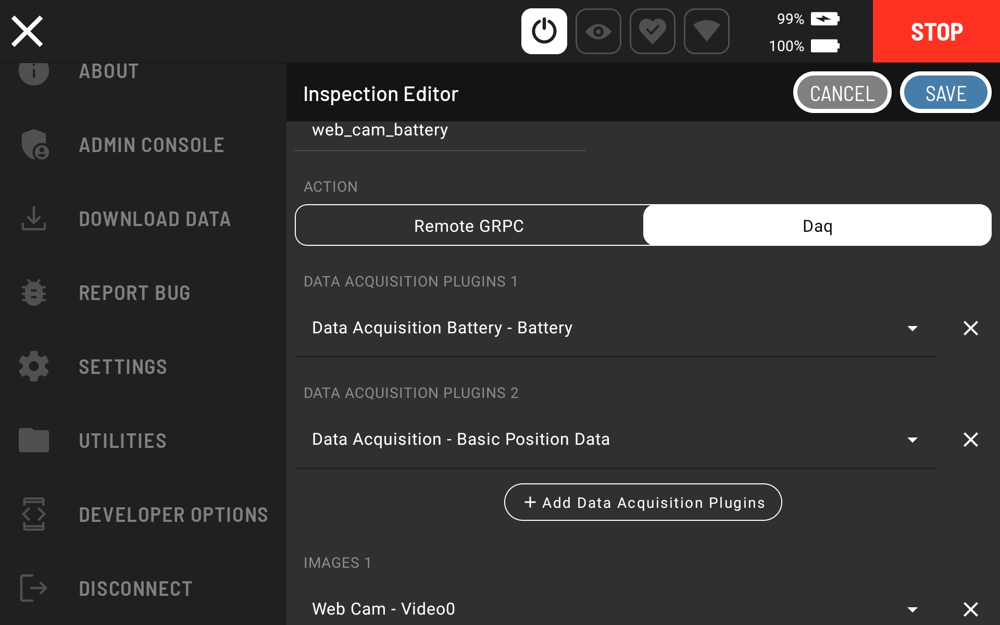
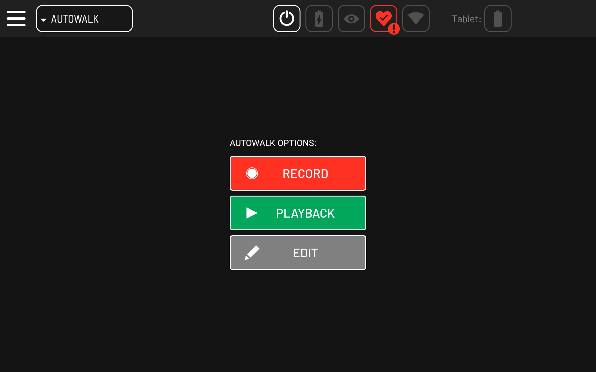
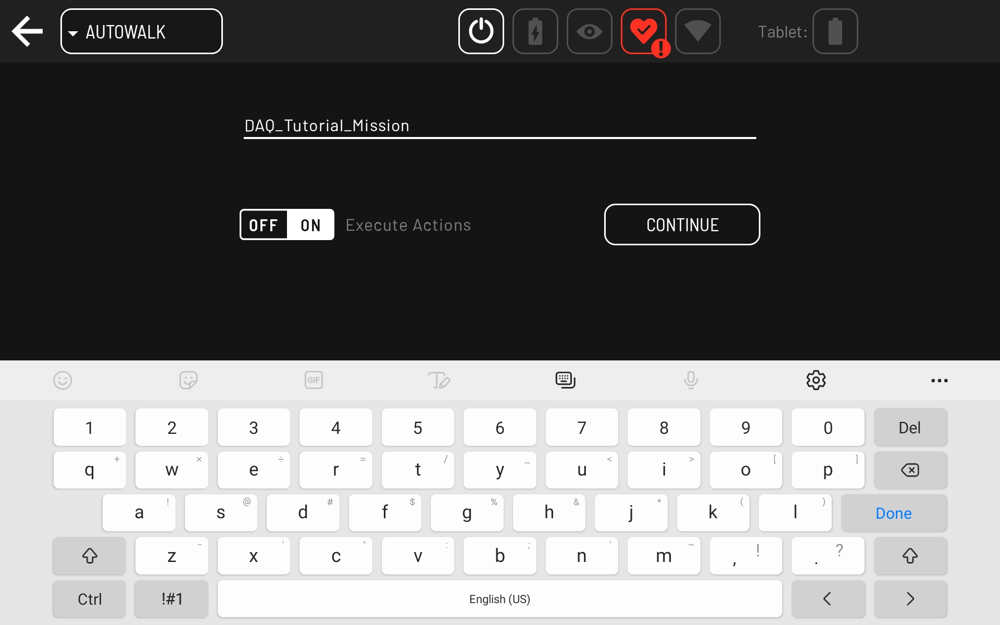
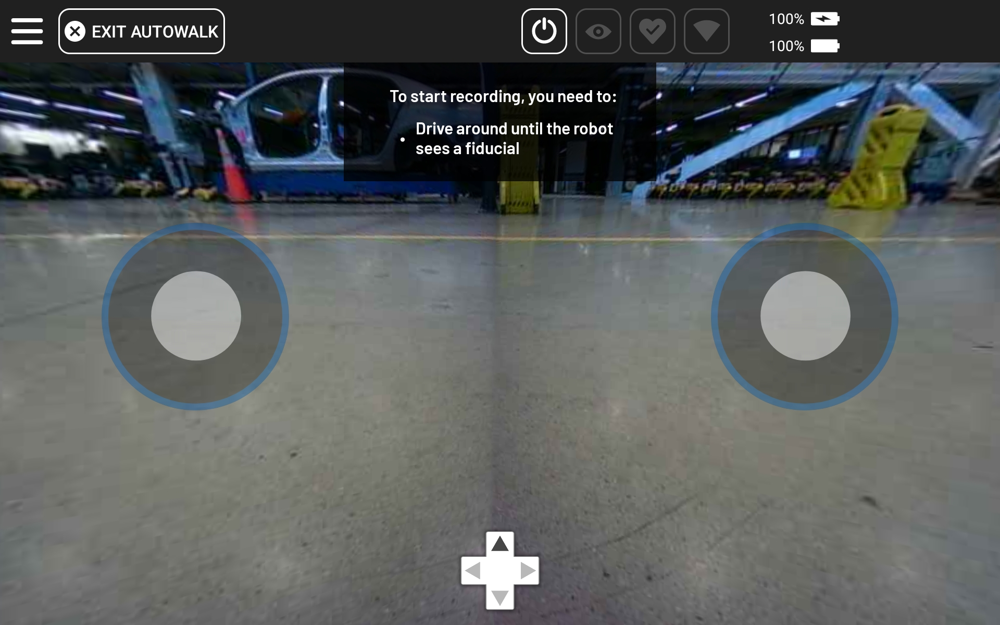
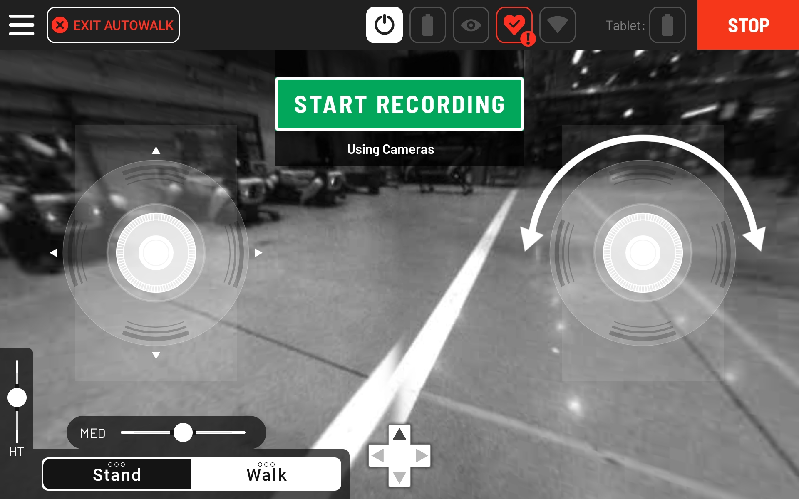
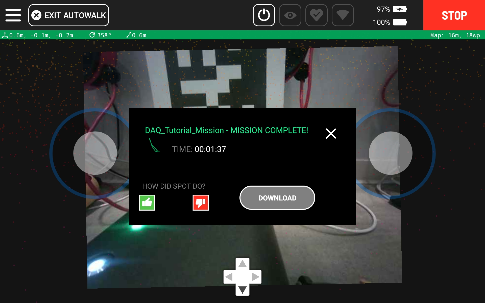

<!--
Copyright (c) 2022 Boston Dynamics, Inc.  All rights reserved.

Downloading, reproducing, distributing or otherwise using the SDK Software
is subject to the terms and conditions of the Boston Dynamics Software
Development Kit License (20191101-BDSDK-SL).
-->

<link rel="stylesheet" type="text/css" href="tutorial.css">
<link href="prism.css" rel="stylesheet" />

[<< Previous Page](daq4.md)
|
[Next Page >>](daq6.md)

---

# Part 5: Collecting Data

In this part of the tutorial, you will:
* Create an action on the tablet to capture data from the services we wrote.
* Record a mission using those actions around your environment.
* Play back the mission to autonomously capture data a the recorded locations.
* Download the data from the robot.
* Configure the robot to automatically upload its data to the cloud.

To collect data we will create an [Autowalk mission](https://support.bostondynamics.com/s/article/Getting-Started-with-Autowalk) with Spot.

## Creating Actions

Sources from image services and data acquisition plugins are automatically registered as action on the Spot tablet app. They can be modified in the hamburger menu, under the `Actions` section. That means they are available to set up as captures during the recording of a mission using the Red Plus button. After setting up the image service and/or the data acquisition plugin to run on SpotCORE or on a computer connected to the robot’s wifi, new actions will automatically be created to capture from those services.  Make sure that the corresponding actions are listed in the Spot tablet app. 

For our data collection, we want to capture from _both_ sources.  We will create a new action "web_cam_battery" that captures both. To do that, navigate to Settings -> Actions from the hamburger menu.

Then, click `Create New Action`, which brings up the menu shown below to choose a template.

Select the `All Data and Images` template and click `CREATE`. The following window pops up, where you can update the action name to "web_cam_battery" and select `Video0` under `WEB CAM` and also `Battery level` under `DATA ACQUISITION BATTERY`:

## Testing the action

You may now drive the robot around and trigger the new action.
This will cause it to capture both the web cam image and the battery data.  This data can be downloaded from the "Download Data" in the hamburger menu, where you will be able to see the images captured directly on the tablet.

## Mission Recording

Follow these steps to record a mission with the new captures:

1. First select `Autowalk` from the drop-down menu in the top-left corner of the app, and then select `Record`.

2. Enter mission name.

3. Stand the robot up and move it near a fiducial, if necessary. The app displays those two warnings till both are satisfied. The robot automatically detects fiducials in the robot cameras field of view.

4. Start recording.

5. Move robot to location where to capture data.

6. Then, click the Red Plus button and choose `web_cam_battery` action.

7. Click `Confirm`.

8. Click `Create` to create action.

9. Repeat steps 5-8 as desired.

10. When done recording the mission, click `Finish Recording` to save mission.

 ### Mission playback
Next, follow these steps to play back the mission recorded in the section above.

1. First select `Autowalk` from the drop-down menu in the top-left corner of the app, and then select `Playback`.

2. Select `DAQ_Tutorial_Mission` mission and click `Play Now`.

3. Move the robot near the fiducial at the beginning of the mission and click `Initialize`.

4. When the mission completes, download the captured data by clicking “Sit and View Data”.

### Configure the robot to automatically upload its data to the cloud.

The [Post Docking Callbacks example](../../../python/examples/post_docking_callbacks/README.md) contains scripts to enable users to upload files saved during a data acquisition mission to various endpoints, with the target use case having the callback run when Spot docks at the end of an Autowalk mission. Please follow instructions in that example to set up a callback to upload the captured data to AWS when the robot docks.

## Head over to [Part 6: Processing Collected Data](daq6.md) >>

[<< Previous Page](daq4.md)
|
[Next Page >>](daq6.md)
