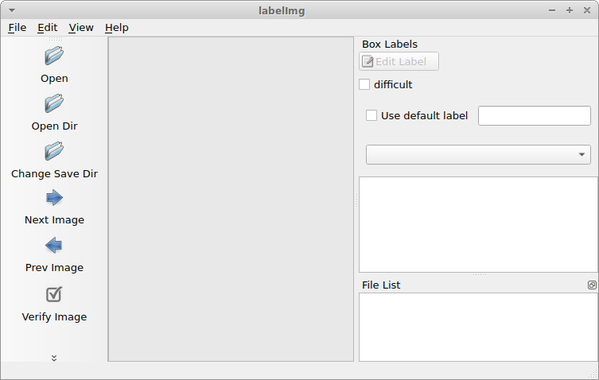

<!--
Copyright (c) 2023 Boston Dynamics, Inc.  All rights reserved.

Downloading, reproducing, distributing or otherwise using the SDK Software
is subject to the terms and conditions of the Boston Dynamics Software
Development Kit License (20191101-BDSDK-SL).
-->

<link rel="stylesheet" type="text/css" href="tutorial.css">
<link href="prism.css" rel="stylesheet" />

# Tutorial: Playing Fetch with Spot

**NOTE: This tutorial uses some deprecated APIs and will be updated in the future.**

In this tutorial, you'll create a fully-functional API example, enabling Spot to autonomously play fetch with you.  You'll learn how to:

<ul class="simple">
    <li><strong>Train</strong> a machine learning model to detect a dog-toy</li>
    <li><strong>Visualize</strong> the results of that model online using Spot's tablet</li>
    <li>Command the robot to <strong>pick up the dog-toy</strong> with its arm and the manipulation API</li>
    <li>Use an off-the-shelf ML model to <strong>detect a person</strong></li>
    <li><strong>Drop the dog-toy</strong> two meters away from the person</li>
</ul>

At the end, you'll have a fully-functional API example that enables Spot to autonomously play fetch with you.

<video autoplay loop muted playsinline class="tutorial-video">
    <source src="videos/fetch_with_titles_c.webm" type="video/webm">
    <source src="videos/fetch_with_titles_c.mp4" type="video/mp4">
</video>

<h2>Required Materials</h2>
<ul>
    <li><a href="https://shop.bostondynamics.com/">Spot robot with an arm</a></li>
    <li>A dog-toy, hand towel, or any object that:</li>
    <ul>
        <li>has a distinct visual appearance</li>
        <li>is easy to see in the tablet view</li>
        <li>Spot's arm is capable of picking using the <a href="https://support.bostondynamics.com/s/article/Spot-Arm-quick-start#pickupandcarry">Pick Up Object</a> option in the tablet</li>
    </ul>
    <li>A computer running Ubuntu 18.04</li>
    <li>CUDA enabled GPU</li>
    <li>A relatively large operational area (5x5 meters)</li>
</ul>

## Contents

- [Part 2: Training the Model](fetch2.md)
- [Part 3: Evaluating the Model](fetch3.md)
- [Part 4: Autonomous Pick Up](fetch4.md)
- [Part 5: Detecting People and Playing Fetch](fetch5.md)
- [Part 6: Running the model on Core IO](fetch6.md)

<h2>Collect and Label Training Data</h2>

<h4>Overview</h4>
We will use transfer learning to quickly and efficiently train a model to find a dog-toy.

<ol>
    <li>Use Spot to <strong>collect images</strong> of the dog-toy</li>
    <li>Download pre-trained model weights</li>
    <li>Train the <strong>top layers of the model</strong> to recognize our dog toy</li>
</ol>

<h4>Setting up Python 3 and the Spot SDK</h4>
<ul>
    <li>Follow the [Quickstart guide](../quickstart.md) for the Spot SDK.</li>
    <li><strong>Note</strong>: the <strong>virtualenv</strong> section of that guide is <strong>required</strong> for this tutorial.
</ul>

Once you have successfully made Spot move using the API, you're ready to go.

<pre><code class="language-bash">source my_spot_env/bin/activate # enter your virtualenv
cd ~/spot-sdk/python/examples/hello_spot # or wherever you installed Spot SDK
python3 hello_spot.py 192.168.80.3
</code></pre>

<video autoplay loop muted playsinline class="tutorial-video">
    <source src="videos/hello_spot.webm" type="video/webm">
    <source src="videos/hello_spot.mp4" type="video/mp4">
</video>

<h2>Collect Images</h2>

Our goal is to collect images of the dog toy in the same environment we want to test in.  If you want your model to work in many environments, you'll need to collect data in as many of those as you can.

To collect the data, we'll run the robot with the tablet while downloading images from the API.  We want a diverse set of viewpoints, so we'll walk Spot around while taking the images.

<h4>Enter your Spot API virtualenv</h4>

Replace <code>my_spot_env</code> with the name of the virtualenv that you created using the <a href="https://dev.bostondynamics.com/docs/python/quickstart">Spot Quickstart Guide</a>:

<pre><code class="language-text">source my_spot_env/bin/activate
</code></pre>

<h4>Install requirements</h4>

    Install OpenCV's python bindings in your virtualenv:

<pre><code class="language-text">python3 -m pip install opencv-python==4.5.*</code></pre>

<h4>Directory Set Up</h4>

    Make a folder called <code>~/fetch</code> that we'll put everything into:

<pre><code class="language-bash">mkdir ~/fetch
cd ~/fetch</code></pre>

    Copy (or <a href="files/capture_images.py">download</a>) the script below into a file called <code>capture_images.py</code> and place it in the <code>~/fetch</code> folder

<h4>Live Image Capture Script</h4>

Set up imports for images and the Spot API:

<pre>
<code class="language-python">import argparse
import sys
import os
import bosdyn.client
import bosdyn.client.util
from bosdyn.client.image import ImageClient
import cv2
import numpy as np
import time
</code></pre>

Then, set up basics:

<pre><code class="language-python">def main(argv):
    parser = argparse.ArgumentParser()
    bosdyn.client.util.add_base_arguments(parser)
    parser.add_argument('--image-source', help='Get image from source(s)', default='frontleft_fisheye_image')
    parser.add_argument('--folder', help='Path to write images to', default='')
    options = parser.parse_args(argv)
</code></pre>

Here, we add the common API arguments including <code>--username</code>, <code>--password</code>, and <code>hostname</code>.  We also add our two arguments, <code>--image-source</code> and <code>--folder</code>, which we'll use to determine what camera to use, and where to put the resulting images.

Next, setup the client to talk to Spot:

<pre><code class="language-python">    # Create robot object with an image client.
    sdk = bosdyn.client.create_standard_sdk('image_capture')
    robot = sdk.create_robot(options.hostname)
    bosdyn.client.util.authenticate(robot)
    robot.sync_with_directory()
    robot.time_sync.wait_for_sync()

    image_client = robot.ensure_client(ImageClient.default_service_name)
</code></pre>

This is standard boilerplate for the API, where we're initializing the SDK and logging in.  Don't worry about this stuff too much.

Now it's time for the real work:

<pre><code class="language-python">    counter = 0

    while True:
        # We want to capture from one camera at a time.

        # Capture and save images to disk
        image_responses = image_client.get_image_from_sources([options.image_source])

        dtype = np.uint8

        img = np.frombuffer(image_responses[0].shot.image.data, dtype=dtype)
        img = cv2.imdecode(img, -1)

        # Approximately rotate the image to level.
        if image_responses[0].source.name[0:5] == "front":
            img = cv2.rotate(img, cv2.ROTATE_90_CLOCKWISE)

        elif image_responses[0].source.name[0:5] == "right":
            img = cv2.rotate(img, cv2.ROTATE_180)

        # Don't overwrite an existing image
        while True:
            image_saved_path = os.path.join(options.folder, image_responses[0].source.name + '_{:0>4d}'.format(counter) + '.jpg')
            counter += 1

            if not os.path.exists(image_saved_path):
                break

        cv2.imwrite(image_saved_path, img)

        print('Wrote: ' + image_saved_path)

        # Wait for some time so we can drive the robot to a new position.
        time.sleep(0.7)
</code></pre>

We loop forever, or until we press <code>Ctrl+C</code>, capturing and saving images.  Each time we:

<ul>
    <li>Capture the image with <code>get_image_from_sources</code></li>
    <li>Unpack the image using numpy's <code>frombuffer</code></li>
    <li>Optionally rotate the image, depending on which camera it is from (only the left and back cameras on Spot are upright).</li>
    <li>Make sure to not overwrite existing files.</li>
    <li>Use OpenCV to save it as a JPG.</li>
</ul>

Finally, finish up with:

<pre><code class="language-python">    return True

if __name__ == "__main__":
    if not main(sys.argv[1:]):
        sys.exit(1)
</code>
</pre>

<h2>Running our code to capture images</h2>

    Now that we have a script to capture images, let's run it (use <code>Ctrl+C</code> to stop capturing):

<pre>
<code class="language-text wrap">mkdir -p dogtoy/images
python3 capture_images.py 192.168.80.3 --image-source right_fisheye_image --folder dogtoy/images
</code></pre>

<pre><code class="language-text">Wrote: dogtoy/images/right_fisheye_image_0000.jpg
Wrote: dogtoy/images/right_fisheye_image_0001.jpg
Wrote: dogtoy/images/right_fisheye_image_0004.jpg
[...]
Wrote: dogtoy/images/right_fisheye_image_0076.jpg
Wrote: dogtoy/images/right_fisheye_image_0077.jpg
^C
</code>
</pre>

First we make a directory to store our images.  Then we run the code with parameters:
<ul>
    <li>Username (often <code>user</code>)</li>
    <li>Password</li>
    <li>IP address of the robot. Above, we've used the default IP when the robot is hosting its own access point <code>192.168.80.3</code>.  Yours might be different depending on how Spot is connected to your network.</li>
    <li><code>right_fisheye_image</code> to capture from the right camera</li>
    <li>Store results in the <code>dogtoy/images</code> folder.</li>
</ul>

    While capturing, drive the robot around to get a <strong>variety of viewpoints</strong>.  You'll also want to run the script with a few different cameras to capture a diverse set of images.

    Cameras:
    <ul>
        <li><code>frontleft_fisheye_image</code></li>
        <li><code>frontright_fisheye_image</code></li>
        <li><code>left_fisheye_image</code></li>
        <li><code>right_fisheye_image</code></li>
        <li><code>back_fisheye_image</code></li>
    </ul>

<video autoplay loop muted playsinline class="tutorial-video">
    <source src="videos/capture_images_garage_c.webm" type="video/webm">
    <source src="videos/capture_images_garage_c.mp4" type="video/mp4">
</video>

Here's my result:

<video autoplay loop muted playsinline class="tutorial-video">
    <source src="videos/capture_images_result_garage.webm" type="video/webm">
    <source src="videos/capture_images_result_garage.mp4" type="video/mp4">
</video>

    In this example, I've captured about 400 images.  I probably should have put up a few more lights!

    That's about the minimum you need to get something to work.  If you want your ML model to work more reliably, capture more pictures in a wider variety of locations.

<h2>Label the Images</h2>

To label our images, we'll use an <a href="https://github.com/tzutalin/labelImg">open source off-the-shelf labeling program</a>. There are many out there, but this one is simple and works great for our purposes.

<h4>Install labelImg</h4>

Use <code>pip</code> to install:

<pre><code class="language-bash">source my_spot_env/bin/activate
python3 -m pip install labelImg
[...]
Successfully installed PyQt5-sip-12.8.1 labelImg-1.8.4 pyqt5-5.15.2
</code></pre>

    Now run it:

<pre><code>labelImg</code></pre>

If it installed correctly, you'll see a window like this:

    Open the image directory with <code>File > Open Dir</code>

The main keys we'll use are:

    <table>
    <tr>
        <td style="text-align:center">d</td>
        <td>Next image</td>
    </tr>
    <tr>
        <td style="text-align:center">a</td>
        <td>Previous image</td>
    </tr>
    <tr>
        <td style="text-align:center">w</td>
        <td>Create a box</td>
    </tr>
    <tr>
        <td style="text-align:center">del</td>
        <td>Delete the selected box</td>
    </tr>
    </table>

<ol style="padding-left: 0px">
    <li>Use <code>d</code> to get to an image that has the dog toy in it.</li>
    <li>Press <code>w</code> then click-and-drag to make a box on the toy.</li>
    <li>Enter <code>dogtoy</code> into the pop-up and press OK.</li>
</ol>

Tip: If the box <strong>refuses to be a rectangle</strong>, press <code>Ctrl</code> to disable that mode.

<video autoplay loop muted playsinline class="tutorial-video">
    <source src="videos/labeling_start.webm" type="video/webm">
    <source src="videos/labeling_start.mp4" type="video/mp4">
</video>

    Before you label the rest of your images:

<ul style="padding-left: 0px">
    <li>Enable <code>View > Auto Save mode</code></li>
    <li>Enable <code>View > Single Class Mode</code></li>
    <ul><li style="list-style:none"></li></ul>
</ul>

<ul style="padding-left: 0px"><li>Press <code>d</code> to go to the next image.</li>
    <ul style="padding-bottom: 0px; margin-bottom: 0px"><li>A save dialog will appear.</li></ul>
<li>Create a folder: <code>~/fetch/dogtoy/annotations</code> and save the labels to this location.</li>
</ul>

<h4>Verify the labels are saving</h4>

    Let's make sure things are working <strong>before</strong> we spend a lot of time labeling.

    Label a few more images with <code>d</code> and <code>w</code> then open your <code>annotations</code> folder in a file browser.

    Your should have a directory structure like this:

<pre><code class="language-text">dogtoy/
├── images
│   ├── right_fisheye_image_0000.jpg
│   ├── right_fisheye_image_0001.jpg
│   └── ...
└── annotations
    ├── right_fisheye_image_0000.xml
    ├── right_fisheye_image_0001.xml
    └── ...
</code></pre>

    Open one and it should look something like this:

<pre><code class="language-xml">&lt;annotation&gt;
	&lt;folder&gt;images&lt;/folder&gt;
	&lt;filename&gt;left_fisheye_image_0000.jpg&lt;/filename&gt;
	&lt;path&gt;/home/user/fetch/dogtoy/images/left_fisheye_image_0000.jpg&lt;/path&gt;
	&lt;source&gt;
		&lt;database&gt;Unknown&lt;/database&gt;
	&lt;/source&gt;
	&lt;size&gt;
		&lt;width&gt;480&lt;/width&gt;
		&lt;height&gt;640&lt;/height&gt;
		&lt;depth&gt;1&lt;/depth&gt;
	&lt;/size&gt;
	&lt;segmented&gt;0&lt;/segmented&gt;
	&lt;object&gt;
		&lt;name&gt;dogtoy&lt;/name&gt;
		&lt;pose&gt;Unspecified&lt;/pose&gt;
		&lt;truncated&gt;0&lt;/truncated&gt;
		&lt;difficult&gt;0&lt;/difficult&gt;
		&lt;bndbox&gt;
			&lt;xmin&gt;312&lt;/xmin&gt;
			&lt;ymin&gt;357&lt;/ymin&gt;
			&lt;xmax&gt;441&lt;/xmax&gt;
			&lt;ymax&gt;427&lt;/ymax&gt;
		&lt;/bndbox&gt;
	&lt;/object&gt;
&lt;/annotation&gt;
</code></pre>

    <mark>Note</mark>: The XML file stores the full path, so don't rearrange files after labeling.

<h4>Label Everything</h4>

    Now that we are confident things are working, label the rest of the images.

Tip: A good rule of thumb if you're unsure about a label is to ask, "what do I want the network to do?"

For example, in one of my images I threw the dog-toy.  Do I want the network to find flying dog toys?  No, those aren't good for fetch.  I should wait until it's on the ground.  For that reason, I didn't label the flying dog toy.

<video autoplay loop muted playsinline class="tutorial-video">
    <source src="videos/labeling_garage.webm" type="video/webm">
    <source src="videos/labeling_garage.mp4" type="video/mp4">
</video>

    Once you're done, you should have a large number of XML files which contain the labels.  We are now ready to <a href="fetch2.html">train the model</a>!

<h2>Head over to <a href="fetch2.html">Part 2: Train the Model</a> >></h2>

<a href="fetch2.html">Next Page >></a>

