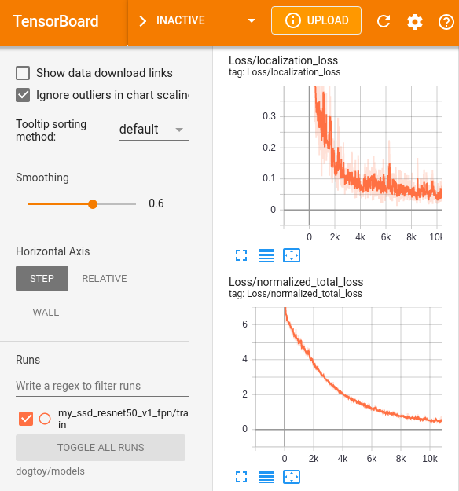
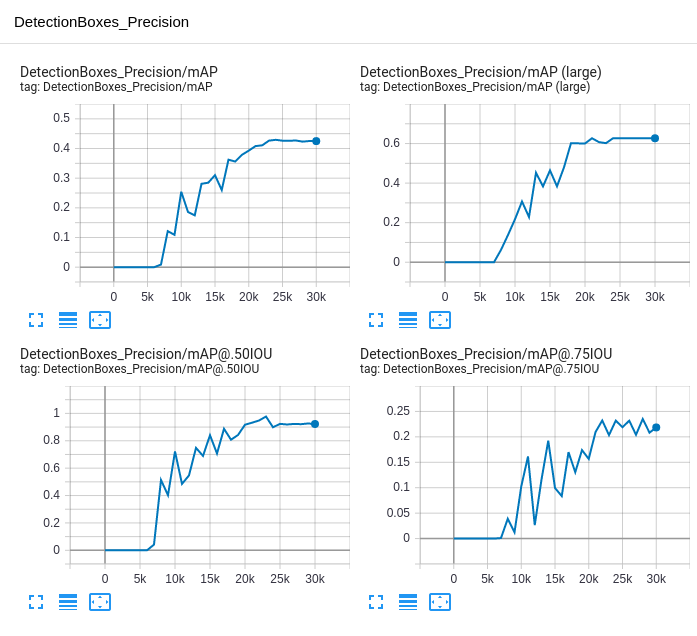

<!--
Copyright (c) 2023 Boston Dynamics, Inc.  All rights reserved.

Downloading, reproducing, distributing or otherwise using the SDK Software
is subject to the terms and conditions of the Boston Dynamics Software
Development Kit License (20191101-BDSDK-SL).
-->

<link rel="stylesheet" type="text/css" href="tutorial.css">
<link href="prism.css" rel="stylesheet" />

<a href="fetch1.html"><< Previous Page</a> | <a href="fetch3.html">Next Page >></a>

# Fetch Part 2: Training the Model

In this portion of the tutorial, you will:
<ul>
    <li>Install TensorFlow.</li>
    <li>Download pre-trained model weights (for transfer learning).</li>
    <li>Train a dog toy finding model.</li>
    <li>Visualize our model's performance live on Spot.</li>
</ul>

We'll follow <a href="https://tensorflow-object-detection-api-tutorial.readthedocs.io/en/latest/">this tutorial</a> pretty closely, with slight modifications for data from Spot.  We're following this example to demonstrate that most out-of-the-box models are easy to use with Spot.  We have included the key Spot-specific tips you'll need along the way.

<h2>Installing TensorFlow, CUDA, and cuDNN</h2>

    There are <a href="https://www.pyimagesearch.com/2019/12/09/how-to-install-tensorflow-2-0-on-ubuntu/">many</a>, <a href="https://www.tensorflow.org/install">many</a> excellent guides on how to do this.  We will cover the basic steps here, but details for different systems are best found elsewhere.

<h4>Install NVIDIA drivers, CUDA, and cuDNN</h4>
<ul>
    <li>We will not cover system-specific NVIDIA driver, CUDA, or cuDNN installation here.  Use the links above for installation guides.</li>
    <li>You must install <strong>CUDA version 10.1</strong> and <strong>cuDNN version 7.6.x</strong></li>
    <ul>
        <li>CUDA and cuDNN versions other than this will not work</li>
    </ul>
    <li>Ensure your NVIDIA driver is >= 418.39 to be compatible with CUDA 10.1, as specified in NVIDIA's compatibility tables <a href="https://docs.nvidia.com/deploy/cuda-compatibility/">here</a></li>
</ul>

<h3>Install TensorFlow</h3>
<h4>Enter your Spot API virtualenv</h4>

Replace <code>my_spot_env</code> with the name of the virtualenv that you created in the [Spot Quickstart Guide](../quickstart.md):

<pre><code class="language-text">source my_spot_env/bin/activate
</code></pre>

If that worked, your prompt should now have <code>(my_spot_env)</code> at the front.

<h4>Install TensorFlow</h4>

<pre><code class="language-text">python3 -m pip install --upgrade pip
python3 -m pip install tensorflow-gpu==2.3.1 tensorflow==2.3.1 tensorboard==2.3.0 tf-models-official==2.3.0 pycocotools lvis
python3 -m pip uninstall opencv-python-headless
</code></pre>
<ul>
    <li>Tensorflow likes to install a non-GUI version of OpenCV, which will cause us problems later</li>
    <li>We can safely uninstall it because we already installed OpenCV.</li>
</ul>
 

<h4>Test TensorFlow and CUDA installation</h4>

<pre><code class="language-text">(my_spot_env) $ python3
>>> import tensorflow as tf
>>> print("Num GPUs Available: ", len(tf.config.list_physical_devices('GPU')))
Num GPUs Available:  1
</code></pre>

If this doesn't work for you, you'll need to figure out what is wrong with your installation.  Common issues are:
<ul>
    <li>NVIDIA drivers not working.</li>
    <li>Wrong CUDA version installed (we are using 10.1).</li>
    <li>Didn't install cuDNN or installed wrong cuDNN version.</li>
</ul>

<h2>Install TensorFlow Object Detection API</h2>

    To make things easy, we're going to use a specific revision of the tensorflow models.  More advanced users can <a href="https://tensorflow-object-detection-api-tutorial.readthedocs.io/en/latest/install.html#tensorflow-object-detection-api-installation">download and compile protobufs</a> themselves.

<ol>
    <li>Download <a href="files/models-with-protos.zip">our package</a> with the precompiled files and save it in the <code>fetch</code> folder</li>
    <li>Unzip it:</li>
<pre><code class="language-bash">unzip models-with-protos.zip</code></pre>
    <li>Install the object detection API:</li>
<pre><code class="language-bash">cd models-with-protos/research
python3 -m pip install .</code></pre>
</ol>

    <a
      class="btn__first"
      data-toggle="collapse"
      data-target=".collapse.models_with_protos"
      data-text="Collapse"
      >
      How did you make this package? &#xbb;
    </a>

      

        <ul>
            <li>Checked out the models repository at revision <code>9815ea67e2122dfd3eb2003716add29987e7daa1</code></li>
            <li>Compiled protobufs with:</li>
<pre><code class="language-bash">cd models/research
protoc object_detection/protos/*.proto --python_out=.
</code></pre>
            <li>Copied and installed the object detection tf setup file:</li>

<pre><code class="language-bash">cp object_detection/packages/tf2/setup.py .
python3 -m pip install .
</code></pre>
</ul>
      

    

 
<h2>Prepare Training Data</h2>

We'll now split our data into a training set and a test set, and then convert our XML labels into a format that TensorFlow accepts.

<h4>Partition the Data</h4>

We want to hold back some of our data from the training set so that we can test to ensure our model isn't grossly over-fitting the data.

The goal is to organize our data as follows:

<pre><code class="language-text">dogtoy/
├── images
│   ├── left_fisheye_image_0000.jpg
│   ├── left_fisheye_image_0001.jpg
│   └── ...
└── annotations
    ├── test
    │   ├── right_fisheye_image_0027.xml
    │   └── ...
    └── train
        ├── right_fisheye_image_0009.xml
        └── ...

</code></pre>

You could do this manually, but we'll use a script.

    <ul>
        <li>Download <a href="files/split_dataset.py">the script</a> and put it in the <code>~/fetch</code> folder.</li>
        <li>Run the script:</li>
    </ul>

<pre><code class="language-text wrap">cd ~/fetch
python3 split_dataset.py --labels-dir dogtoy/annotations/ --output-dir dogtoy/annotations/ --ratio 0.9
</code></pre>

This copies your XML label files into the <code>train</code> and <code>test</code> folders, splitting them up randomly.  The script copies just to be extra safe and not delete your painstakingly labeled files!

<h4>Create a Label Map</h4>
Create a file called <code>label_map.pbtxt</code> and put it in <code>dogtoy/annotations</code> with the following contents:
<pre><code class="language-python">item {
    id: 1
    name: 'dogtoy'
}
</code></pre>

<h4>Convert Labels to <code>.record</code> Format</h4>

TensorFlow takes a different format than <code>labelImg</code> produces.  We'll convert using this <a href="https://tensorflow-object-detection-api-tutorial.readthedocs.io/en/latest/_downloads/da4babe668a8afb093cc7776d7e630f3/generate_tfrecord.py">script</a>.
<ul>
    <li>Download the script and place it in the <code>fetch</code> directory.</li>
    <li>Run it:</li>
<pre><code class="language-bash wrap">python3 generate_tfrecord.py --xml_dir dogtoy/annotations/train --image_dir dogtoy/images --labels_path dogtoy/annotations/label_map.pbtxt --output_path dogtoy/annotations/train.record</code></pre>
    <li>Run it again for the test set:</li>

<pre><code class="language-bash wrap">python3 generate_tfrecord.py --xml_dir dogtoy/annotations/test --image_dir dogtoy/images --labels_path dogtoy/annotations/label_map.pbtxt --output_path dogtoy/annotations/test.record</code></pre>
</ul>

<h2>Download Model for Transfer Learning</h2>

We don't want to train a model from scratch since that would take a long time and require huge amounts of input data.  Instead, we'll get a model that is trained to detect lots of things and guide it to detect our dog-toy specifically.

<ul>
    <li>Make a pre-trained-models folder:</li>
<pre><code class="language-bash">mkdir dogtoy/pre-trained-models</code></pre>
    <li>We'll use the <a href="http://download.tensorflow.org/models/object_detection/tf2/20200711/ssd_resnet50_v1_fpn_640x640_coco17_tpu-8.tar.gz">SSD ResNet50 V1 FPN 640x640</a> model.  Download it into the <code>~/fetch/dogtoy/pre-trained-models</code> folder.</li>
    <ul><li>The <a href="https://github.com/tensorflow/models/blob/master/research/object_detection/g3doc/tf2_detection_zoo.md">TensorFlow Model Zoo</a> has lots of other models you could use.</li></ul>
    <li>Extract it:</li>

<pre><code class="language-bash">cd dogtoy/pre-trained-models
tar -zxvf ssd_resnet50_v1_fpn_640x640_coco17_tpu-8.tar.gz</code></pre>

</ul>

<h2>Train the Model</h2>

We're almost ready for training!

<h4>Set up model parameters</h4>
<ul>
    <li>Make a folder for our new model:</li>
<pre><code class="language-bash">cd ~/fetch/dogtoy
mkdir -p models/my_ssd_resnet50_v1_fpn
</code></pre>
    <li>Copy the pre-trained model parameters:</li>
<pre><code class="language-bash wrap">cp pre-trained-models/ssd_resnet50_v1_fpn_640x640_coco17_tpu-8/pipeline.config models/my_ssd_resnet50_v1_fpn/
</code></pre>
    <li>Open <code>models/my_ssd_resnet50_v1_fpn/pipeline.config</code> and change:</li>
</ul>

<pre><code class="language-python">num_classes to 1

batch_size to 4

fine_tune_checkpoint to "dogtoy/pre-trained-models/ssd_resnet50_v1_fpn_640x640_coco17_tpu-8/checkpoint/ckpt-0"

fine_tune_checkpoint_type to "detection"

Under train_input_reader:
    label_map_path: "dogtoy/annotations/label_map.pbtxt"
    input_path: "dogtoy/annotations/train.record"

Under eval_input_reader:
    label_map_path: "dogtoy/annotations/label_map.pbtxt"
    input_path: "dogtoy/annotations/test.record"
</code></pre>
 

To help keep you on track, here is a checklist:

<form style="padding: revert">
<ul>
    <li><input type="checkbox" name="num_classes" id="num_classes" onChange="update_checklist(this, 'checklist_output')"><label for="num_classes">num_classes to 1</label></li>
    <li><input type="checkbox" name="batch_size" id="batch_size" onChange="update_checklist(this, 'checklist_output')"><label for="batch_size">batch_size to 4</label></li>
    <li><input type="checkbox" name="fine_tine_checkpoint" id="fine_tine_checkpoint" onChange="update_checklist(this, 'checklist_output')"><label for="fine_tine_checkpoint">fine_tune_checkpoint</label></li>
    <li><input type="checkbox" name="fine_tune_checkpoint_type" id="fine_tune_checkpoint_type" onChange="update_checklist(this, 'checklist_output')"><label for="fine_tune_checkpoint_type">fine_tune_checkpoint_type to "detection"</label></li>
    <li>train_input_reader</li>
    <ul>
        <li><input type="checkbox" name="train_input_reader_label_map_path" id="train_input_reader_label_map_path" onChange="update_checklist(this, 'checklist_output')"><label for="train_input_reader_label_map_path">label_map_path</label></li>
        <li><input type="checkbox" name="train_input_reader_input_path" id="train_input_reader_input_path" onChange="update_checklist(this, 'checklist_output')"><label for="train_input_reader_input_path">input_path</label></li>
    </ul>
    <li>eval_input_reader</li>
    <ul>
        <li><input type="checkbox" name="eval_input_reader_label_map_path" id="eval_input_reader_label_map_path" onChange="update_checklist(this, 'checklist_output')"><label for="eval_input_reader_label_map_path">label_map_path</label></li>
        <li><input type="checkbox" name="eval_input_reader_input_path" id="eval_input_reader_input_path" onChange="update_checklist(this, 'checklist_output')"><label for="eval_input_reader_input_path">input_path</label></li>
    </ul>
    <li><strong>Not Done</strong></li>
</ul>
</form>

<h4>Train the Model</h4>
<ul>
    <li>Copy the training script into a more convenient location:</li>
<pre><code class="language-bash">cd ~/fetch
cp models-with-protos/research/object_detection/model_main_tf2.py .
</code></pre>
    <li>Start training:</li>

<pre><code class="language-bash wrap">python3 model_main_tf2.py --model_dir=dogtoy/models/my_ssd_resnet50_v1_fpn --pipeline_config_path=dogtoy/models/my_ssd_resnet50_v1_fpn/pipeline.config --num_train_steps=20000
</code></pre>

<li>If all goes well after a while, you'll start seeing output like this:</li>

<pre><code class="language-text">INFO:tensorflow:Step 100 per-step time 0.340s loss=6.323
INFO:tensorflow:Step 200 per-step time 0.352s loss=6.028
INFO:tensorflow:Step 300 per-step time 0.384s loss=5.854
</code></pre>

<li>If it doesn't go well, see the <a href="#troubleshooting">troubleshooting section</a> below.</li>
<li>We can monitor things using <code>nvidia-smi</code>.  In a <strong>new terminal</strong>:</li>

<pre><code class="language-text">watch -n 0.5 nvidia-smi</code></pre>

<li>Finally, in a <strong>new terminal</strong>, we can use <code>tensorboard</code> to see outputs:</li>

<pre><code class="language-text">source my_spot_env/bin/activate
cd ~/fetch
tensorboard --logdir=dogtoy/models --bind_all
</code></pre>

<li>and point your browser to: <a href="http://localhost:6006">http://localhost:6006</a>
     
    </li>
</ul>

<h4>Evaluation During Training</h4>
During training, we can evaluate our network's current state against our test set.
<ul>
    <li>In a <strong>new terminal:</strong></li>
<pre><code class="language-text wrap">source my_spot_env/bin/activate
cd ~/fetch
CUDA_VISIBLE_DEVICES="-1" python3 model_main_tf2.py --model_dir=dogtoy/models/my_ssd_resnet50_v1_fpn --pipeline_config_path=dogtoy/models/my_ssd_resnet50_v1_fpn/pipeline.config --checkpoint_dir=dogtoy/models/my_ssd_resnet50_v1_fpn</code></pre>
</ul>

    Let's break down what this is doing.

<pre><code class="language-text">CUDA_VISIBLE_DEVICES="-1"</code></pre>

    Set an environment variable that tells CUDA that no GPUs are available.

<ul>
    <li>We do this because the training is using all of our GPU memory.</li>
    <li>This forces the evaluation to run on the CPU, where we still have memory available.</li>
    <li>CPU will be slow, but that's okay since it will only evaluate the model once every 5 minutes or so.</li>
</ul>
 

<pre><code class="language-text wrap">model_main_tf2.py --model_dir=dogtoy/models/my_ssd_resnet50_v1_fpn --pipeline_config_path=dogtoy/models/my_ssd_resnet50_v1_fpn/pipeline.config</code></pre>
<ul><li>Same as above.</li></ul>
 

<pre><code class="language-text">--checkpoint_dir=dogtoy/models/my_ssd_resnet50_v1_fpn</code></pre>
<ul>
    <li>Tell the script to run in evaluation mode and point it to our training output.</li>
</ul>
 

    Once this is running, you'll see new charts in TensorBoard that show results from evaluating on our training set, once per 1,000 steps of training.

<ul>
    <li>These results are more trustworthy because they are from images the network has not seen during training.</li>
</ul>

    <a
      class="btn__first"
      data-toggle="collapse"
      data-target=".collapse.what_do_these_numbers_mean"
      data-text="Collapse"
      >
      What do these numbers mean? &#xbb;
    </a>

      

        <ul>
            <li>mAP (mean average-precision) is a metric that describes (a) how much the model's predicted bounding boxes overlap with your labeled bounding boxes and (b) how often the class labels are wrong.</li>
    <li>Take a look at the section <em>How do I measure the accuracy of a deep learning object detector?
</em> of <a href="https://www.pyimagesearch.com/2018/05/14/a-gentle-guide-to-deep-learning-object-detection/">this post</a> for a good explanation.</li>
        </ul>
      

    

    <a
      class="btn__first"
      data-toggle="collapse"
      data-target=".collapse.why_do_i_care"
      data-text="Collapse"
      >
      Why do I care? &#xbb;
    </a>

      

        <ul>
            <li>You can use these graphs as a way to tell if your model is done training.</li>
            <li>Feel free to <code>^C</code> training if it looks like you're done.  Checkpoints are automatically saved.</li>
        </ul>
      

    

 

    TensorBoard provides an <strong>Images</strong> tab that will graphically show you your model's results.  Take a look.
     
    

<h3>Troubleshooting</h3>
<ul>
<pre><code class="language-text wrap">Failed to get convolution algorithm. This is probably because cuDNN failed to initialize</code></pre>
    <ul><li>
            You may be out of GPU memory.  Often in that case, you'll see <code>Could not create cudnn handle: CUDNN_STATUS_INTERNAL_ERROR</code>
        </li>
        <li>Run with the environment variable: <code>TF_FORCE_GPU_ALLOW_GROWTH="true"</code></li>
        <ul>
            <li>You can set the environment variable right before the training line:</li>
            <li class="nomarker"><pre><code class="language-text">TF_FORCE_GPU_ALLOW_GROWTH="true" python3 model_main_tf2.py --model_dir=dogtoy/models/my_ssd_resnet50_v1_fpn --pipeline_config_path=dogtoy/models/my_ssd_resnet50_v1_fpn/pipeline.config --num_train_steps=20000</code></pre></li>
        </ul>
        <li>Try closing items shown in <code>nvidia-smi</code> to free GPU memory.</li>
        <li>See the <a href="https://www.tensorflow.org/guide/gpu#limiting_gpu_memory_growth">tensorflow documentation</a> for other options.</li>
    </ul>
     
<pre><code class="language-text wrap">A checkpoint was restored (e.g. tf.train.Checkpoint.restore or tf.keras.Model.load_weights) but not all checkpointed values were used</code></pre>
    <ul>
        <li>
            We are failing to load the pre-trained model.  Check that <code>fine_tune_checkpoint_type</code> is set to <code>"detection"</code>
        </li>
    </ul>
     
    <li>Last message was: <code>Use tf.cast instead</code> and then nothing happens.</li>
    <ul>
        <li>Double check that your <code>train.record</code> file isn't empty:</li>
<pre><code class="language-text">ls -lah ~/fetch/dogtoy/annotations/train.record</code></pre>

<pre><code class="language-text">
-rw-r--r-- 1 user users 9.3M Mar  2 14:17 /home/user/fetch/dogtoy/annotations/train.record
                        ^^^^<---- not zero!
</code></pre>

    Once training is complete, head to <a href="fetch3.html">Part 3</a> to take the latest checkpoint, convert it to an online model, and visualize the results.

<h2>Head over to <a href="fetch3.html">Part 3: Evaluate the Model</a> >></h2>

<a href="fetch1.html"><< Previous Page</a> | <a href="fetch3.html">Next Page >></a>

