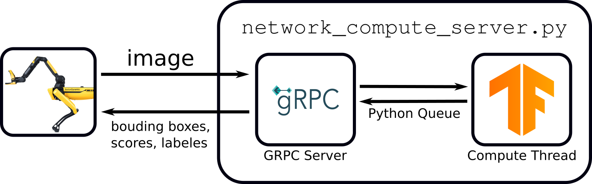
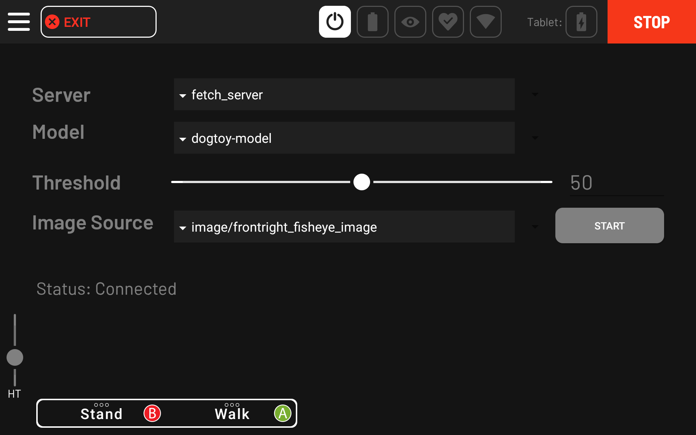

<!--
Copyright (c) 2023 Boston Dynamics, Inc.  All rights reserved.

Downloading, reproducing, distributing or otherwise using the SDK Software
is subject to the terms and conditions of the Boston Dynamics Software
Development Kit License (20191101-BDSDK-SL).
-->

<link rel="stylesheet" type="text/css" href="tutorial.css">
<link href="prism.css" rel="stylesheet" />

<a href="fetch2.html"><< Previous Page</a> | <a href="fetch4.html">Next Page >></a>

# Fetch Part 3: Evaluating the Model

In this portion of the tutorial, you will:
<ul>
    <li>Evaluate your model on test data.</li>
    <li>Connect your model to Spot.</li>
    <li>Use Spot's tablet to view your model in real time.</li>
</ul>

<h4>Convert a Checkpoint into an Online Model</h4>

First, we need to convert our training output into a model we can use online.

<ul>
    <li>Copy the conversion script to a convenient location:</li>
    <pre><code class="language-text">cp models-with-protos/research/object_detection/exporter_main_v2.py .</code></pre>
    <li>Make a directory for our exported model:</li>
    <pre><code class="language-text wrap">mkdir -p dogtoy/exported-models/dogtoy-model</code></pre>
    <li>Run the exporter:</li>
    <pre><code class="language-text wrap">python3 exporter_main_v2.py --input_type image_tensor --pipeline_config_path dogtoy/models/my_ssd_resnet50_v1_fpn/pipeline.config --trained_checkpoint_dir dogtoy/models/my_ssd_resnet50_v1_fpn/ --output_directory dogtoy/exported-models/dogtoy-model</code></pre>
</ul>

<h4>Evaluate the Model</h4>

    Now we'll run our model on some images and make sure the results are acceptable.

<ul>
    <li>Download the <a href="files/eval.py">eval.py</a> script and save it in <code>~/fetch</code></li>
    <li>Make a directory for the output images</li>
    <pre><code class="language-text">mkdir -p dogtoy/output</code></pre>
    <li>Evaluate on all of the images:</li>
    <pre><code class="language-text wrap">python3 eval.py -i dogtoy/images -m dogtoy/exported-models/dogtoy-model/saved_model -l dogtoy/annotations/label_map.pbtxt -o dogtoy/output</code></pre>
</ul>

    If everything went well, you'll have a bunch of images with bounding boxes around the dog-toys!

<video autoplay loop muted playsinline class="tutorial-video">
    <source src="videos/model_output_garage.webm" type="video/webm">
    <source src="videos/model_output_garage.mp4" type="video/mp4">
</video>

<h3>Troubleshooting</h3>

    If a lot of bounding boxes are incorrect or missing, you'll need to troubleshoot.

<h4>Is the model failing on images <strong>in the training set</strong>?</h4>

If so, something went wrong during training, as the model isn't working on the data it <strong>already saw</strong> during training.  This usually means there is a structural problem with your training.

<ul>
    <li>Double check that you made all changes to <code>pipeline.config</code> from <a href="fetch2.html#checklist">our checklist</a>.</li>
    <li>Train for longer.</li>
</ul>

<h4>Good performance on training set; poor performance in test set</h4>
<ul>
    <li>Do you have at least 300 labeled images?</li>
    <li>Did you move the toy to get multiple views during data capture?</li>
    <li>Do your images cover a wide variety of viewpoints?</li>
    <li>Do you have images both close to and far from the dog-toy?</li>
</ul>

<h2>Connecting to Spot</h2>

    Next, we'll connect to Spot using the [Network Compute Bridge](../../concepts/network_compute_bridge.md) which will let us view the results on the tablet and use our model in a script.

To do this, we'll write a script that connects to Spot and offers our model as a network compute resource.

<h3>Network Compute Server Overview</h3>

    We will write a small server that will take images, run our model, and return bounding box coordinates.

    Create (or <a href="files/network_compute_server.py">download</a>) <code>network_compute_server.py</code> into your <code>~/fetch</code> folder.  We'll walk through each part:

<pre><code class="language-python">import argparse
import io
import os
import sys
import time
import logging

import cv2
from PIL import Image
import numpy as np

from bosdyn.api import network_compute_bridge_service_pb2_grpc
from bosdyn.api import network_compute_bridge_pb2
from bosdyn.api import image_pb2
from bosdyn.api import header_pb2
import bosdyn.client
import bosdyn.client.util
import grpc
from concurrent import futures
import tensorflow as tf

import queue
import threading
from google.protobuf import wrappers_pb2
from object_detection.utils import label_map_util

kServiceAuthority = "fetch-tutorial-worker.spot.robot"

</code></pre>

Import a bunch of packages and define a constant.

 

<pre><code class="language-python">class TensorFlowObjectDetectionModel:
    def __init__(self, model_path, label_path):
        self.detect_fn = tf.saved_model.load(model_path)
        self.category_index = label_map_util.create_category_index_from_labelmap(label_path, use_display_name=True)
        self.name = os.path.basename(os.path.dirname(model_path))

    def predict(self, image):
        input_tensor = tf.convert_to_tensor(image)
        input_tensor = input_tensor[tf.newaxis, ...]
        detections = self.detect_fn(input_tensor)

        return detections
</code></pre>

This class loads our model and has a function to run the model on an image.  We'll call that function below.

 

<pre><code class="language-python">def process_thread(args, request_queue, response_queue):
    # Load the model(s)
    models = {}
    for model in args.model:
        this_model = TensorFlowObjectDetectionModel(model[0], model[1])
        models[this_model.name] = this_model

    print('')
    print('Service ' + args.name + ' running on port: ' + str(args.port))

    print('Loaded models:')
    for model_name in models:
        print('    ' + model_name)
</code></pre>

This is the main function for our script.

<ul>
    <li>We'll support multiple models (we'll need that later).</li>
     
    <li>Because our computation could take a long time, we don't want to do the computation in the GRPC callback.  Instead we'll use a thread.</li>
</ul>

<pre><code class="language-python">    while True:
        request = request_queue.get()
</code></pre>
<ul>
    <li>Set up a <code class="language-python">while</code> loop that keeps the thread alive forever.</li>
    <li>Unpack the GRPC request that comes in via the <a href="https://docs.python.org/3/library/queue.html">python queue</a>.</li>
    <ul>
        <li>Note: this call is blocking, so we'll wait here forever until we get a request
         
        (that's how we avoid the <code class="language-python">while True</code> from using 100% CPU)</li>
    </ul>
</ul>
 

<pre><code class="language-python">        if isinstance(request, network_compute_bridge_pb2.ListAvailableModelsRequest):
            out_proto = network_compute_bridge_pb2.ListAvailableModelsResponse()
            for model_name in models:
                out_proto.models.data.append(network_compute_bridge_pb2.ModelData(model_name=model_name))
            response_queue.put(out_proto)
            continue
        else:
            out_proto = network_compute_bridge_pb2.NetworkComputeResponse()

</code></pre>

    The GRPC protocol can ask our server about the models it supports.  Here we check to see if we got a <code>ListAvailableModelsRequest</code>, and if so, we reply with our model and then <code>continue</code> to wait for the next request.

 

<pre><code class="language-python">        # Find the model
        if request.input_data.model_name not in models:
            err_str = 'Cannot find model "' + request.input_data.model_name + '" in loaded models.'
            print(err_str)

             # Set the error in the header.
            out_proto.header.error.code = header_pb2.CommonError.CODE_INVALID_REQUEST
            out_proto.header.error.message = err_str
            response_queue.put(out_proto)
            continue

        model = models[request.input_data.model_name]

</code></pre>

    The input request includes a model name.  Find that model or report an error.

 

<pre><code class="language-python">        # Unpack the incoming image.
        if request.input_data.image.format == image_pb2.Image.FORMAT_RAW:
            pil_image = Image.open(io.BytesIO(request.input_data.image.data))
            if request.input_data.image.pixel_format == image_pb2.Image.PIXEL_FORMAT_GREYSCALE_U8:
                # If the input image is grayscale, convert it to RGB.
                image = cv2.cvtColor(pil_image, cv2.COLOR_GRAY2RGB)

            elif request.input_data.image.pixel_format == image_pb2.Image.PIXEL_FORMAT_RGB_U8:
                # Already an RGB image.
                image = pil_image

            else:
                print('Error: image input in unsupported pixel format: ', request.input_data.image.pixel_format)
                response_queue.put(out_proto)
                continue

        elif request.input_data.image.format == image_pb2.Image.FORMAT_JPEG:
            dtype = np.uint8
            jpg = np.frombuffer(request.input_data.image.data, dtype=dtype)
            image = cv2.imdecode(jpg, -1)

            if len(image.shape) < 3:
                # If the input image is grayscale, convert it to RGB.
                image = cv2.cvtColor(image, cv2.COLOR_GRAY2RGB)

        image_width = image.shape[0]
        image_height = image.shape[1]

</code></pre>

    Images can be in a number of formats.  Here we unpack:

<ul>
    <li><code>RAW</code> images in either <code>GRAYSCALE</code> or <code>RGB</code></li>
    <li><code>JPEG</code> images</li>
    <ul><li>Either way, we always convert to RGB since that's what our model uses</li></ul>
</ul>

    We want to support all of these image types because images could be from the robot directly or from a user uploading their own image.

 

<pre><code class="language-python">        detections = model.predict(image)
</code></pre>

    The main call!  This runs our ML model using <a href="#predict_function">our function</a> above.

 

<pre><code class="language-python">        num_objects = 0

        # All outputs are batches of tensors.
        # Convert to numpy arrays, and take index [0] to remove the batch dimension.
        # We're only interested in the first num_detections.
        num_detections = int(detections.pop('num_detections'))
        detections = {key: value[0, :num_detections].numpy()
                       for key, value in detections.items()}

        boxes = detections['detection_boxes']
        classes = detections['detection_classes']
        scores = detections['detection_scores']

</code></pre>

    The output format is a little wonky, so we unpack it into something more reasonable.

 

<pre><code class="language-python">        for i in range(boxes.shape[0]):
            if scores[i] < request.input_data.min_confidence:
                continue

            box = tuple(boxes[i].tolist())

            # Boxes come in with normalized coordinates.  Convert to pixel values.
            box = [box[0] * image_width, box[1] * image_height, box[2] * image_width, box[3] * image_height]

            score = scores[i]

            if classes[i] in model.category_index.keys():
                label = model.category_index[classes[i]]['name']
            else:
                label = 'N/A'

            num_objects += 1

            print('Found object with label: "' + label + '" and score: ' + str(score))

</code></pre>

    Loop through each object and...

<ul>
    <li>check if the score is high enough.</li>
    <li>convert from normalized (percentage-across/down-the-image) into pixel coordinates.</li>
    <li>unpack the class label.</li>
</ul>
 

<pre><code class="language-python">            point1 = np.array([box[1], box[0]])
            point2 = np.array([box[3], box[0]])
            point3 = np.array([box[3], box[2]])
            point4 = np.array([box[1], box[2]])

            # Add data to the output proto.
            out_obj = out_proto.object_in_image.add()
            out_obj.name = "obj" + str(num_objects) + "_label_" + label

            vertex1 = out_obj.image_properties.coordinates.vertexes.add()
            vertex1.x = point1[0]
            vertex1.y = point1[1]

            vertex2 = out_obj.image_properties.coordinates.vertexes.add()
            vertex2.x = point2[0]
            vertex2.y = point2[1]

            vertex3 = out_obj.image_properties.coordinates.vertexes.add()
            vertex3.x = point3[0]
            vertex3.y = point3[1]

            vertex4 = out_obj.image_properties.coordinates.vertexes.add()
            vertex4.x = point4[0]
            vertex4.y = point4[1]

</code></pre>

    Now that we have the result we'll pack it into the <a href="https://github.com/boston-dynamics/spot-sdk/blob/432ccc81499fa88bf4042780bd75aba471347a27/protos/bosdyn/api/network_compute_bridge.proto#L108">output proto format:</a>

<ul>
    <li>Bounding box coordinates</li>
    <li>Object label</li>
</ul>
 

<pre><code class="language-python">            # Pack the confidence value.
            confidence = wrappers_pb2.FloatValue(value=score)
            out_obj.additional_properties.Pack(confidence)
</code></pre>

    The confidence value is packed to an <code>Any</code> field.  You could pack lots of other things in here for your application.

 

<pre><code class="language-python">            if not args.no_debug:
                polygon = np.array([point1, point2, point3, point4], np.int32)
                polygon = polygon.reshape((-1, 1, 2))
                cv2.polylines(image, [polygon], True, (0, 255, 0), 2)

                caption = "{}: {:.3f}".format(label, score)
                left_x = min(point1[0], min(point2[0], min(point3[0], point4[0])))
                top_y = min(point1[1], min(point2[1], min(point3[1], point4[1])))
                cv2.putText(image, caption, (int(left_x), int(top_y)), cv2.FONT_HERSHEY_SIMPLEX, 0.5,
                            (0, 255, 0), 2)

</code></pre>

    For debugging, we draw the bounding box on the image along with labeling text.

 

<pre><code class="language-python">        print('Found ' + str(num_objects) + ' object(s)')

        if not args.no_debug:
            debug_image_filename = 'network_compute_server_output.jpg'
            cv2.imwrite(debug_image_filename, image)
            print('Wrote debug image output to: "' + debug_image_filename + '"')
</code></pre>

    After our loop, we print out the number of objects and write our debug image.

 

<pre><code class="language-python">        response_queue.put(out_proto)
</code></pre>

    Lastly, we send the output proto back to the GRPC servicer using another python queue.  After this, we're ready for the next request.

 

<pre><code class="language-python">class NetworkComputeBridgeWorkerServicer(
        network_compute_bridge_service_pb2_grpc.NetworkComputeBridgeWorkerServicer):

    def __init__(self, thread_input_queue, thread_output_queue):
        super(NetworkComputeBridgeWorkerServicer, self).__init__()

        self.thread_input_queue = thread_input_queue
        self.thread_output_queue = thread_output_queue

    def NetworkCompute(self, request, context):
        print('Got NetworkCompute request')
        self.thread_input_queue.put(request)
        out_proto = self.thread_output_queue.get()
        return out_proto

    def ListAvailableModels(self, request, context):
        print('Got ListAvailableModels request')
        self.thread_input_queue.put(request)
        out_proto = self.thread_output_queue.get()
        return out_proto
</code></pre>

    This is the GRPC servicer.  It's mostly boilerplate code that connects the GRPC network request to our python queues, and writes our thread's responses back out.

 

<pre><code class="language-python">def register_with_robot(options):
    """ Registers this worker with the robot's Directory."""
    ip = bosdyn.client.common.get_self_ip(options.hostname)
    print('Detected IP address as: ' + ip)

    sdk = bosdyn.client.create_standard_sdk("tensorflow_server")

    robot = sdk.create_robot(options.hostname)

    # Authenticate robot before being able to use it
    bosdyn.client.util.authenticate(robot)

    directory_client = robot.ensure_client(
        bosdyn.client.directory.DirectoryClient.default_service_name)
    directory_registration_client = robot.ensure_client(
        bosdyn.client.directory_registration.DirectoryRegistrationClient.default_service_name)

    # Check to see if a service is already registered with our name
    services = directory_client.list()
    for s in services:
        if s.name == options.name:
            print("WARNING: existing service with name, \"" + options.name + "\", removing it.")
            directory_registration_client.unregister(options.name)
            break

    # Register service
    print('Attempting to register ' + ip + ':' + options.port + ' onto ' + options.hostname + ' directory...')
    directory_registration_client.register(options.name, "bosdyn.api.NetworkComputeBridgeWorker", kServiceAuthority, ip, int(options.port))

</code></pre>
<ul>
    <li>Authenticate with Spot.</li>
    <li>Check to see if the Directory already has a service with our name, and if so, remove it.</li>
    <li>Add ourselves to Spot's Directory.</li>
</ul>
 

<pre><code class="language-python">def main(argv):
    default_port = '50051'

    parser = argparse.ArgumentParser()
    parser.add_argument('-m', '--model', help='[MODEL_DIR] [LABELS_FILE.pbtxt]: Path to a model\'s directory and path to its labels .pbtxt file', action='append', nargs=2, required=True)
    parser.add_argument('-p', '--port', help='Server\'s port number, default: ' + default_port,
                        default=default_port)
    parser.add_argument('-d', '--no-debug', help='Disable writing debug images.', action='store_true')
    parser.add_argument('-n', '--name', help='Service name', default='fetch-server')
    bosdyn.client.util.add_base_arguments(parser)

    options = parser.parse_args(argv)

    print(options.model)

    for model in options.model:
        if not os.path.isdir(model[0]):
            print('Error: model directory (' + model[0] + ') not found or is not a directory.')
            sys.exit(1)

    # Perform registration.
    register_with_robot(options)
</code></pre>

    Set up our arguments and call our directory registration function.

 

<pre><code class="language-python">    # Thread-safe queues for communication between the GRPC endpoint and the ML thread.
    request_queue = queue.Queue()
    response_queue = queue.Queue()

    # Start server thread
    thread = threading.Thread(target=process_thread, args=([options, request_queue, response_queue]))
    thread.start()

</code></pre>

    Set up and start our machine learning thread.

 

<pre><code class="language-python">    # Set up GRPC endpoint
    server = grpc.server(futures.ThreadPoolExecutor(max_workers=10))
    network_compute_bridge_service_pb2_grpc.add_NetworkComputeBridgeWorkerServicer_to_server(
        NetworkComputeBridgeWorkerServicer(request_queue, response_queue), server)
    server.add_insecure_port('[::]:' + options.port)
    server.start()

</code></pre>

    GRPC boilerplate code to start up our GRPC servicer.

 

<pre><code class="language-python">    print('Running...')
    thread.join()

    return True

if __name__ == '__main__':
    logging.basicConfig()
    if not main(sys.argv[1:]):
        sys.exit(1)
</code></pre>

    Have the main thread wait for the processing thread forever.

<h2>Running the Model with Spot</h2>

    Run the script:

<pre><code class="language-text wrap">python3 network_compute_server.py -m dogtoy/exported-models/dogtoy-model/saved_model dogtoy/annotations/label_map.pbtxt 192.168.80.3
</code></pre>

    Arguments are:

<ul>
    <li>path to the model to use</li>
    <li>path to the labels file</li>
    <li>IP address of the robot. Above, we've used the default IP when the robot is hosting its own access point <code>192.168.80.3</code>.  Yours might be different depending on how Spot is connected to your network.</li>
</ul>

    Now let's check to see if that server registered itself with the Directory.  In a new terminal (<em>don't forget to reenter your virtualenv</em>):

<pre><code class="language-text wrap">source my_spot_env/bin/activate
python3 -m bosdyn.client 192.168.80.3 dir list</code></pre>

    Fill in your IP, username, and password.  If it worked, you should see an entry like this:

<pre><code class="language-text">name                       type                                                      authority                             tokens
--------------------------------------------------------------------------------------------------------------------------------
[...]
fetch-server              bosdyn.api.NetworkComputeBridgeWorker                     fetch-tutorial-worker.spot.robot      user
[...]
</code></pre>

    Now we're ready to see results!  Get Spot's tablet, connect to the robot, and stand it up.

    Select <code>Hamburger Menu > Utilities > ML Model Viewer</code>

    

    

    

    The <strong>Server</strong> and <strong>Model</strong> should be automatically filled if your server was in the directory.  Select the camera you want to use and press <strong>Start</strong>.

    Look at your terminal with <code>network_compute_server.py</code> running and you should start to see requests from the robot.

<h3>Troubleshooting</h3>

    The most common problem here is a firewall.  The robot needs to be able to connect to your server (by default on port 50051).  To determine if this is an issue:

<ul>
    <li>Does the server print <code>Got ListAvailableModels request</code> when you enter the <em>ML Model Viewer</em> screen?</li>
    <ul>
        <li>If so, your networking is working, otherwise, continue debugging.</li>
    </ul>
    <li><code>ufw</code> is a common firewall.  Check to see if it is running with:</li>
    <pre><code class="language-text">$ service ufw status</code></pre>
    <pre><code class="language-text">    ● ufw.service - Uncomplicated firewall
       Loaded: loaded (/lib/systemd/system/ufw.service; enabled; vendor preset: enab
---->  Active: active (exited) since Fri 2021-02-19 20:07:28 EST; 2s ago
         Docs: man:ufw(8)
      Process: 14875 ExecStop=/lib/ufw/ufw-init stop (code=exited, status=0/SUCCESS)
      Process: 26704 ExecStart=/lib/ufw/ufw-init start quiet (code=exited, status=0/
     Main PID: 26704 (code=exited, status=0/SUCCESS)
</code></pre>
    <ul>
        <li>If you see <code>Active: active</code> on the line with the arrow above, consider opening the port in your firewall, e.g. <code>sudo ufw allow from 192.168.80.3 to any port 50051</code>.</li>
        <li>If <code>ufw</code> isn't running, you'll see <code>Active: inactive (dead)</code></li>
    </ul>
</ul>

    If everything went well, you should see bounding boxes around the dog-toy in your images.  You can drive the robot in this screen by enabling power.

<video autoplay loop muted playsinline class="tutorial-video">
    <source src="videos/tablet_ml_model_viewer_garage.webm" type="video/webm">
    <source src="videos/tablet_ml_model_viewer_garage.mp4" type="video/mp4">
</video>

    Once you're satisfied with your model, head over to <a href="fetch4.html">Part 4</a> where we'll integrate the Spot Manipulation API to pick up the dog-toy.

<h2>Head over to <a href="fetch4.html">Part 4: Autonomous Pick Up</a> >></h2>

<a href="fetch2.html"><< Previous Page</a> | <a href="fetch4.html">Next Page >></a>

