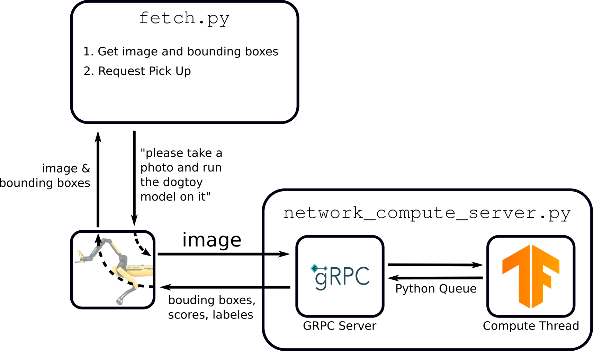

<!--
Copyright (c) 2022 Boston Dynamics, Inc.  All rights reserved.

Downloading, reproducing, distributing or otherwise using the SDK Software
is subject to the terms and conditions of the Boston Dynamics Software
Development Kit License (20191101-BDSDK-SL).
-->

<link rel="stylesheet" type="text/css" href="tutorial.css">
<link href="prism.css" rel="stylesheet" />

<a href="fetch3.html"><< Previous Page</a> | <a href="fetch5.html">Next Page >></a>

# Fetch Part 4: Autonomous Pick Up

    Now that we can identify the toy, we'll write a script to automatically pick it up.

    Create a new file called <code>fetch.py</code> in your <code>~/fetch</code> folder.  Paste or <a href="files/fetch_only_pickup.py">download</a> the following:

<ul>
    <li>Note: If you download the file, rename it to <code>fetch.py</code></li>
</ul>

<pre><code class="language-python">import argparse
import sys
import time
import numpy as np
import cv2
import math
import bosdyn.client
import bosdyn.client.util
from bosdyn.client.robot_state import RobotStateClient
from bosdyn.client.robot_command import RobotCommandClient, RobotCommandBuilder, block_until_arm_arrives
from bosdyn.api import geometry_pb2
from bosdyn.client.lease import LeaseClient, LeaseKeepAlive
from bosdyn.api import image_pb2
from bosdyn.client.network_compute_bridge_client import NetworkComputeBridgeClient
from bosdyn.api import network_compute_bridge_pb2
from google.protobuf import wrappers_pb2
from bosdyn.client.manipulation_api_client import ManipulationApiClient
from bosdyn.api import manipulation_api_pb2
from bosdyn.api import basic_command_pb2
from bosdyn.client import frame_helpers
from bosdyn.client import math_helpers

kImageSources = [
    'frontleft_fisheye_image', 'frontright_fisheye_image',
    'left_fisheye_image', 'right_fisheye_image', 'back_fisheye_image'
]

</code></pre>

    Import the desired libraries and define a constant with the image sources we'll use.

 

<pre><code class="language-python">def get_obj_and_img(network_compute_client, server, model, confidence,
                    image_sources, label):

    for source in image_sources:
        # Build a network compute request for this image source.
        image_source_and_service = network_compute_bridge_pb2.ImageSourceAndService(
            image_source=source)

        # Input data:
        #   model name
        #   minimum confidence (between 0 and 1)
        #   if we should automatically rotate the image
        input_data = network_compute_bridge_pb2.NetworkComputeInputData(
            image_source_and_service=image_source_and_service,
            model_name=model,
            min_confidence=confidence,
            rotate_image=network_compute_bridge_pb2.NetworkComputeInputData.
            ROTATE_IMAGE_ALIGN_HORIZONTAL)

        # Server data: the service name
        server_data = network_compute_bridge_pb2.NetworkComputeServerConfiguration(
            service_name=server)

        # Pack and send the request.
        process_img_req = network_compute_bridge_pb2.NetworkComputeRequest(
            input_data=input_data, server_config=server_data)

        resp = network_compute_client.network_compute_bridge_command(
            process_img_req)

</code></pre>

    Make a function that iterates over each image source and issues a <code>NetworkComputeRequest</code> for each image source.

 

<pre><code class="language-python">        best_obj = None
        highest_conf = 0.0
        best_vision_tform_obj = None

        img = get_bounding_box_image(resp)
        image_full = resp.image_response

        # Show the image
        cv2.imshow("Fetch", img)
        cv2.waitKey(15)

</code></pre>

    Call the function that draws bounding boxes on the image (see <a href="#get_bounding_box_image"> below</a>) and show the image to the user.

 

<pre><code class="language-python">        if len(resp.object_in_image) > 0:
            for obj in resp.object_in_image:
                # Get the label
                obj_label = obj.name.split('_label_')[-1]
                if obj_label != label:
                    continue
                conf_msg = wrappers_pb2.FloatValue()
                obj.additional_properties.Unpack(conf_msg)
                conf = conf_msg.value
</code></pre>

    Unpack the confidence value for each object in the image.

 

<pre><code class="language-python">                try:
                    vision_tform_obj = frame_helpers.get_a_tform_b(
                        obj.transforms_snapshot,
                        frame_helpers.VISION_FRAME_NAME,
                        obj.image_properties.frame_name_image_coordinates)
                except bosdyn.client.frame_helpers.ValidateFrameTreeError:
                    # No depth data available.
                    vision_tform_obj = None

                if conf > highest_conf and vision_tform_obj is not None:
                    highest_conf = conf
                    best_obj = obj
                    best_vision_tform_obj = vision_tform_obj

        if best_obj is not None:
            return best_obj, image_full, best_vision_tform_obj

    return None, None, None

</code></pre>
<ul>
    <li>The robot automatically computes the position of the object by correlating its depth camera with the pixels in the bounding box.</li>
    <ul><li>Note: The depth cameras' field of views are smaller than the grayscale cameras, so some objects will not have a position computed.</li></ul>
    <li>Compare the value to the best confidence we've seen in this image.</li>
    <li>Return the object with the highest confidence that has position data, or nothing if there are no objects.</li>
</ul>
 

<pre><code class="language-python">def get_bounding_box_image(response):
    dtype = np.uint8
    img = np.fromstring(response.image_response.shot.image.data, dtype=dtype)
    if response.image_response.shot.image.format == image_pb2.Image.FORMAT_RAW:
        img = img.reshape(response.image_response.shot.image.rows,
                          response.image_response.shot.image.cols)
    else:
        img = cv2.imdecode(img, -1)

    # Convert to BGR so we can draw colors
    img = cv2.cvtColor(img, cv2.COLOR_GRAY2BGR)

    # Draw bounding boxes in the image for all the detections.
    for obj in response.object_in_image:
        conf_msg = wrappers_pb2.FloatValue()
        obj.additional_properties.Unpack(conf_msg)
        confidence = conf_msg.value

        polygon = []
        min_x = float('inf')
        min_y = float('inf')
        for v in obj.image_properties.coordinates.vertexes:
            polygon.append([v.x, v.y])
            min_x = min(min_x, v.x)
            min_y = min(min_y, v.y)

        polygon = np.array(polygon, np.int32)
        polygon = polygon.reshape((-1, 1, 2))
        cv2.polylines(img, [polygon], True, (0, 255, 0), 2)

        caption = "{} {:.3f}".format(obj.name, confidence)
        cv2.putText(img, caption, (int(min_x), int(min_y)),
                    cv2.FONT_HERSHEY_SIMPLEX, 0.5, (0, 255, 0), 2)

    return img
</code></pre>

    The <code>get_bounding_box_image</code> function returns an image with bounding boxes drawn on top.

<ul>
    <li>Unpack the image from the proto.</li>
    <li>Convert to color so we can draw green boxes on top of the gray-scale images.</li>
    <li>For each detected object:</li>
    <ul>
        <li>Draw a line between each polygon corner.</li>
        <li>Draw a caption with the object's name and confidence value.</li>
    </ul>
</ul>

<pre><code class="language-python">def find_center_px(polygon):
    min_x = math.inf
    min_y = math.inf
    max_x = -math.inf
    max_y = -math.inf
    for vert in polygon.vertexes:
        if vert.x < min_x:
            min_x = vert.x
        if vert.y < min_y:
            min_y = vert.y
        if vert.x > max_x:
            max_x = vert.x
        if vert.y > max_y:
            max_y = vert.y
    x = math.fabs(max_x - min_x) / 2.0 + min_x
    y = math.fabs(max_y - min_y) / 2.0 + min_y
    return (x, y)

</code></pre>

    Function to find the approximate center of a polygon by taking the axis-aligned bounding box's center.  While imperfect, it meets our needs.

 

<pre><code class="language-python">def block_for_trajectory_cmd(command_client, cmd_id, timeout_sec=None, verbose=False):
    """Helper that blocks until a trajectory command reaches STATUS_AT_GOAL or a timeout is
        exceeded.
       Args:
        command_client: robot command client, used to request feedback
        cmd_id: command ID returned by the robot when the trajectory command was sent
        timeout_sec: optional number of seconds after which we'll return no matter what the
                        robot's state is.
        verbose: if we should print state at 10 Hz.
       Return values:
        True if reaches STATUS_AT_GOAL, False otherwise.
    """
    start_time = time.time()

    if timeout_sec is not None:
        end_time = start_time + timeout_sec
        now = time.time()

    while timeout_sec is None or now < end_time:
        feedback_resp = command_client.robot_command_feedback(cmd_id)

        current_state = feedback_resp.feedback.mobility_feedback.se2_trajectory_feedback.status

        if verbose:
            current_state_str = basic_command_pb2.SE2TrajectoryCommand.Feedback.Status.Name(current_state)

            current_time = time.time()
            print('Walking: ({time:.1f} sec): {state}'.format(
                time=current_time - start_time, state=current_state_str),
                  end='                \r')

        if current_state == basic_command_pb2.SE2TrajectoryCommand.Feedback.STATUS_AT_GOAL:
            return True

        time.sleep(0.1)
        now = time.time()

    if verbose:
        print('block_for_trajectory_cmd: timeout exceeded.')

    return False
</code></pre>

    Poll the robot for feedback and return when the robot reports <code>STATUS_AT_GOAL</code>.

 

<pre><code class="language-python">def main(argv):
    parser = argparse.ArgumentParser()
    bosdyn.client.util.add_base_arguments(parser)
    parser.add_argument(
        '-s',
        '--ml-service',
        help='Service name of external machine learning server.',
        required=True)
    parser.add_argument('-m',
                        '--model',
                        help='Model name running on the external server.',
                        required=True)
    parser.add_argument(
        '-p',
        '--person-model',
        help='Person detection model name running on the external server.')
    parser.add_argument('-c',
                        '--confidence-dogtoy',
                        help='Minimum confidence to return an object for the dogtoy (0.0 to 1.0)',
                        default=0.5,
                        type=float)
    parser.add_argument('-e',
                        '--confidence-person',
                        help='Minimum confidence for person detection (0.0 to 1.0)',
                        default=0.6,
                        type=float)
    options = parser.parse_args(argv)

    cv2.namedWindow("Fetch")
    cv2.waitKey(500)

</code></pre>

    Set up arguments and tell OpenCV to create an output window.

 

<pre><code class="language-python">    sdk = bosdyn.client.create_standard_sdk('SpotFetchClient')
    sdk.register_service_client(NetworkComputeBridgeClient)
    robot = sdk.create_robot(options.hostname)
    bosdyn.client.util.authenticate(robot)

    # Time sync is necessary so that time-based filter requests can be converted
    robot.time_sync.wait_for_sync()

    network_compute_client = robot.ensure_client(
        NetworkComputeBridgeClient.default_service_name)
    robot_state_client = robot.ensure_client(
        RobotStateClient.default_service_name)
    command_client = robot.ensure_client(
        RobotCommandClient.default_service_name)
    lease_client = robot.ensure_client(LeaseClient.default_service_name)
    manipulation_api_client = robot.ensure_client(
        ManipulationApiClient.default_service_name)

</code></pre>

    Below is the standard setup for a Spot API client.  Note the <code>manipulation_api_client</code> is included so the arm can be used.

 

<pre><code class="language-python">    # This script assumes the robot is already standing via the tablet.  We'll take over from the
    # tablet.
    lease_client.take()
</code></pre>

    Now we <strong>take over</strong> control from the tablet.

<ul>
    <li>This is a useful way to run quick tests, especially where it is difficult to align the robot correctly.</li>
    <li>Note: We used this technique to get all the robots in position for <a href="https://youtu.be/6Zbhvaac68Y?t=28">jump roping</a> before starting the behavior.</li>
</ul>

<pre><code class="language-python">    with bosdyn.client.lease.LeaseKeepAlive(lease_client):
        # Store the position of the hand at the last toy drop point.
        vision_tform_hand_at_drop = None
    
        while True:
            holding_toy = False
            while not holding_toy:
                # Capture an image and run ML on it.
                dogtoy, image, vision_tform_dogtoy = get_obj_and_img(
                    network_compute_client, options.ml_service, options.model,
                    options.confidence_dogtoy, kImageSources, 'dogtoy')
    
                if dogtoy is None:
                    # Didn't find anything, keep searching.
                    continue
</code></pre>
<ul>
    <li>Set up a lease keep-alive and start a loop.</li>
    <li>Search for a dog-toy until one is found.</li>
</ul>
 

<pre><code class="language-python">                # If we have already dropped the toy off, make sure it has moved a sufficient amount before
                # picking it up again
                if vision_tform_hand_at_drop is not None and pose_dist(
                        vision_tform_hand_at_drop, vision_tform_dogtoy) < 0.5:
                    print('Found dogtoy, but it hasn\'t moved.  Waiting...')
                    time.sleep(1)
                    continue

</code></pre>

    After the dog-toy has been dropped off, loop back and wait for the person to throw it again.

 

<pre><code class="language-python">                print('Found dogtoy...')
    
                # Got a dogtoy.  Request pick up.
    
                # Stow the arm in case it is deployed
                stow_cmd = RobotCommandBuilder.arm_stow_command()
                command_client.robot_command(stow_cmd)
    
                # NOTE: we'll enable this code in Part 5, when we understand it.
                # -------------------------
                # # Walk to the object.
                # walk_rt_vision, heading_rt_vision = compute_stand_location_and_yaw(
                    # vision_tform_dogtoy, robot_state_client, distance_margin=1.0)
    
                # move_cmd = RobotCommandBuilder.trajectory_command(
                    # goal_x=walk_rt_vision[0],
                    # goal_y=walk_rt_vision[1],
                    # goal_heading=heading_rt_vision,
                    # frame_name=frame_helpers.VISION_FRAME_NAME,
                    # params=get_walking_params(0.5, 0.5))
                # end_time = 5.0
                # cmd_id = command_client.robot_command(command=move_cmd,
                                                      # end_time_secs=time.time() +
                                                      # end_time)
    
                # # Wait until the robot reports that it is at the goal.
                # block_for_trajectory_cmd(command_client, cmd_id, timeout_sec=5, verbose=True)
                # -------------------------

</code></pre>

    Right now, we aren't going to worry about walking longer distances, but in the next section we'll want to do that.  Don't worry about this code now and we'll enable it in Part 5.

 

<pre><code class="language-python">                # The ML result is a bounding box.  Find the center.
                (center_px_x,
                 center_px_y) = find_center_px(dogtoy.image_properties.coordinates)
    
                # Request Pick Up on that pixel.
                pick_vec = geometry_pb2.Vec2(x=center_px_x, y=center_px_y)
                grasp = manipulation_api_pb2.PickObjectInImage(
                    pixel_xy=pick_vec,
                    transforms_snapshot_for_camera=image.shot.transforms_snapshot,
                    frame_name_image_sensor=image.shot.frame_name_image_sensor,
                    camera_model=image.source.pinhole)
    
                # We can specify where in the gripper we want to grasp. About halfway is generally good for
                # small objects like this. For a bigger object like a shoe, 0 is better (use the entire
                # gripper)
                grasp.grasp_params.grasp_palm_to_fingertip = 0.6
</code></pre>

    The main Pick Up request:

<ul>
    <li>Find the center of the bounding box using our <a href="#get_bounding_box_image">function above</a>.</li>
    <li>Build the <code>PickObjectInImage</code> request with:</li>
    <ul>
        <li><code>x</code> and <code>y</code> pixel location</li>
        <li><code>transforms_snapshot</code> from the image (data about where the camera was when the picture was taken)</li>
        <li>Name of the image sensor's frame</li>
        <li>Calibration data for the camera</li>
    </ul>
    <li>Set the <code>grasp_palm_to_fingertip</code> parameter. This selects where in the hand the dog-toy will be grasped (think the gripper's palm vs. its fingertip).</li>
</ul>
 

<pre><code class="language-python">                # Tell the grasping system that we want a top-down grasp.

                # Add a constraint that requests that the x-axis of the gripper is pointing in the
                # negative-z direction in the vision frame.
    
                # The axis on the gripper is the x-axis.
                axis_on_gripper_ewrt_gripper = geometry_pb2.Vec3(x=1, y=0, z=0)
    
                # The axis in the vision frame is the negative z-axis
                axis_to_align_with_ewrt_vision = geometry_pb2.Vec3(x=0, y=0, z=-1)
    
                # Add the vector constraint to our proto.
                constraint = grasp.grasp_params.allowable_orientation.add()
                constraint.vector_alignment_with_tolerance.axis_on_gripper_ewrt_gripper.CopyFrom(
                    axis_on_gripper_ewrt_gripper)
                constraint.vector_alignment_with_tolerance.axis_to_align_with_ewrt_frame.CopyFrom(
                    axis_to_align_with_ewrt_vision)
    
                # We'll take anything within about 15 degrees for top-down or horizontal grasps.
                constraint.vector_alignment_with_tolerance.threshold_radians = 0.25
    
                # Specify the frame we're using.
                grasp.grasp_params.grasp_params_frame_name = frame_helpers.VISION_FRAME_NAME

</code></pre>

    Tell the grasping system that we will only accept a top-down grasp.
    <ul>
        <li>Specifying this parameter increases the robustness of the grasp.  We'd rather the robot report that it can't find a grasp than succeed at grasping the wrong thing.</li>
    </ul>

    Let's break down how this works:
    <ul>
        <li>The <code>vector_alignment_with_tolerance</code> system takes a vector on the gripper and a vector in a frame.  It promises that those two vectors will be within a tolerance (in rotation).</li>
        <li>We want a "top-down" grasp, so we'll set the X-axis of the gripper to be pointed straight down</li>
    </ul>

    

<ul>
     <li>X-axis of the gripper: <code>axis_on_gripper_ewrt_gripper = geometry_pb2.Vec3(x=1, y=0, z=0)</code></li>
    <li>Straight down: <code>axis_to_align_with_ewrt_vision = geometry_pb2.Vec3(x=0, y=0, z=-1)</code></li>
    <li>Set the tolerance to <code>0.25</code> radians, or about 15 degrees.</li>
    <li>Tell the robot we are expressing the second vector in the vision frame.</li>
</ul>

 

    Time to command a grasp!

<pre><code class="language-python">                # Build the proto
                grasp_request = manipulation_api_pb2.ManipulationApiRequest(
                    pick_object_in_image=grasp)
    
                # Send the request
                print('Sending grasp request...')
                cmd_response = manipulation_api_client.manipulation_api_command(
                    manipulation_api_request=grasp_request)

</code></pre>
<ul>
    <li>Send the request to the robot.</li>
</ul>
 

<pre><code class="language-python">                # Wait for the grasp to finish
                grasp_done = False
                failed = False
                time_start = time.time()
                while not grasp_done:
                    feedback_request = manipulation_api_pb2.ManipulationApiFeedbackRequest(
                        manipulation_cmd_id=cmd_response.manipulation_cmd_id)
    
                    # Send a request for feedback
                    response = manipulation_api_client.manipulation_api_feedback_command(
                        manipulation_api_feedback_request=feedback_request)
    
                    current_state = response.current_state
                    current_time = time.time() - time_start
                    print('Current state ({time:.1f} sec): {state}'.format(
                        time=current_time,
                        state=manipulation_api_pb2.ManipulationFeedbackState.Name(
                            current_state)),
                          end='                \r')
                    sys.stdout.flush()
    
                    failed_states = [manipulation_api_pb2.MANIP_STATE_GRASP_FAILED,
                                     manipulation_api_pb2.MANIP_STATE_GRASP_PLANNING_NO_SOLUTION,
                                     manipulation_api_pb2.MANIP_STATE_GRASP_FAILED_TO_RAYCAST_INTO_MAP,
                                     manipulation_api_pb2.MANIP_STATE_GRASP_PLANNING_WAITING_DATA_AT_EDGE]
    
                    failed = current_state in failed_states
                    grasp_done = current_state == manipulation_api_pb2.MANIP_STATE_GRASP_SUCCEEDED or failed
    
                    time.sleep(0.1)
    
                holding_toy = not failed

</code></pre>

    The grasp will take time to complete.

<ul>
    <li>Poll the robot until the grasp is finished.</li>
    <li>Print the status data.</li>
    <li>Note if the grasp failed or succeeded.</li>
</ul>
 

<pre><code class="language-python">        # Move the arm to a carry position.
        print('')
        print('Grasp finished, search for a person...')
        carry_cmd = RobotCommandBuilder.arm_carry_command()
        command_client.robot_command(carry_cmd)

        # Wait for the carry command to finish
        time.sleep(0.75)

</code></pre>

    After the grasp is complete, move the arm to a "carry" position.  This moves the arm out of the way of the front cameras.

 

<pre><code class="language-python">        # For now, we'll just exit...
        print('')
        print('Done for now, returning control to tablet in 5 seconds...')
        time.sleep(5.0)
        break
</code></pre>

    For now, we'll just exit.  Once we've successfully tested, we'll add person detection here.
As the code exits the keep-alive context manager, the lease is returned.

 

<pre><code class="language-python">

if __name__ == '__main__':
    if not main(sys.argv[1:]):
        sys.exit(1)
</code></pre>

    Finish up with some python boilerplate.

 

<h2>Running Automatic Dog-Toy Grasping</h2>

    For this, we'll <strong>keep running</strong> our <code>network_compute_server.py</code> in a separate terminal.  Here's the diagram:
    

    Notice that <strong>two scripts</strong> will be running.  The advantage being that your ML model server <em>doesn't care what you're doing with the results</em>.

<h4>Start (or keep running) your <code>network_compute_server.py</code></h4>

<pre><code class="language-text wrap">python network_compute_server.py -m dogtoy/exported-models/dogtoy-model/saved_model -l dogtoy/annotations/label_map.pbtxt 192.168.80.3
</code></pre>

<h4>Run <code>fetch.py</code></h4>

    Our fetch script takes over from the tablet.

<ul>
    <li>Command Spot to Stand using the tablet.</li>
    <li>Place the dog-toy on the floor.</li>
    <li>Walk Spot near to the dog-toy.</li>
</ul>

    While <strong>the robot is on</strong> and <strong>standing</strong>, in a <strong>new terminal</strong>:

<aside>

    <strong>Where's the estop?</strong>

    The estop on the tablet will be active even when the script takes control over from the tablet.

</aside>
 

<pre><code class="language-text wrap">python fetch.py -s fetch-server -m dogtoy-model 192.168.80.3
</code></pre>

    Upon success, your robot should autonomously find and pick up the dog-toy!

<video autoplay loop muted playsinline class="tutorial-video">
    <source src="videos/fetch_py_screen.webm" type="video/webm">
    <source src="videos/fetch_py_screen.mp4" type="video/mp4">
</video>

<video autoplay loop muted playsinline class="tutorial-video">
    <source src="videos/fetch_py_robot_c.webm" type="video/webm">
    <source src="videos/fetch_py_robot_c.mp4" type="video/mp4">
</video>

<h3>Troubleshooting</h3>

    <strong>Not Finding the Dog-Toy</strong>

<ul>
    <li>At any time you can use the <a href="fetch3.html#ml_model_viewer">ML Model Viewer</a> and make sure your model is still working.</li>
    <li><code>fetch.py</code> uses the same code-path as the ML Model Viewer, so if that is working, this script should work.</li>
</ul>

    <strong>Failing to Grasp</strong>

<ul>
    <li>Try changing <code>grasp.grasp_params.grasp_palm_to_fingertip = 0.5</code> to <code>0.0</code> or <code>1.0</code></li>
    <li>Use the tablet's Pick Up Object</em> action and see if Spot can grasp the dog-toy using that method.</li>
    <li>Try running the <a href="https://github.com/boston-dynamics/spot-sdk/tree/master/python/examples/arm_grasp">arm_grasp API example</a> and compare the results.</li>
    <li>If your dog-toy is a long rope, the center of your bounding boxes might be empty space.  Try tying the rope so the center is always graspable.</li>
</ul>

    Once you're happy with your autonomous picks, head over to <a href="fetch5.html">Part 5</a> to start playing fetch!

<h2>Head over to <a href="fetch5.html">Part 5: Detecting People and Playing Fetch</a> >></h2>

<a href="fetch3.html"><< Previous Page</a> | <a href="fetch5.html">Next Page >></a>

