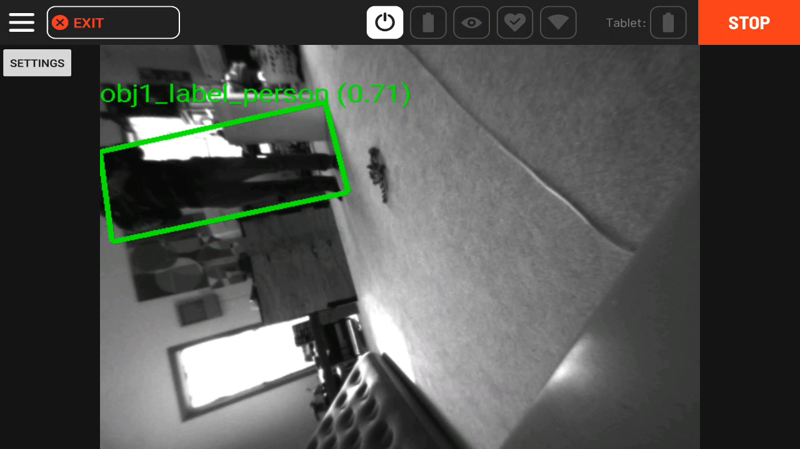
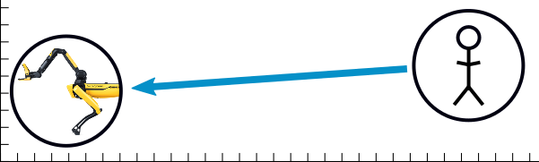
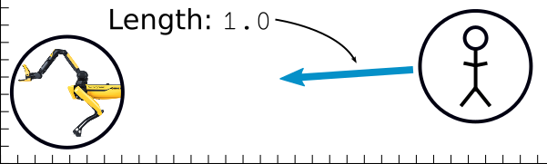
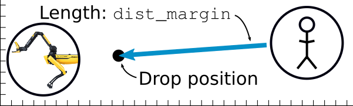
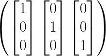

<!--
Copyright (c) 2022 Boston Dynamics, Inc.  All rights reserved.

Downloading, reproducing, distributing or otherwise using the SDK Software
is subject to the terms and conditions of the Boston Dynamics Software
Development Kit License (20191101-BDSDK-SL).
-->

<link rel="stylesheet" type="text/css" href="tutorial.css">
<link href="prism.css" rel="stylesheet" />

<a href="fetch4.html"><< Previous Page</a> | <a href="fetch6.html">Next Page >></a>

# Fetch Part 5: Detecting People and Playing Fetch

   Congratulations, you are one step away from a fully-functional, fetch-playing Spot!  The last step is teaching Spot to detect people.

    While we could train a new ML model, as we did in <a href="fetch2.html">Part 2</a>, instead we'll use an off-the-shelf model that is less work, and will likely yield better performance.

<h3>Loading an Off-the-Shelf Model</h3>

    We're going to use the <strong>same model</strong> we used for transfer learning.  This has a number of advantages:

<ol>
    <li>It has sufficient person-detection performance.</li>
    <li>The structure is the same, so we won't have to change how we call the model.</li>
    <li>Bonus: You already have it!</li>
</ol>

    Copy the labels file into the model directory:
    <pre><code class="language-text wrap">cp ~/fetch/models-with-protos/research/object_detection/data/mscoco_label_map.pbtxt ~/fetch/dogtoy/pre-trained-models/ssd_resnet50_v1_fpn_640x640_coco17_tpu-8/</code></pre>

    To load the model, call <code>network_compute_server.py</code> with an additional <code>-m</code> argument.

<ul>
    <li>If you are still running <code>network_compute_server.py</code> stop it with <code>^C</code></li>
</ul>
 

    Restart it with the new model and its labels:

    <pre><code class="language-text wrap">cd ~/fetch
python network_compute_server.py -m dogtoy/exported-models/dogtoy-model/saved_model dogtoy/annotations/label_map.pbtxt -m dogtoy/pre-trained-models/ssd_resnet50_v1_fpn_640x640_coco17_tpu-8/saved_model dogtoy/pre-trained-models/ssd_resnet50_v1_fpn_640x640_coco17_tpu-8/mscoco_label_map.pbtxt 192.168.80.3
</code></pre>
Yikes!  Let's break that down:
<ul>
    <li><code>python network_compute_server.py</code> calls our script.</li>
    <li><code class="wrap">-m dogtoy/exported-models/dogtoy-model/saved_model dogtoy/annotations/label_map.pbtxt</code> is the custom model and its labels that we ran before.</li>
    <li><code class="wrap">-m dogtoy/pre-trained-models/ssd_resnet50_v1_fpn_640x640_coco17_tpu-8/saved_model dogtoy/pre-trained-models/ssd_resnet50_v1_fpn_640x640_coco17_tpu-8/mscoco_label_map.pbtxt </code> is the pre-trained model and its labels.</li>
     
    <li><code>192.168.80.3</code> is the robot's and IP address</li>
    <li>This command assumes that the `BOSDYN_CLIENT_USERNAME` and `BOSDYN_CLIENT_PASSWORD` environment variables are set to the robot's username and password.
</ul>

   Upon success, you'll see a bunch of output as TensorFlow and CUDA start up. Eventually, you'll see indication that both models have loaded, as shown below:

<pre><code class="language-text">[... lots of text ...]
Service fetch_server running on port: 50051
Loaded models:
    dogtoy-model
    ssd_resnet50_v1_fpn_640x640_coco17_tpu-8
</code></pre>

<h3>Testing Person Detection</h3>

    With the new model running, we can go back to the tablet and try it out.

    1. Select <code>Hamburger Menu > Utilities > ML Model Viewer</code>

    

    

    

    2. Select <code>ssd_resnet50_v1_fpn_640x640_coco17_tpu-8</code> model and press <strong>Start</strong>.

    Upon success, you'll see bounding boxes around people in the video.  Make sure to stay 2 meters away from the robot.
    

    For the gif lovers out there:

<video autoplay loop muted playsinline class="tutorial-video">
    <source src="videos/person_detection_tablet.webm" type="video/webm">
    <source src="videos/person_detection_tablet.mp4" type="video/mp4">
</video>

<h2>Putting it All Together</h2>

   We now have all the required pieces to fetch:

<ol>
    <li>Dog-toy detection</li>
    <li>Grasping of the toy</li>
    <li>Person detection</li>
</ol>

    To pull it together, we'll add to our <code>fetch.py</code> and use the person detection to play fetch!

<ul>
    <li>(or download: <a href="files/fetch.py">fetch.py</a>)</li>
</ul>

    First, <mark>delete the following lines</mark> near the end of <code>fetch.py</code>

<pre><code class="language-python">            # For now, we'll just exit...
            print('')
            print('Done for now, returning control to tablet in 5 seconds...')
            time.sleep(5.0)
            break
</code></pre>

    Add new code to replace it directly after these lines:

<pre><code class="language-python">            # Wait for the carry command to finish
            time.sleep(0.75)</code></pre>

<pre><code class="language-python">            person = None
            while person is None:
                # Find a person to deliver the toy to
                person, image, vision_tform_person = get_obj_and_img(
                    network_compute_client, options.ml_service,
                    options.person_model, options.confidence_person, kImageSources,
                    'person')
</code></pre>

    Same call as above, but this time we use model <code>options.person_model</code> and search for objects with the <code>'person'</code> label.

<ul>
    <li>
        If you're new to Spot's frame conventions, take a look at our <a href="https://dev.bostondynamics.com/docs/concepts/geometry_and_frames#transformations-between-spot-s-frames">concept documentation</a>.
    </li>
</ul>
 

<pre><code class="language-python">            # We now have found a person to drop the toy off near.
            drop_position_rt_vision, heading_rt_vision = compute_stand_location_and_yaw(
                vision_tform_person, robot_state_client, distance_margin=2.0)

            wait_position_rt_vision, wait_heading_rt_vision = compute_stand_location_and_yaw(
                vision_tform_person, robot_state_client, distance_margin=3.0)

</code></pre>

    Compute the position we'll stand to drop the toy and the position we'll stand to back up and wait.  We'll fill in this function <a href="#compute_stand_location_and_yaw">below</a>.

 

<pre><code class="language-python">            # Tell the robot to go there

            # Limit the speed so we don't charge at the person.
            move_cmd = RobotCommandBuilder.trajectory_command(
                goal_x=drop_position_rt_vision[0],
                goal_y=drop_position_rt_vision[1],
                goal_heading=heading_rt_vision,
                frame_name=frame_helpers.VISION_FRAME_NAME,
                params=get_walking_params(0.5, 0.5))
            end_time = 5.0
            cmd_id = command_client.robot_command(command=move_cmd,
                                                end_time_secs=time.time() +
                                                end_time)
</code></pre>
<ul>
    <li>Set a velocity limit when walking</li>
    <li>Command the robot to move to our drop position and yaw</li>
</ul>

<pre><code class="language-python">            # Wait until the robot reports that it is at the goal.
            block_for_trajectory_cmd(command_client, cmd_id, timeout_sec=5, verbose=True)

            print('Arrived at goal, dropping object...')
</code></pre>

    Wait for the robot to walk.  This helper function polls the robot for feedback using <code>cmd_id</code> and returns when we've arrived.

 

<pre><code class="language-python">            # Do an arm-move to gently put the object down.
            # Build a position to move the arm to (in meters, relative to and expressed in the gravity aligned body frame).
            x = 0.75
            y = 0
            z = -0.25
            hand_ewrt_flat_body = geometry_pb2.Vec3(x=x, y=y, z=z)

            # Point the hand straight down with a quaternion.
            qw = 0.707
            qx = 0
            qy = 0.707
            qz = 0
            flat_body_Q_hand = geometry_pb2.Quaternion(w=qw, x=qx, y=qy, z=qz)

            flat_body_tform_hand = geometry_pb2.SE3Pose(
                position=hand_ewrt_flat_body, rotation=flat_body_Q_hand)

            robot_state = robot_state_client.get_robot_state()
            vision_tform_flat_body = frame_helpers.get_a_tform_b(
                robot_state.kinematic_state.transforms_snapshot,
                frame_helpers.VISION_FRAME_NAME,
                frame_helpers.GRAV_ALIGNED_BODY_FRAME_NAME)

            vision_tform_hand_at_drop = vision_tform_flat_body * math_helpers.SE3Pose.from_obj(
                flat_body_tform_hand)
</code></pre>

    Compute the drop position.  Since we're already standing in the right location, we can do a body-relative move to point the hand down in front of Spot.

    Note: We convert to the vision frame using <code>vision_tform_flat_body * ...</code> because we don't want the robot to move relative to its body (we want a fixed point in the world).

    Often this won't matter, but if the robot is disturbed, it will keep the arm in place, as opposed to holding the arm relative to the robot

<pre><code class="language-python">            # duration in seconds
            seconds = 1

            arm_command = RobotCommandBuilder.arm_pose_command(
                vision_tform_hand_at_drop.x, vision_tform_hand_at_drop.y,
                vision_tform_hand_at_drop.z, vision_tform_hand_at_drop.rot.w,
                vision_tform_hand_at_drop.rot.x, vision_tform_hand_at_drop.rot.y,
                vision_tform_hand_at_drop.rot.z, frame_helpers.VISION_FRAME_NAME,
                seconds)

            # Keep the gripper closed.
            gripper_command = RobotCommandBuilder.claw_gripper_open_fraction_command(
                0.0)

            # Combine the arm and gripper commands into one RobotCommand
            command = RobotCommandBuilder.build_synchro_command(
                gripper_command, arm_command)

            # Send the request
            cmd_id = command_client.robot_command(command)

</code></pre>

    Build and send the arm command.  We use a <a href="https://dev.bostondynamics.com/docs/concepts/arm/arm_concepts">synchronized command</a> to command the arm and the gripper.  We don't pass anything for Spot's body to do, so it will continue to stand.

 

<pre><code class="language-python">            # Wait until the arm arrives at the goal.
            block_until_arm_arrives(command_client, cmd_id)

            # Open the gripper
            gripper_command = RobotCommandBuilder.claw_gripper_open_fraction_command(
                1.0)
            command = RobotCommandBuilder.build_synchro_command(gripper_command)
            cmd_id = command_client.robot_command(command)

            # Wait for the dogtoy to fall out
            time.sleep(1.5)

            # Stow the arm.
            stow_cmd = RobotCommandBuilder.arm_stow_command()
            command_client.robot_command(stow_cmd)

            time.sleep(1)

</code></pre>
<ul>
    <li>Wait until the arm is in position for the drop</li>
    <li>Open the gripper</li>
    <li>Stow the arm</li>
</ul>
 

<pre><code class="language-python">            print('Backing up and waiting...')

            # Back up one meter and wait for the person to throw the object again.
            move_cmd = RobotCommandBuilder.trajectory_command(
                goal_x=wait_position_rt_vision[0],
                goal_y=wait_position_rt_vision[1],
                goal_heading=wait_heading_rt_vision,
                frame_name=frame_helpers.VISION_FRAME_NAME,
                params=get_walking_params(0.5, 0.5))
            end_time = 5.0
            cmd_id = command_client.robot_command(command=move_cmd,
                                                end_time_secs=time.time() +
                                                end_time)

            # Wait until the robot reports that it is at the goal.
            block_for_trajectory_cmd(command_client, cmd_id, timeout_sec=5, verbose=True)
</code></pre>

    The last part!  Back up to let the user pick up the toy safely and loop.

    Now we'll define some of the helper functions:

<pre><code class="language-python">def compute_stand_location_and_yaw(vision_tform_target, robot_state_client,
                                   distance_margin):
    # Compute drop-off location:
    #   Draw a line from Spot to the person
    #   Back up 2.0 meters on that line
    vision_tform_robot = frame_helpers.get_a_tform_b(
        robot_state_client.get_robot_state(
        ).kinematic_state.transforms_snapshot, frame_helpers.VISION_FRAME_NAME,
        frame_helpers.GRAV_ALIGNED_BODY_FRAME_NAME)
</code></pre>

    This function computes where to stand for the toy drop-off.  It takes in:

<ol>
    <li>Target position</li>
    <li>Client to get robot state</li>
    <li>Offset distance</li>
</ol>

    What we'll do is:

<ol>
    <li>Draw a line from the target position to our current position.</li>
    <li>Ignore that line's length.</li>
    <li>Move in the direction of the line, from the target, until we're <code>2.0</code> meters along it.</li>
</ol>

<pre><code class="language-python">    # Compute vector between robot and person
    robot_rt_person_ewrt_vision = [
        vision_tform_robot.x - vision_tform_target.x,
        vision_tform_robot.y - vision_tform_target.y,
        vision_tform_robot.z - vision_tform_target.z
    ]

</code></pre>

    

    The subtraction of these two vectors computes the vector between the positions.

  

<pre><code class="language-python">    # Compute the unit vector.
    if np.linalg.norm(robot_rt_person_ewrt_vision) < 0.01:
        robot_rt_person_ewrt_vision_hat = vision_tform_robot.transform_point(1, 0, 0)
    else:
        robot_rt_person_ewrt_vision_hat = robot_rt_person_ewrt_vision / np.linalg.norm(
            robot_rt_person_ewrt_vision)

</code></pre>

    

    We don't care how long the vector is, so we'll change it to be 1.0 meters (computing a <a href="https://en.wikipedia.org/wiki/Unit_vector">unit vector</a>).

<ul>
    <li>Note that we guard for a division by zero using the robot's current direction</li>
</ul>

  

<pre><code class="language-python">    # Starting at the person, back up meters along the unit vector.
    drop_position_rt_vision = [
        vision_tform_target.x +
        robot_rt_person_ewrt_vision_hat[0] * distance_margin,
        vision_tform_target.y +
        robot_rt_person_ewrt_vision_hat[1] * distance_margin,
        vision_tform_target.z +
        robot_rt_person_ewrt_vision_hat[2] * distance_margin
    ]

</code></pre>

    

    Now that we have a vector that is exactly <code>1.0</code> in length, we can multiply it by whatever length we want and get our drop position.

  

<pre><code class="language-python">    # We also want to compute a rotation (yaw) so that we will face the person when dropping.
    # We'll do this by computing a rotation matrix with X along
    #   -robot_rt_person_ewrt_vision_hat (pointing from the robot to the person) and Z straight up:
    xhat = -robot_rt_person_ewrt_vision_hat
    zhat = [0.0, 0.0, 1.0]
    yhat = np.cross(zhat, xhat)
    mat = np.matrix([xhat, yhat, zhat]).transpose()
    heading_rt_vision = math_helpers.Quat.from_matrix(mat).to_yaw()

    return drop_position_rt_vision, heading_rt_vision
</code></pre>

    We want the robot to be facing the person when it drops off the dog-toy.  We'll do this by constructing a rotation matrix and extracting the yaw from that.

    Recall linear algebra, where we can construct a rotation matrix from three orthogonal vectors:
     
    

    With numbers:
     
    

    We can construct a new rotation matrix where <code>xhat</code> is the direction we want the robot to face.
     
    

We've already computed a unit vector, <code>robot_rt_person_ewrt_vision_hat</code>, that points from the person to the robot.  If we negate that vector, it will point from the robot to the person:

<code>xhat = -robot_rt_person_ewrt_vision_hat</code>

    For <code>zhat</code>, we'll use the gravity vector: <code>[0, 0, 1]</code>.
     
    Visually:

    

    <code>yhat</code> is easy since it is always orthogonal to <code>xhat</code> and <code>zhat</code>, so we can find it using the cross product.

<ul>
    <li>With <code>xhat</code>, <code>yhat</code>, and <code>zhat</code>, we can construct a rotation matrix:</li>
    <ul><li class="nomarker"><code>mat = np.matrix([xhat, yhat, zhat]).transpose()</code></li></ul>
    <li>We can then easily convert from a rotation matrix through a quaternion, to a yaw.</li>
    <ul><li class="nomarker"><code>heading_rt_vision = math_helpers.Quat.from_matrix(mat).to_yaw()</code></li></ul>
</ul>

 
<aside>
    

        <strong>Why not use Euler angles?</strong>
    

    

        <em>"if you're using Euler angles, your code is wrong"</em> &#8212; the author
    

    

        Obviously this isn't strictly true, but Euler angles are really hard to get right with 3D angles.  They have the worst property when it comes to math + robots: <em>it looks correct, but it's not</em>*.
    

    

        * which means it will break at the worst possible time
    

    

        Euler angles work well for output displays, but are too easy to make mistakes with for frame math.
    

</aside>

 

<pre><code class="language-python">def pose_dist(pose1, pose2):
    diff_vec = [pose1.x - pose2.x, pose1.y - pose2.y, pose1.z - pose2.z]
    return np.linalg.norm(diff_vec)
</code></pre>

    Compute the distance between two frames:

 

<pre><code class="language-python">def get_walking_params(max_linear_vel, max_rotation_vel):
    max_vel_linear = geometry_pb2.Vec2(x=max_linear_vel, y=max_linear_vel)
    max_vel_se2 = geometry_pb2.SE2Velocity(linear=max_vel_linear,
                                           angular=max_rotation_vel)
    vel_limit = geometry_pb2.SE2VelocityLimit(max_vel=max_vel_se2)
    params = RobotCommandBuilder.mobility_params()
    params.vel_limit.CopyFrom(vel_limit)
    return params
</code></pre>

    Set up Spot's <a href="https://github.com/boston-dynamics/spot-sdk/blob/3ae45683623712f548b77af17f0ee00168fc0fe5/protos/bosdyn/api/spot/robot_command.proto#L59">mobility parameters</a> to limit walking speed.

<h4>Enable longer-distance walking for Pickup</h4>

    In the previous section, we had a <a href="fetch4.html#enable_in_part5">part that was commented out</a>, starting with:

<pre><code class="language-python"># NOTE: we'll enable this code in Part 5, when we understand it.</code></pre>
<ul>
    <li>This is essentially the same as what we do for walking up to a person above.  Uncomment this section to allow the robot to walk further to the dogtoy.</li>
</ul>

<h2>Playing Fetch</h2>

    Run the code:

<pre><code class="language-text wrap">python fetch.py -s fetch-server -m dogtoy-model -p ssd_resnet50_v1_fpn_640x640_coco17_tpu-8 192.168.80.3</code></pre>

    Arguments are:

<ul>
    <li>Name of our ML server</li>
    <li>Name of the dog-toy model</li>
    <li>Name of our person detection model</li>
    <li>IP address of the robot</li>
</ul>

    Upon success, the robot should pick up the toy, bring it to you, drop it, and wait for you to throw it again!

<video autoplay loop muted playsinline class="tutorial-video">
    <source src="videos/fetch_c.webm" type="video/webm">
    <source src="videos/fetch_c.mp4" type="video/mp4">
</video>

    Once fetch is running from your laptop, you can move the model to run on the robot in Core IO, try it out in <a href="fetch6.html">Part 6</a>!

<h2>Head over to <a href="fetch6.html">Part 6: Running the model on Core IO</a> >></h2>

<a href="fetch4.html"><< Previous Page</a> | <a href="fetch6.html">Next Page >></a>

