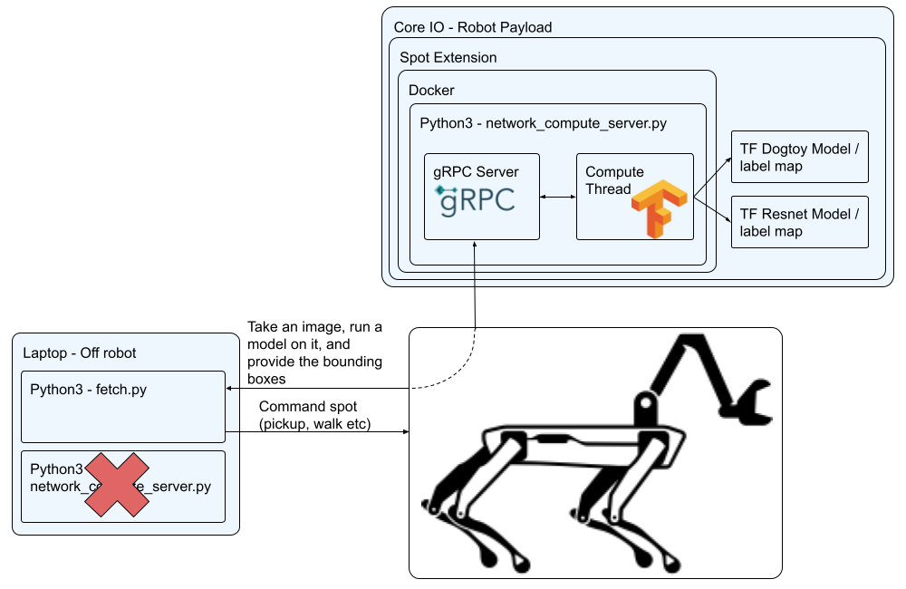

<!--
Copyright (c) 2023 Boston Dynamics, Inc.  All rights reserved.

Downloading, reproducing, distributing or otherwise using the SDK Software
is subject to the terms and conditions of the Boston Dynamics Software
Development Kit License (20191101-BDSDK-SL).
-->

<script type="text/javascript" src="video_play_at_scroll.js"></script>
<link rel="stylesheet" type="text/css" href="tutorial.css">
<link href="prism.css" rel="stylesheet" />
<script src="prism.js"></script>

<div class="section line-numbers">

<p>
<a href="fetch5.html"><< Previous Page</a>
</p>
<hr />

# Fetch Part 6: Running the model on CORE I/O

<aside>
<p>
    <strong>Don't have a CORE I/O?</strong>
</p>
<p>
    Congratulations, you have completed the fetch tutorial! If you would like to try modifying and improving the behavior please see the <a href="#next-steps">Next Steps</a> section at the bottom on this page.  
</p>
</aside>
<br />

<p>
    For this part we are going to move the inference models to run on the robot in the CORE I/O. This is to show how you could run these as part of a mission, without the need for a laptop conencted to Spot.
</p>

<h3>The Setup</h3>
<p>
    The diagram below illustrates how the network compute server will be run on the CORE I/O.
</p>
<ul>
    <li>The main script controlling the robot (fetch.py) will still be run offboard from the robot, but the network compute server running inference will not be.</li>
    <li>If you're not familiar with the CORE I/O, you can learn about it <a href="../../payload/coreio_documentation.html">here</a>.</li>
    <li>We will deploy our code to the Spot CORE I/O via a Spot Extension. If you're not familiar you can read about them <a href="../../payload/docker_containers.html#core-i-o-extensions-configuration">here</a>.</li>
    <li>Spot extensions wrap a docker image and compose script, so we will also need to build those.</li>
    <li>Inside docker we will run our compute server that we've already built in Step 3.</li>
</ul>



<h3>Modifications for CORE I/O</h3>
<p>
    The first thing we need to is make a slight modification to <code>network_compute_server.py</code> so it will run on the CORE I/O. You can also download the modified script <a href="files/coreio_extension/network_compute_server_core_io.py">here</a> and save it over the <code>network_compute_server.py</code> in <code>~/fetch</code> that we created previously.
</p>
<p>
    Lets modify the authentication so it can work with the payload secret instead of a username and password login.
</p>
<ol>
<li>Add an argument for the credentials path</li>

```diff
    parser = argparse.ArgumentParser()
    parser.add_argument('-m', '--model', help='[MODEL_DIR] [LABELS_FILE.pbtxt]: Path to a model\'s directory and path to its labels .pbtxt file', action='append', nargs=2, required=True)
    parser.add_argument('-p', '--port', help='Server\'s port number, default: ' + default_port,
                        default=default_port)
    parser.add_argument('-d', '--no-debug', help='Disable writing debug images.', action='store_true')
    parser.add_argument('-n', '--name', help='Service name', default='fetch-server')
+   bosdyn.client.util.add_payload_credentials_arguments(parser, required=False)
    bosdyn.client.util.add_base_arguments(parser)
```

<li>Modify the authentication to use the credentials if available.</li>

```diff
    # Authenticate robot before being able to use it
-   bosdyn.client.util.authenticate(robot)
+   if options.payload_credentials_file:
+       robot.authenticate_from_payload_credentials(
+           *bosdyn.client.util.get_guid_and_secret(options))
+   else:
+       bosdyn.client.util.authenticate(robot)
```

</ol>

<h3>Prepare The Docker Image</h3>
To keep this section organized were going to create a working directory for building the docker image and spot extension.
<pre><code class="language-text wrap">cd ~/fetch
mkdir -p coreio_extension
cd coreio_extension
</code></pre>

In this folder, create (or <a href="files/coreio_extension/Dockerfile.l4t">download</a>) a <code>Dockerfile.l4t</code> and add the following commands.

<pre><code class="language-text wrap"># Use a base image provided by nvidia that already contains tensorflow 2.7
FROM nvcr.io/nvidia/l4t-tensorflow:r32.7.1-tf2.7-py3

# Do some basic apt and pip updating
RUN apt-get update && \
    apt-get install -y --no-install-recommends python3-pip && \
    apt-get clean

# Copy over the python requirements file and our prebuilt models API library
COPY docker-requirements.txt ./
COPY models-with-protos models-with-protos

# Install the python requirements
RUN python3 -m pip install pip==21.3.1 setuptools==59.6.0 wheel==0.37.1 && \
    python3 -m pip install -r docker-requirements.txt --find-links .

# Copy over our main script
COPY network_compute_server.py /app/
WORKDIR /app

# Set our script as the main entrypoint for the container
ENTRYPOINT ["python3", "network_compute_server.py"]
</code></pre>

Also create (or <a href="files/coreio_extension/docker-requirements.txt">download</a>) the <code>docker-requirements.txt</code> file and add the following

<pre><code class="language-python wrap">bosdyn-api==3.2.0
    # via
    #   bosdyn-client
    #   bosdyn-core
bosdyn-client==3.2.0
    # via -r requirements.txt
bosdyn-core==3.2.0
    # via bosdyn-client
certifi==2022.5.18.1
    # via requests
charset-normalizer==2.0.12
    # via requests
deprecated==1.2.13
    # via
    #   bosdyn-client
    #   bosdyn-core
grpcio
    #==1.46.3 (conflicts with base image)
    # via bosdyn-client
idna==3.3
    # via requests
numpy==1.19.4
    # via bosdyn-client
protobuf==3.19.4
    # via bosdyn-api
pyjwt==2.4.0
    # via bosdyn-client
requests==2.27.1
    # via bosdyn-client
six
    #==1.16.0 (conflicts with base image)
    # via grpcio
urllib3==1.26.9
    # via requests
wrapt
    #==1.14.1 (conflicts with base image)
    # via deprecated
Pillow==9.4.0
opencv-python==4.6.0.66
    # via network_compute_server.py
</code></pre>

If you don't already have Docker installed, you can install it by running:

<pre><code class="language-bash wrap">sudo apt install docker.io
</code></pre>

Because we are going to cross compile for the CORE I/O's Arm64 platform, we need to enable emulation and cross compile support by running:

<pre><code class="language-bash wrap">sudo docker run --rm --privileged multiarch/qemu-user-static --reset -p yes
</code></pre>

If everything is successful you should see a bunch of settings get set, including,

<pre><code class="language-bash wrap">...
Setting /usr/bin/qemu-aarch64-static as binfmt interpreter for aarch64
...
</code></pre>

Now we're ready to test build our Docker image. Copy over the required files and run Docker on the Dockerfile we created. We're going to tag it as `fetch_detector:l4t`.

<pre><code class="language-bash wrap">cd ~/fetch/coreio_extension
cp ../network_compute_server.py .
cp -r ../models-with-protos .
sudo docker build -t fetch_detector:l4t -f Dockerfile.l4t .
</code></pre>

If the build was successful you will see the command finish with `Successfully tagged fetch_detector:l4t`.

<h3>Build The Spot Extension</h3>
A Spot Extension is a tar of a specific set of files. To be a valid extension it requires,
<ul>
    <li><code>manifest.json</code> file with metadata about the Extension</li>
    <li>Docker Image(s)</li>
    <li><code>docker-compose.yml</code> file telling the extension what to run</li>
    <li>[Optional] Icon to show on the web portal</li>
    <li>[Optional] Udev rules to install on the CORE I/O</li>
    <li>[Optional] Other files needed by the extension</li>
</ul>

Let's prepare our extension by creating a `manifest.json` file (or <a href="files/coreio_extension/manifest.json">download</a> it).

<pre><code class="language-bash wrap">{
    "description": "fetch_detector",
    "version": "3.2.0",
    "images": [
        "fetch_detector_image.tar.gz"
    ]
}
</code></pre>

Also create (or <a href="files/coreio_extension/docker-compose.yml">download</a>) a <code>docker-compose.yml</code> file. You'll notice that we're going to mount volumes for the credentials file and the ML models. This is so that you can update the models without having to rebuild the docker image. The path to the files in the Spot Extension (`/data/.extensions/fetch_detector`) is detailed in the Spot Extension documentation.

<pre><code class="language-bash wrap">version: "3.5"
services:
  fetch_detector:
    image: fetch_detector:l4t
    network_mode: host
    restart: unless-stopped
    environment:
      # This package couldn't be installed, but putting it on the path allows required access to the protos.
      - PYTHONPATH=/models-with-protos/research/
    volumes:
      # Mount payload credentials.
      - /opt/payload_credentials/payload_guid_and_secret:/opt/payload_credentials/payload_guid_and_secret
      # and ML models
      - /data/.extensions/fetch_detector/data:/data
    # The command below is partial because the docker image is already configured with an entrypoint.
    command: >
      -m /data/dogtoy-model/saved_model /data/dogtoy-model/label_map.pbtxt
      -m /data/ssd_resnet50_v1_fpn_640x640_coco17_tpu-8/saved_model /data/ssd_resnet50_v1_fpn_640x640_coco17_tpu-8/mscoco_label_map.pbtxt
      --payload-credentials-file /opt/payload_credentials/payload_guid_and_secret
      192.168.50.3
    deploy:
      resources:
        reservations:
          devices:
            - driver: nvidia
              capabilities: [gpu]
</code></pre>

To make updating and building our extension easy, we're going to create a script that builds the extension. Make (or <a href="files/coreio_extension/create_extension.sh">download</a>) the following `create_extension.sh` script.
You'll see this script copies over the latest versions of the network compute script and the ML models. The models are put into a `data` folder that is included in the spot extension, then mounted in the Docker image at run time as specified in the `docker-compose.yml` file.

<pre><code class="language-bash wrap">#!/bin/bash -e

SCRIPT=${BASH_SOURCE[0]}
SCRIPT_PATH="$(dirname "$SCRIPT")"
cd $SCRIPT_PATH

FETCH_DIR=~/fetch

# Copy over the latest files
cp $FETCH_DIR/network_compute_server.py .
cp -r $FETCH_DIR/models-with-protos .

mkdir -p data
rm -rf data/*
# Dogtoy model
cp -r $FETCH_DIR/dogtoy/exported-models/dogtoy-model data/.
# and its label map
cp $FETCH_DIR/dogtoy/annotations/label_map.pbtxt data/dogtoy-model/.
# coco model (includes its label map)
cp -r $FETCH_DIR/dogtoy/pre-trained-models/ssd_resnet50_v1_fpn_640x640_coco17_tpu-8 data/.

# Build the image
sudo docker build -t fetch_detector:l4t -f Dockerfile.l4t .

# Exports the image, uses pigz
sudo docker save fetch_detector:l4t | pigz > fetch_detector_image.tar.gz

# Built the Spot Extension by taring all the files together
tar -cvzf fetch_detector.spx \
    fetch_detector_image.tar.gz \
    manifest.json \
    docker-compose.yml \
    data

# Cleanup intermediate image
rm fetch_detector_image.tar.gz
</code></pre>

Don't forget to make the script executable.

<pre><code class="language-bash wrap">cd ~/fetch/coreio_extension
chmod +x create_extension.sh
</code></pre>

Let's build the Spot Extension!

<pre><code class="language-bash wrap">cd ~/fetch/coreio_extension
./create_extension.sh
</code></pre>

If everything is successful you should end up with a `fetch_detector.spx` file.

<h3>Run fetch_detector on CORE I/O</h3>
<p>
    To run Spot Extension on CORE I/O, go to the Spot Core's webpage. If you're accessing it through spot it'll be something like <code>https://ROBOT_IP:21443</code>. If you're connected to the robot's wifi, try <a href="https://192.168.80.3:21443">https://192.168.80.3:21443</a>.
</p>
<p>
    After logging in, navigate to the extension page and upload the <code>fetch_detector.spx</code> file.
    
</p>
<p>
    Once upload completes the extension should automatically start running. This might take a few minutes.
    
</p>
<p>
    You should see some cosole output similar to below.
</p>
<pre><code class="language-text">
2022-08-01T19:24:58.150841720Z 2022-08-01 19:24:58.150396: I tensorflow/stream_executor/platform/default/dso_loader.cc:53] Successfully opened dynamic library libcudart.so.10.2
2022-08-01T19:25:27.746030301Z 2022-08-01 19:25:27.745487: I tensorflow/stream_executor/platform/default/dso_loader.cc:53] Successfully opened dynamic library libcuda.so.1
2022-08-01T19:25:27.750924622Z 2022-08-01 19:25:27.750486: I tensorflow/stream_executor/cuda/cuda_gpu_executor.cc:1001] ARM64 does not support NUMA - returning NUMA node zero
2022-08-01T19:25:27.751010254Z 2022-08-01 19:25:27.750671: I tensorflow/core/common_runtime/gpu/gpu_device.cc:1734] Found device 0 with properties: 
2022-08-01T19:25:27.751046894Z pciBusID: 0000:00:00.0 name: Xavier computeCapability: 7.2
2022-08-01T19:25:27.751058702Z coreClock: 1.109GHz coreCount: 6 deviceMemorySize: 15.45GiB deviceMemoryBandwidth: 66.10GiB/s
2022-08-01T19:25:27.751089006Z 2022-08-01 19:25:27.750804: I tensorflow/stream_executor/platform/default/dso_loader.cc:53] Successfully opened dynamic library libcudart.so.10.2
2022-08-01T19:25:27.754844443Z 2022-08-01 19:25:27.754675: I tensorflow/stream_executor/platform/default/dso_loader.cc:53] Successfully opened dynamic library libcublas.so.10
2022-08-01T19:25:27.754998332Z 2022-08-01 19:25:27.754847: I tensorflow/stream_executor/platform/default/dso_loader.cc:53] Successfully opened dynamic library libcublasLt.so.10
2022-08-01T19:25:27.758325927Z 2022-08-01 19:25:27.758082: I tensorflow/stream_executor/platform/default/dso_loader.cc:53] Successfully opened dynamic library libcufft.so.10
2022-08-01T19:25:27.759084714Z 2022-08-01 19:25:27.758951: I tensorflow/stream_executor/platform/default/dso_loader.cc:53] Successfully opened dynamic library libcurand.so.10
2022-08-01T19:25:27.763559097Z 2022-08-01 19:25:27.763253: I tensorflow/stream_executor/platform/default/dso_loader.cc:53] Successfully opened dynamic library libcusolver.so.10
2022-08-01T19:25:27.766903301Z 2022-08-01 19:25:27.766619: I tensorflow/stream_executor/platform/default/dso_loader.cc:53] Successfully opened dynamic library libcusparse.so.10
2022-08-01T19:25:27.767628199Z 2022-08-01 19:25:27.767451: I tensorflow/stream_executor/platform/default/dso_loader.cc:53] Successfully opened dynamic library libcudnn.so.8
2022-08-01T19:25:27.767854600Z 2022-08-01 19:25:27.767739: I tensorflow/stream_executor/cuda/cuda_gpu_executor.cc:1001] ARM64 does not support NUMA - returning NUMA node zero
2022-08-01T19:25:27.768139817Z 2022-08-01 19:25:27.767993: I tensorflow/stream_executor/cuda/cuda_gpu_executor.cc:1001] ARM64 does not support NUMA - returning NUMA node zero
2022-08-01T19:25:27.768297418Z 2022-08-01 19:25:27.768127: I tensorflow/core/common_runtime/gpu/gpu_device.cc:1872] Adding visible gpu devices: 0
2022-08-01T19:25:27.770893107Z 2022-08-01 19:25:27.770684: I tensorflow/stream_executor/cuda/cuda_gpu_executor.cc:1001] ARM64 does not support NUMA - returning NUMA node zero
2022-08-01T19:25:27.771066195Z 2022-08-01 19:25:27.770846: I tensorflow/core/common_runtime/gpu/gpu_device.cc:1734] Found device 0 with properties: 
2022-08-01T19:25:27.771105523Z pciBusID: 0000:00:00.0 name: Xavier computeCapability: 7.2
2022-08-01T19:25:27.771119155Z coreClock: 1.109GHz coreCount: 6 deviceMemorySize: 15.45GiB deviceMemoryBandwidth: 66.10GiB/s
2022-08-01T19:25:27.771229364Z 2022-08-01 19:25:27.771027: I tensorflow/stream_executor/cuda/cuda_gpu_executor.cc:1001] ARM64 does not support NUMA - returning NUMA node zero
2022-08-01T19:25:27.771577461Z 2022-08-01 19:25:27.771366: I tensorflow/stream_executor/cuda/cuda_gpu_executor.cc:1001] ARM64 does not support NUMA - returning NUMA node zero
2022-08-01T19:25:27.771636085Z 2022-08-01 19:25:27.771441: I tensorflow/core/common_runtime/gpu/gpu_device.cc:1872] Adding visible gpu devices: 0
2022-08-01T19:25:27.771737142Z 2022-08-01 19:25:27.771559: I tensorflow/stream_executor/platform/default/dso_loader.cc:53] Successfully opened dynamic library libcudart.so.10.2
2022-08-01T19:25:30.463620133Z 2022-08-01 19:25:30.463273: I tensorflow/core/common_runtime/gpu/gpu_device.cc:1258] Device interconnect StreamExecutor with strength 1 edge matrix:
2022-08-01T19:25:30.463732677Z 2022-08-01 19:25:30.463369: I tensorflow/core/common_runtime/gpu/gpu_device.cc:1264]      0 
2022-08-01T19:25:30.463750150Z 2022-08-01 19:25:30.463402: I tensorflow/core/common_runtime/gpu/gpu_device.cc:1277] 0:   N 
2022-08-01T19:25:30.463926950Z 2022-08-01 19:25:30.463786: I tensorflow/stream_executor/cuda/cuda_gpu_executor.cc:1001] ARM64 does not support NUMA - returning NUMA node zero
2022-08-01T19:25:30.464228135Z 2022-08-01 19:25:30.464103: I tensorflow/stream_executor/cuda/cuda_gpu_executor.cc:1001] ARM64 does not support NUMA - returning NUMA node zero
2022-08-01T19:25:30.464412680Z 2022-08-01 19:25:30.464303: I tensorflow/stream_executor/cuda/cuda_gpu_executor.cc:1001] ARM64 does not support NUMA - returning NUMA node zero
2022-08-01T19:25:30.464568200Z 2022-08-01 19:25:30.464460: I tensorflow/core/common_runtime/gpu/gpu_device.cc:1418] Created TensorFlow device (/job:localhost/replica:0/task:0/device:GPU:0 with 5377 MB memory) -> physical GPU (device: 0, name: Xavier, pci bus id: 0000:00:00.0, compute capability: 7.2)
</code></pre>

<h3>Check the detector is working</h3>
<p>
    Before running this with <code>fetch.py</code>, you can use the ML viewer on the tablet (like we did in step 3) to check its working. You should have options for both the <code>dogtoy-model</code> and the <code>ssd_resnet...</code> model.
</p>
<p>
    If the tablet reports it's having trouble connecting, remember to wait several minutes for the server to initialize.
</p>

<h3>Run Fetch</h3>
<p>
    Just as in the previous step, run the fetch code on your laptop:
</p>

<pre><code class="language-text">python3 fetch.py -s fetch-server -m dogtoy-model -p ssd_resnet50_v1_fpn_640x640_coco17_tpu-8 192.168.80.3</code></pre>

<p>
    Congratulations you're now running with an onboard network compute server! If you want to make it even better check out the Next Steps below.
</p>
<hr />

<h3 id="next-steps">Next Steps</h3>
<p>
    Congratulations, you have successfully completed the tutorial and built fetch!  What you have learned provides you with a foundation you can expand upon.  We hope you had fun and we look forward to seeing the exciting new behaviors that you build!
</p>
<ul>
    <li>Try changing the code to put the toy in a bucket on the back, using <a href="https://github.com/boston-dynamics/spot-sdk/tree/master/python/examples/arm_joint_move">the joint angle API.</a> This is how we built the <a href="https://www.youtube.com/watch?v=6Zbhvaac68Y">glove and laundry-pickup</a> parts of our Spot's Got an Arm video.</li>
    <li>Collect more data in additional environments to tune your model.</li>
</ul>

<hr />
<p>
<a href="fetch5.html"><< Previous Page</a>
</p>

</div>
