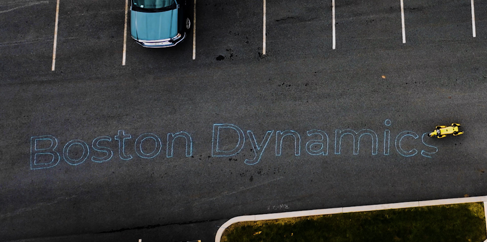

<!--
Copyright (c) 2023 Boston Dynamics, Inc.  All rights reserved.

Downloading, reproducing, distributing or otherwise using the SDK Software
is subject to the terms and conditions of the Boston Dynamics Software
Development Kit License (20191101-BDSDK-SL).
-->

# GCODE Drawing

A relatively simple [GCODE](https://en.wikipedia.org/wiki/G-code) interpreter for Spot.

Can be used to draw with sidewalk chalk or similar. You can configure it by changing
values in `gcode.cfg`, in this directory.

Currently understands the following GCODE commands:

```
G00     fast positioning
G01     straight line motion

G02     clockwise arc
G03     counterclockwise arc

M0      program pause
```

Many programs can produce GCODE output. Inkscape has a plugin that we've tested successfully
with this example.

Consider using a [simple gcode simulator](https://nraynaud.github.io/webgcode/) before running your program.

## Drawing with Chalk

To draw with chalk, we recommend a very large piece of chalk. The image below was drawn with a
stick of chalk 1.5 inches in diameter and 5 inches long. We taped the chalk to the gripper using gaffers tape.



## Details

This example uses the `ArmSurfaceContact` mode of the robot to perform the drawing. It is possible to knock the robot over in this mode, so be careful when tuning parameters.

## Understanding Spot Programming

For your best learning experience, please use the [Quickstart Guide](../../../docs/python/quickstart.md)
found in the SDK's docs/python directory. That will help you get your Python programming environment set up properly.

## Common Problems

1. Remember, you will need to launch a software e-stop separately. The E-Stop programming example is [here](../estop/README.md).
2. Make sure the Motor Enable button on the Spot rear panel is depressed.
3. Make sure Spot is sitting upright, with the battery compartment on the side closest the floor.

## Setup Dependencies

This example requires the bosdyn API and client to be installed, and must be run using python3. Using pip, these dependencies can be installed using:

```
python3 -m pip install -r requirements.txt
```

## Run the Example

To run the example:

```
python3 gcode.py ROBOT_IP
```
