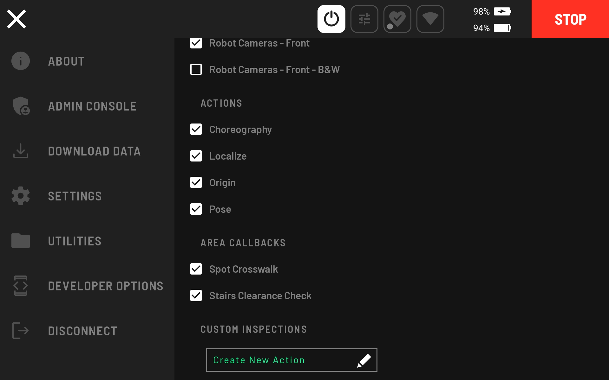
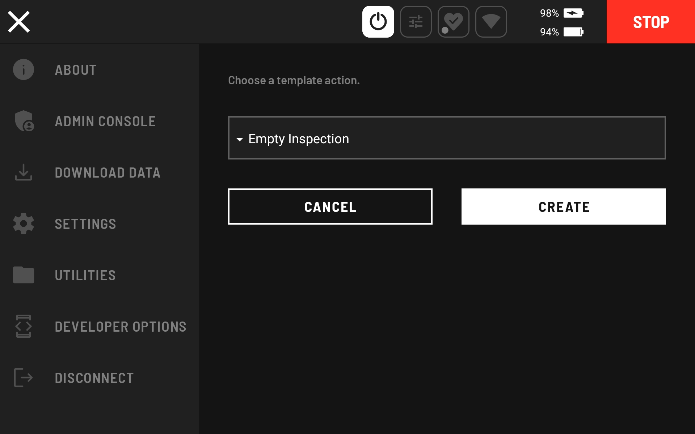
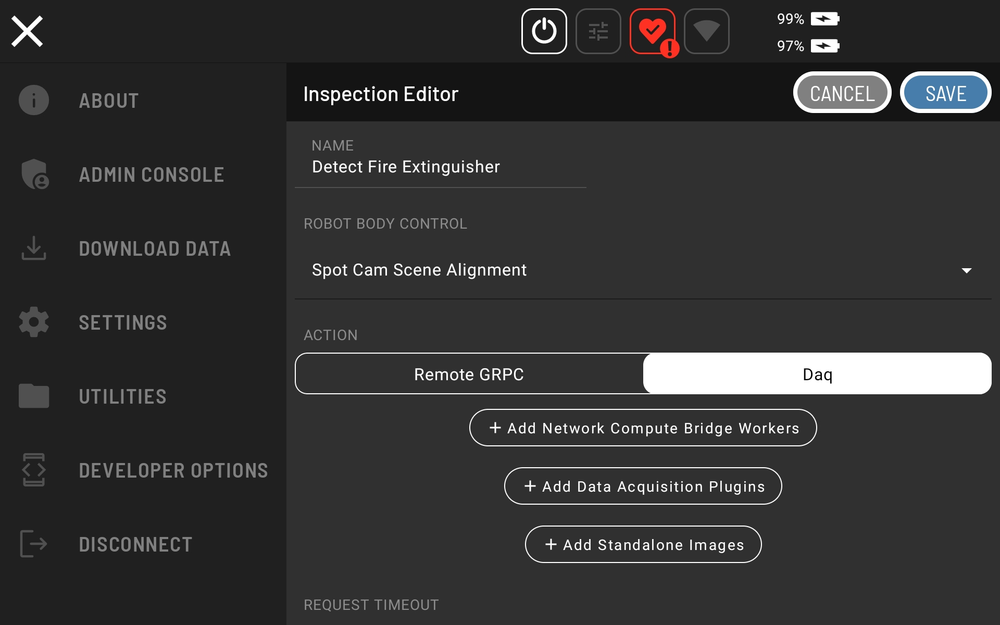
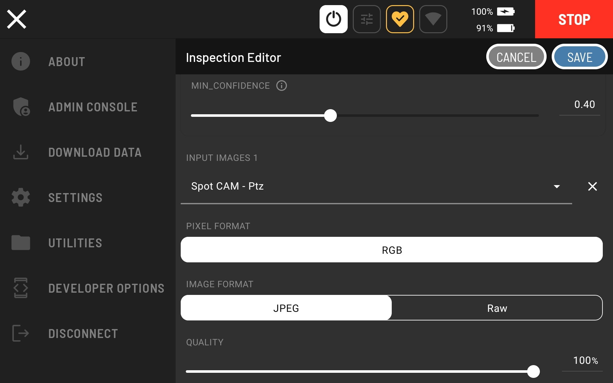
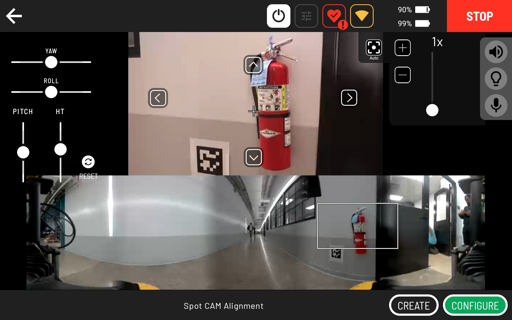

<!--
Copyright (c) 2023 Boston Dynamics, Inc.  All rights reserved.

Downloading, reproducing, distributing or otherwise using the SDK Software
is subject to the terms and conditions of the Boston Dynamics Software
Development Kit License (20191101-BDSDK-SL).
-->

# Fire Extinguisher Detector Server

This is an example of a Network Compute Bridge server. It is similar to `tensorflow_server.py`, but uses Keras Retinanet instead of TensorFlow. The provided model specifically detects fire extinguishers.

## Build and Export

This example can be run on a local machine directly, but is easier to use with Docker.

The Docker image can be built and exported with the following commands:

```
# builds the image
sudo docker build -t fire_ext_detector .

# exports the image, uses pigz
sudo docker save fire_ext_detector | pigz > fire_ext_detector.tar.gz
```

To build the image for CORE I/O:

```
# Prerequisites
# Install the pigz and qemu packages
sudo apt-get install qemu binfmt-support qemu-user-static pigz
# This step will execute the registering scripts
docker run --rm --privileged multiarch/qemu-user-static --reset -p yes

# Builds the image
sudo docker build -t fire_ext_detector:l4t -f Dockerfile.l4t .

# Exports the image, uses pigz
sudo docker save fire_ext_detector:l4t | pigz > fire_ext_detector.tar.gz
```

## Execution

To run this example on a Spot CORE, run:

```
./start_server.sh
```

Otherwise, run:

```
sudo docker run -d --name retinanet_server --network host --env BOSDYN_CLIENT_USERNAME --env BOSDYN_CLIENT_PASSWORD --restart unless-stopped fire_ext_detector -d . --port $PORT $ROBOT_IP
```

- `$PORT` is the port to use for the server on the machine the server is running on
- `$ROBOT_IP` is the IP address or hostname of your Spot.
- `BOSDYN_CLIENT_USERNAME` is the environment variable for the username for the robot
- `BOSDYN_CLIENT_PASSWORD` is the environment variable for the password for the robot

To run this example on a CORE I/O, run:

```
# Load the image
sudo docker load -i fire_ext_detector.tar.gz

# Run the container
sudo docker run -d \
    --gpus all \
    --name retinanet_server \
    --network host \
    --restart unless-stopped \
    -v /opt/payload_credentials/payload_guid_and_secret:/opt/payload_credentials/payload_guid_and_secret \
    fire_ext_detector:l4t \
    -d . 192.168.50.3 --payload-credentials-file /opt/payload_credentials/payload_guid_and_secret
```

## Spot Extension for CORE I/O

This example can also be built into a [Spot Extension](../../../../docs/payload/docker_containers.md) using a provided [convenience script](../../extensions/README.md)

```sh
cd {/path/to/python/examples/network_compute_bridge/fire_extinguisher_server/}

python3 ../../extensions/build_extension.py \
    --dockerfile-paths Dockerfile.l4t \
    --build-image-tags fire_ext_detector:l4t \
    -i fire_ext_detector_image.tar.gz \
    --package-dir . \
    --spx fire_extinguisher_detector.spx
```

The output file will be called fire_ext_detector.spx and can be uploaded to a CORE I/O.

## Action Configuration

To configure the Fire Extinguisher Detector as an Inspection on Spot's control tablet, go to Hamburger menu --> SETTINGS --> ACTIONS.


Scroll down to CUSTOM INSPECTIONS and select "Create New Action."



Choose the "Empty Inspection" template action and click the CREATE button.



Set the ROBOT BODY CONTROL to "Body Pose" and the ACTION to "Daq."



Click "Add Network Compute Bridge Workers" and select "Fire Extinguisher Server - Fire Ext"


Add the Spot CAM - Ptz as an input image to the `Fire Extinguisher Server - Fire Ext` Network Compute Bridge Worker. Note that this input image is what will be used as the input to the Worker. It is not a standalone image. So, make sure to add an input image and not a standalone image.


Click save to finish configuring the action.

The configuration can be verified by teleoperating Spot to a fire extinguisher and setting up a clear shot with the SPOT CAM PTZ.


Click the red action button, select the configured action and fine tune the shot.



Click CONFIGURE to observe the input image.


After a short period of time, you can see the output of the worker on the second page by clicking the arrows below the input image.


If you see a green box around the fire extinguisher gauge, then the action is configured and working correctly. If you do not see any green boxes, then reduce the "MIN_CONFIDENCE" or exit the action and set up a clearer shot of the fire extinguisher (e.g., consider zooming out further than indicated in the above screenshots).
