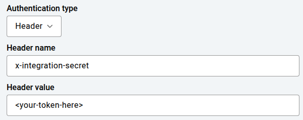
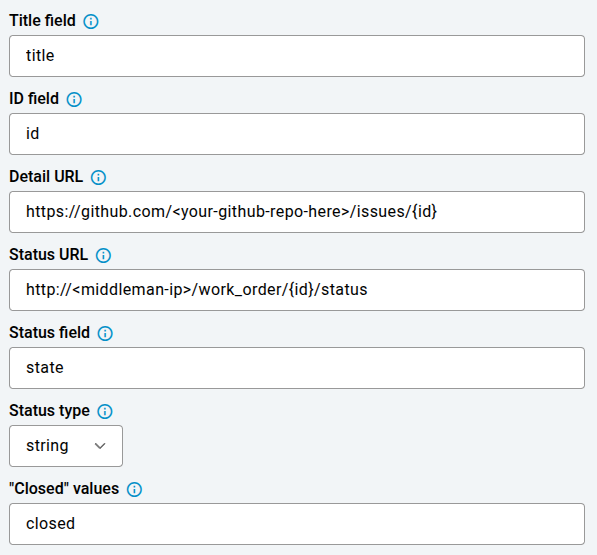

<!--
Copyright (c) 2023 Boston Dynamics, Inc.  All rights reserved.

Downloading, reproducing, distributing or otherwise using the SDK Software
is subject to the terms and conditions of the Boston Dynamics Software
Development Kit License (20191101-BDSDK-SL).
-->

# Orbit Work Orders Example

This example demonstrates how to use a Flask web service to create and read GitHub issues as work orders. Orbit can support working with Github directly, but this example uses a middleman service to illustrate how such an integration could be built.

See the [Orbit Documentation](../../../../docs/concepts/orbit/about_orbit.md) for more information on how Orbit handles work orders.

## Setup Dependencies

See the `requirements.txt` file for a list of Python dependencies. Install them with:

```
pip install -r requirements.txt
```

## Environment Variables

Before running, set the following environment variables:

- `INTEGRATION_SECRET`: Secret for authenticating API requests with the middleman service. This should match the value set in Orbit's work order integration configuration.
- `GITHUB_TOKEN`: GitHub personal access token (with repo/issues access). Please see [authenticating with a personal access token](https://docs.github.com/en/rest/authentication/authenticating-to-the-rest-api?apiVersion=2022-11-28#authenticating-with-a-personal-access-token) for more information.
- `GITHUB_REPO`: GitHub repository in the format `{owner}/{repo}`

## Configuring Orbit

This example uses the following Orbit work order configuration:

### Authentication



### Work Order Spec

```json
{
  "specs": {
    "body": {
      "spec": {
        "stringSpec": {
          "editable": true,
          "templateValue": "Found an anomaly during mission {anomaly.missionName}. See full anomaly here: \n\n{anomaly}",
          "isMultiline": true
        }
      },
      "uiInfo": {
        "displayName": "Description",
        "displayOrder": "2"
      }
    },
    "title": {
      "spec": {
        "stringSpec": {
          "editable": true,
          "templateValue": "Problem at {anomaly.actionName}"
        }
      },
      "uiInfo": {
        "displayName": "Title",
        "displayOrder": "1"
      }
    }
  }
}
```

### Other Fields



## Running the Example

To run the Flask server:

```
python git_example.py
```

The server will start on port 21605. You can interact with the API using curl or any HTTP client. This example should not be run in production environments.

## API Endpoints

- `POST /work_order` — Create a new work order (GitHub issue)
  - JSON body should include `title`, `body`
- `GET /work_order/<id>/status` — Get details for a specific work order (GitHub issue)

## Example Usage

Create a work order:

```
curl -X POST http://localhost:21605/work_order \
  -H "x-integration-secret: <your_secret>" \
  -H "Content-Type: application/json" \
  -d '{"title": "Test Work Order", "body": "This is a test."}'
```

Get status of a work order:

```
curl -X GET http://localhost:21605/work_order/1/status \
  -H "x-integration-secret: <your_secret>"
```

## Common Problems

1. Ensure all required environment variables are set before running.
2. Your GitHub token must have permission to create issues in the target repository.
3. The integration secret must match the value sent in the `x-integration-secret` header from Orbit.
4. If you see authentication errors, check your token and secret values.

## Learn More

For more information on Orbit's work order integration, see the [Orbit Documentation](../../../../docs/concepts/orbit/about_orbit.md) or contact Boston Dynamics support.
