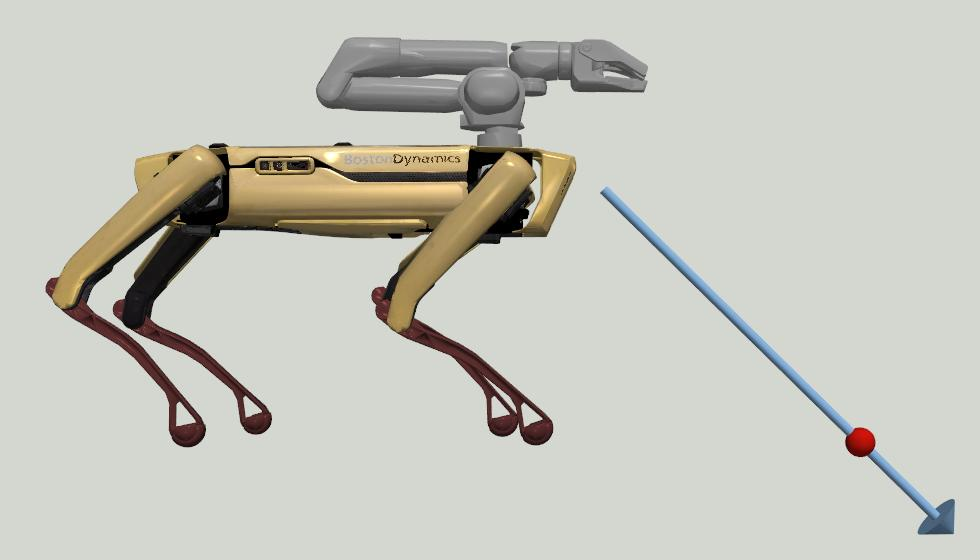

<!--
Copyright (c) 2022 Boston Dynamics, Inc.  All rights reserved.

Downloading, reproducing, distributing or otherwise using the SDK Software
is subject to the terms and conditions of the Boston Dynamics Software
Development Kit License (20191101-BDSDK-SL).
-->

# Ray Cast Example

The ray cast service calculates intersection points between a ray and various data sources on the robot. This example program shows how to use this API.

## Understanding Spot Programming

For your best learning experience, please use the [Quickstart Guide](../../../docs/python/quickstart.md)
found in the SDK's docs/python directory. That will help you get your Python programming environment set up properly.

## Setup Dependencies

This example requires the bosdyn API and client to be installed, and must be run using python3. Using pip, these dependencies can be installed using:

```shell
python3 -m pip install -r requirements.txt
```

## Run the Example

Below is example output from casting a ray starting in front of the robot (positive X) forward and down toward the ground.

```shell
>>> python3 cast_single_ray.py -o 0.5 0.0 0.0 -d 1.0 0.0 -1.0 HOSTNAME
Raycasting from position: X: 0.500 Y: 0.000 Z: 0.000
Raycasting in direction: X: 1.000 Y: 0.000 Z: -1.000
Raycast returned 3 hits.
Hit 0:
        Position: X: 1.014 Y: 0.000 Z: -0.514
        Type: TYPE_VOXEL_MAP
        Distance: 0.5136719346046448
Hit 1:
        Position: X: 1.014 Y: 0.000 Z: -0.514
        Type: TYPE_GROUND_PLANE
        Distance: 0.5138996896169675
Hit 2:
        Position: X: 1.016 Y: 0.000 Z: -0.516
        Type: TYPE_TERRAIN_MAP
        Distance: 0.5157292485237122
```

The above query is shown visually below. In this case, the ray (gray) intersects with the ground, indicated by the sphere (red).

